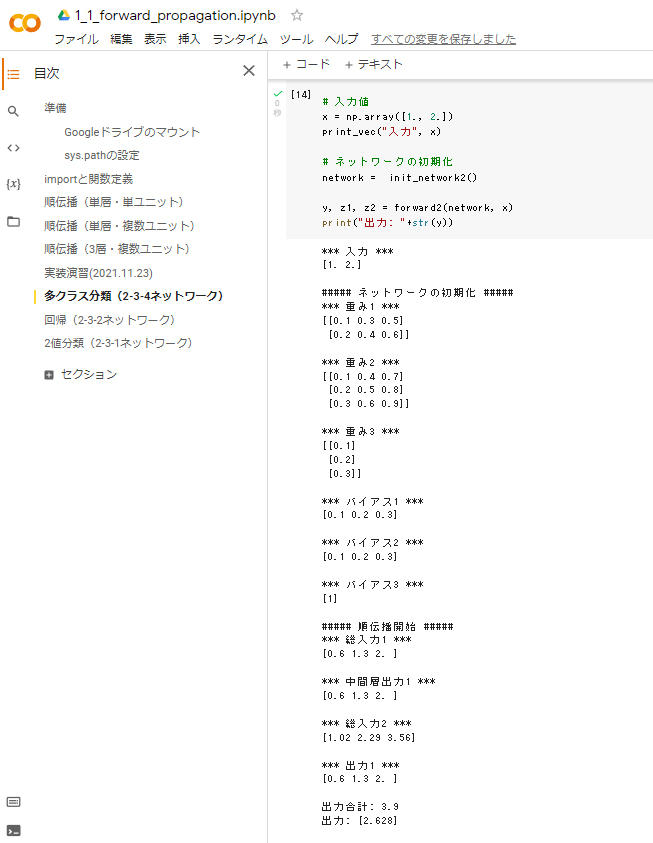
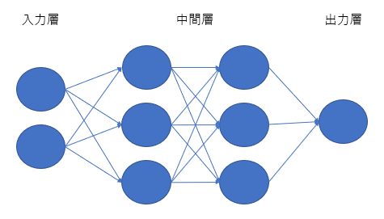
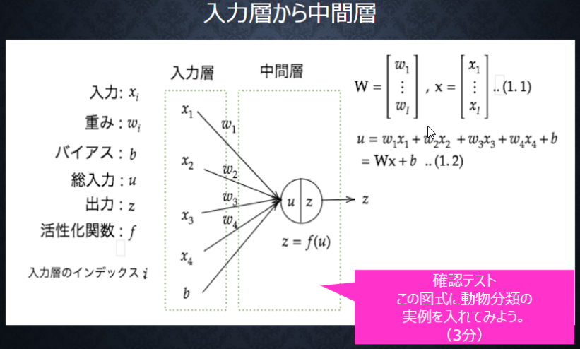
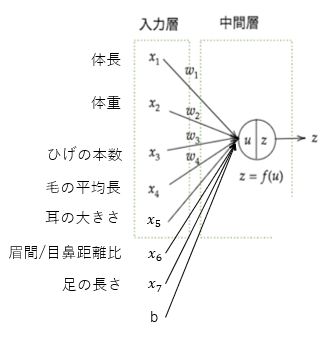
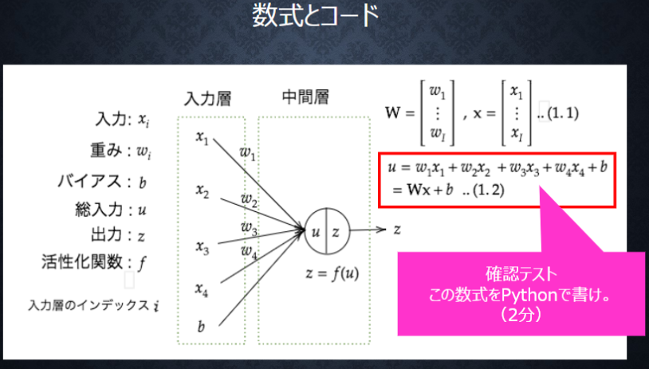
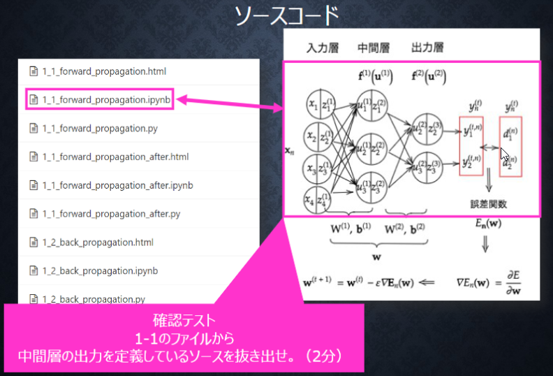

# Section1: 入力層～中間層

## 1. 要点まとめ

ニューラルネットワークとは、脳内の神経細胞（ニューロン）のネットワーク構造を模した数学モデルである。
連続値を予測する回帰問題、クラス（離散値）を予測する分類問題どちらにも適用可能である。
また、クラスからデータを生成する生成モデルも可能であり、非常に柔軟なモデルである。

ニューラルネットワークは、入力情報を受け取る入力層、受け取った情報を処理する中間層、最終結果を出力する出力層で構成される。中間層が多数存在するものはディープニューラルネットワークと呼ばれ、複雑な問題を解くことが可能である。

入力層に入力された情報xiは、重要度に応じた重みが掛けられ、これらを足し合わせてバイアスをつけた結果が中間層の各ノードに渡される（総入力u）。


-----
## 2. 実装演習

1_1_forward_propagation.ipynbの「順伝播（3層・複数ユニット）」のコードを参考に、以下ニューラルネットワークを作成する。

- 入力層: 2ノード1層
- 中間層: 3ノード2層 （※参考コードでは、「3ノード1層」＋「2ノード1層」）
- 出力層: 1ノード1層 （※参考コードでは、「2ノード1層」）

``` python
# ウェイトとバイアスを設定
# ネートワークを作成
def init_network2():
    print("##### ネットワークの初期化 #####")
    network = {}
    
    #試してみよう
    #_各パラメータのshapeを表示
    #_ネットワークの初期値ランダム生成
    
    # 行数=2 →　入力元ノード数=2
    # 列数=3 →　出力先ノード数=3
    network['W1'] = np.array([
        [0.1, 0.3, 0.5],
        [0.2, 0.4, 0.6]
    ])
    # 行数=3 →　入力元ノード数=3
    # 列数=3 →　出力先ノード数=3
    network['W2'] = np.array([
        [0.1, 0.4, 0.7],
        [0.2, 0.5, 0.8],
        [0.3, 0.6, 0.9]
    ])
    # 行数=3 →　入力元ノード数=3
    # 列数=1 →　出力先ノード数=1
    network['W3'] = np.array([
        [0.1],
        [0.2],
        [0.3]
    ])
    network['b1'] = np.array([0.1, 0.2, 0.3])
    network['b2'] = np.array([0.1, 0.2, 0.3])
    network['b3'] = np.array([1])

    print_vec("重み1", network['W1'] )
    print_vec("重み2", network['W2'] )
    print_vec("重み3", network['W3'] )
    print_vec("バイアス1", network['b1'] )
    print_vec("バイアス2", network['b2'] )
    print_vec("バイアス3", network['b3'] )

    return network

# プロセスを作成（ここのコードはノード数非依存)
# x：入力値
def forward2(network, x):
    
    print("##### 順伝播開始 #####")

    W1, W2, W3 = network['W1'], network['W2'], network['W3']
    b1, b2, b3 = network['b1'], network['b2'], network['b3']
    
    # 中間層（1層目）の総入力
    u1 = np.dot(x, W1) + b1
    
    # 中間層（1層目）の総出力
    z1 = functions.relu(u1)
    
    # 中間層（2層目）の総入力
    u2 = np.dot(z1, W2) + b2
    
    # 中間層（2層目）の総出力
    z2 = functions.relu(u2)

    # 出力層の総入力
    u3 = np.dot(z2, W3) + b3
    
    # 出力層の総出力
    y = u3
    
    print_vec("総入力1", u1)
    print_vec("中間層出力1", z1)
    print_vec("総入力2", u2)
    print_vec("出力1", z1)
    print("出力合計: " + str(np.sum(z1)))

    return y, z1, z2

# 入力値
x = np.array([1., 2.])
print_vec("入力", x)

# ネットワークの初期化
network =  init_network2()

y, z1, z2 = forward2(network, x)
``` 

実行結果（snapshot）は以下




-----
## 3. 確認テスト


- ディープラーニングの目的
  - ネットワークのパラメータ（重みやバイアス）をデータから学習し、入力データから適切な出力が得られるモデルを構築すること
- 最適化対象
  - ③重み[W]、④バイアス[b]

-----




-----




-----


``` python
# 数式u=Wx+bのpythonコード
u = np.dot(x, W) + b
``` 

-----


1_1_forward_propagation.ipynbの「順伝播（3層・複数ユニット）」から、中間層の出力を定義しているソースを抜き出した結果は以下

``` python
# 1層の総出力
z1 = functions.relu(u1)
# 2層の総出力
z2 = functions.relu(u2)
``` 
