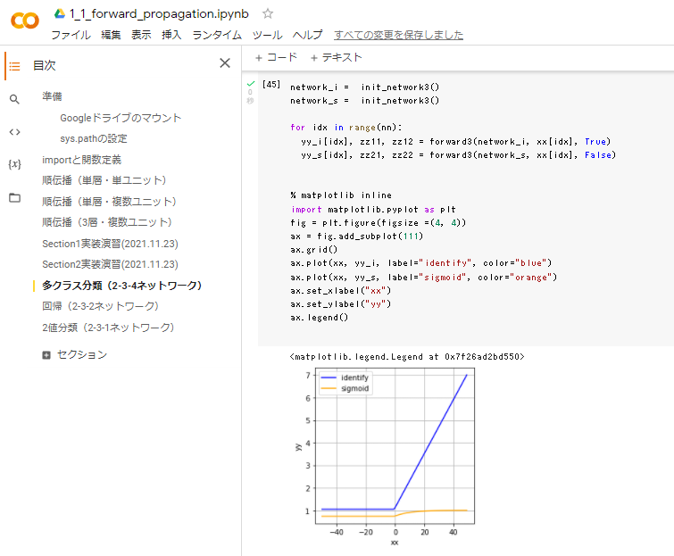

# Section2: 活性化関数

## 1. 要点まとめ

活性化関数とは、次の層への出力の大きさを決める関数である。
非線形の関数にすることで、ニューラルネットワークの表現力が高まる。
活性化関数により、ノードの総入力uiから次の層への出力値が算出される。

よく使われる活性化関数は以下。

| 活性化関数 | 説明 |
|:-----------|:------------|
| ステップ関数 | 閾値を超えたら発火する関数。出力は2値。現在はほとんど使われない |
| シグモイド関数 | 0～1を緩やかに変化する関数。勾配消失問題を引き起こしてしまう |
| ReLU関数 | 0以下の値を0にする関数。現在最もよく使われる関数。主に中間層で使われる |
| ソフトマックス関数 | シグモイド関数を、入力がベクトルとなるよう拡張した関数。主に、分類モデルの出力層で使われる |
| 恒等関数 | 入力をそのまま返す関数。主に、回帰モデルの出力層で使われる |


※ソフトマックス関数、恒等関数は図示省略


-----
## 2. 実装演習

1_1_forward_propagation.ipynbの「順伝播（3層・複数ユニット）」のコードにおいて、出力層の活性化関数をシグモイド関数に変更したコードを作成し、実行結果を元コード（出力層の活性化関数＝恒等関数）と比較する。


``` python
from google.colab import drive
import sys
import numpy as np
from common import functions

drive.mount('/content/drive')
sys.path.append('/content/drive/My Drive/studyAI/DNN_code_colab_lesson_1_2')

# ネートワークを作成(入力、出力ともにスカラー)
def init_network3():
    network = {}
    
    network['W1'] = np.array([
        [0.1, 0.3, 0.5]
    ])
    network['W2'] = np.array([
        [0.1, 0.4],
        [0.2, 0.5],
        [0.3, 0.6]
    ])
    network['W3'] = np.array([
        [0.1],
        [0.2]
    ])
    network['b1'] = np.array([0.1, 0.2, 0.3])
    network['b2'] = np.array([0.1, 0.2])
    network['b3'] = np.array([1])

    return network

# プロセスを作成
# x：入力値
# is_act_i: True=恒等関数、False=シグモイド関数
def forward3(network, x, is_act_i):
    
    W1, W2, W3 = network['W1'], network['W2'], network['W3']
    b1, b2, b3 = network['b1'], network['b2'], network['b3']
    
    # 1層の総入力
    u1 = np.dot(x, W1) + b1
    
    # 1層の総出力
    z1 = functions.relu(u1)
    
    # 2層の総入力
    u2 = np.dot(z1, W2) + b2
    
    # 2層の総出力
    z2 = functions.relu(u2)

    # 出力層の総入力
    u3 = np.dot(z2, W3) + b3
    
    # 出力層の総出力
    if is_act_i==True:
      y = u3
    else:
      y = functions.sigmoid(u3)

    return y, z1, z2


nn = 100
xx = np.arange(-nn/2,nn/2)
yy_i = np.empty((nn,1))
yy_s = np.empty((nn,1))

network_i =  init_network3()
network_s =  init_network3()

for idx in range(nn):
  yy_i[idx], zz11, zz12 = forward3(network_i, xx[idx], True)
  yy_s[idx], zz21, zz22 = forward3(network_s, xx[idx], False)


% matplotlib inline
import matplotlib.pyplot as plt
fig = plt.figure(figsize =(4, 4))
ax = fig.add_subplot(111)
ax.grid()
ax.plot(xx, yy_i, label="identify", color="blue")
ax.plot(xx, yy_s, label="sigmoid", color="orange")
ax.set_xlabel("xx[][0]")
ax.set_ylabel("yy")
ax.legend()

``` 

実行結果（snapshot）は以下

- シグモイド（オレンジ）の結果は、全ての入力に対して、出力＝0～1におさまっている。
- それに対し、恒等関数（青線）の結果は、出力＝一定値（≒1）以上となっており値域が限定されていない。
- 中間層の活性化関数＝ReLU関数の効果として、入力＝負の場合に、恒等関数（青線）の結果が全て一定値となっている。




-----
## 3. 確認テスト


- 線形
  - 入力と出力が比例関係にある状態。2次元だと１本の線で表される
  - 加法性（入力同士の加算＝出力の加算）、斉次性（入力の定数倍＝出力の定数倍）を満たす
- 非線形
  - 入力と出力が比例関係にない状態。2次元だと曲線、もしくは折れ線等で表される
  - 加法性、斉次性を満たさない


-----


1_1_forward_propagation.ipynbの「順伝播（3層・複数ユニット）」から抜き出した結果は以下

``` python
# 1層の総出力
z1 = functions.relu(u1)
# 2層の総出力
z2 = functions.relu(u2)
``` 
