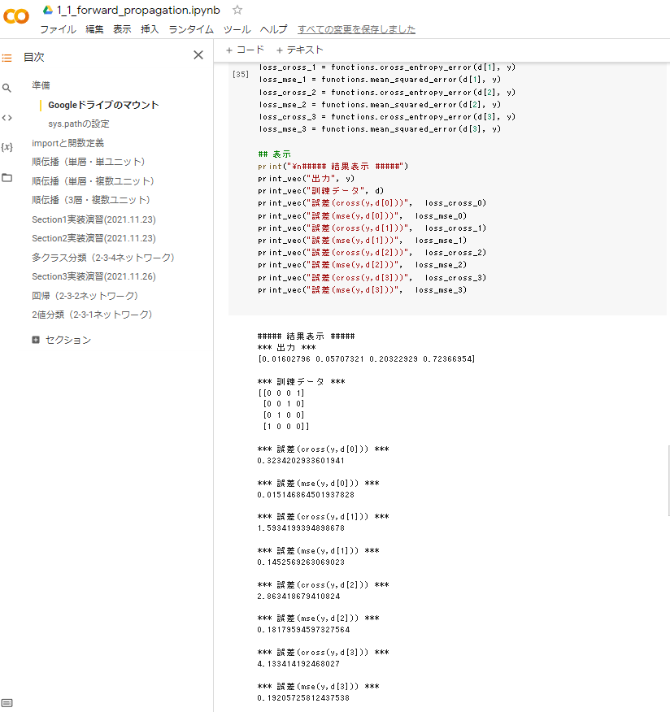
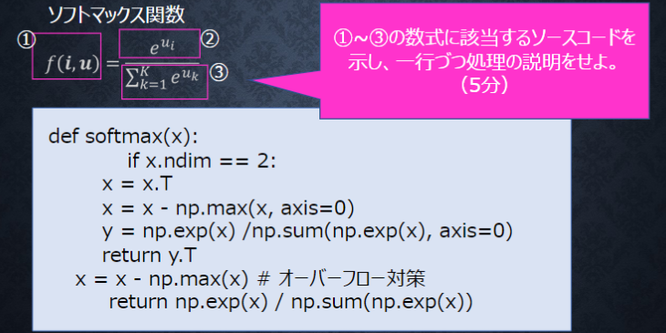
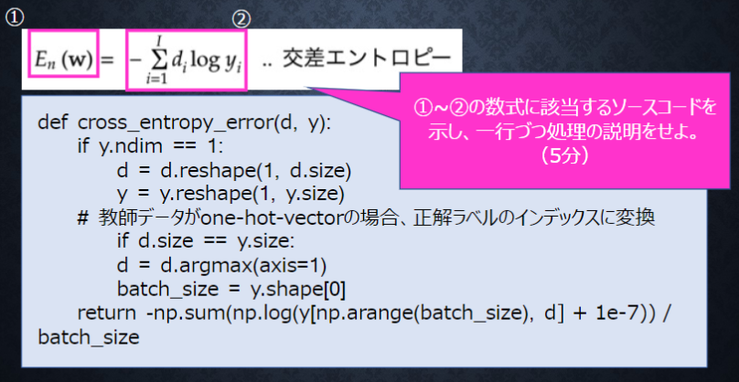

# Section3: 出力層

## 1. 要点まとめ

出力層の役割は、ニューラルネットワークで推定したい情報を出力することである。

活性化関数は、中間層でも適用されるが、中間層と出力層では活性化関数の役割が異なる（以下）

- 中間層：情報を抽出するため、信号の強弱を調整
- 出力層：
   - 回帰問題の場合は、信号の大きさ（比率）を変えない
   - 分類問題の場合は、値域：0～1の確率で、総和=1となるよう変換

誤差関数は、ニューラルネットワークと訓練データ（正解）の比較をする関数であり、正解との誤差を出力する。

出力層の活性化関数と誤差関数は、問題（回帰 or 2値分類 or 多クラス分類）によって最適な関数が決まっており、通常は下表の組み合わせを適用する。

| -- | 回帰 | 2値分類 | 多クラス分類 |
|:-----------|:------------|:------------|:------------|
| 活性化関数 | 恒等写像 | シグモイド関数 | ソフトマックス関数 | 
| 誤差関数 | 2乗誤差(平均2乗誤差) | クロスエントロピー | クロスエントロピー  | 


-----
## 2. 実装演習

1_1_forward_propagation.ipynbの「多クラス分類（2-3-4ネットワーク）」のコードにおいて、誤差関数＝平均2乗誤差に変更したコードを作成し、実行＆評価結果を元コード（誤差関数＝クロスエントロピー）と比較する。

``` python
from google.colab import drive
import sys
import numpy as np
from common import functions

drive.mount('/content/drive')
sys.path.append('/content/drive/My Drive/studyAI/DNN_code_colab_lesson_1_2')

def print_vec(text, vec):
    print("*** " + text + " ***")
    print(vec)
    #print("shape: " + str(x.shape))
    print("")

# ネートワークを作成
def init_network_sec3():
    network = {}
    network['W1'] = np.array([
        [0.1, 0.3, 0.5],
        [0.2, 0.4, 0.6]
    ])
    network['W2'] = np.array([
        [0.1, 0.4, 0.7, 1.0],
        [0.2, 0.5, 0.8, 1.1],
        [0.3, 0.6, 0.9, 1.2]
    ])
    network['b1'] = np.array([0.1, 0.2, 0.3])
    network['b2'] = np.array([0.1, 0.2, 0.3, 0.4])
    return network

# プロセスを作成
# x：入力値
def forward_sec3(network, x):
    W1, W2 = network['W1'], network['W2']
    b1, b2 = network['b1'], network['b2']
    
    # 1層の総入力
    u1 = np.dot(x, W1) + b1
    # 1層の総出力
    z1 = functions.relu(u1)
    # 2層の総入力
    u2 = np.dot(z1, W2) + b2
    # 出力値
    y = functions.softmax(u2)        
    return y, z1

## 事前データ
# 入力値
x = np.array([1., 2.])

# 目標出力
d = np.array([[0, 0, 0, 1],[0, 0, 1, 0],[0, 1, 0, 0],[1, 0, 0, 0]])

# ネットワークの初期化
network =  init_network_sec3()

# 出力
y, z1 = forward_sec3(network, x)

# 誤差
loss_cross_0 = functions.cross_entropy_error(d[0], y)
loss_mse_0 = functions.mean_squared_error(d[0], y)
loss_cross_1 = functions.cross_entropy_error(d[1], y)
loss_mse_1 = functions.mean_squared_error(d[1], y)
loss_cross_2 = functions.cross_entropy_error(d[2], y)
loss_mse_2 = functions.mean_squared_error(d[2], y)
loss_cross_3 = functions.cross_entropy_error(d[3], y)
loss_mse_3 = functions.mean_squared_error(d[3], y)

## 表示
print("\n##### 結果表示 #####")
print_vec("出力", y)
print_vec("訓練データ", d)
print_vec("誤差(cross(y,d[0]))",  loss_cross_0)
print_vec("誤差(mse(y,d[0]))",  loss_mse_0)
print_vec("誤差(cross(y,d[1]))",  loss_cross_1)
print_vec("誤差(mse(y,d[1]))",  loss_mse_1)
print_vec("誤差(cross(y,d[2]))",  loss_cross_2)
print_vec("誤差(mse(y,d[2]))",  loss_mse_2)
print_vec("誤差(cross(y,d[3]))",  loss_cross_3)
print_vec("誤差(mse(y,d[3]))",  loss_mse_3)
``` 

実行結果（snapshot）は以下

- 平均2乗誤差(mse)で出力した誤差は、クロスエントロピー(cross)の誤差と比較して、正解との差が大きくなっても（d[2],d[3]）誤差値の増加が小さい。
- このため、分類問題（確率出力）に対して平均2乗誤差を適用すると、誤差逆伝搬で伝搬される誤差値が小さくなり、学習が進みにくくなると考えられる。



-----
## 3. 確認テスト


- 二乗する理由
  - 出力と訓練データの差を常に正にすることで、正負が打ち消しあって誤差が不当に小さくなることを防ぐ
- 1/2の意味
   - 微分した式を簡略化し（y-dとする）、学習時の誤差逆伝搬をやりやすくする


-----


common/functions.pyからソフトマックス関数定義を抜き出したソースは以下。処理の説明を、以下ソースのコメントに記載。

``` python
# 出力層の活性化関数
# ソフトマックス関数
def softmax(x):
    if x.ndim == 2:
        # ミニバッチ用
        x = x.T
        x = x - np.max(x, axis=0)
        
        # ①: 下式y
        # ②: 下式np.exp(x)                  e^uiの計算
        # ③: 下式np.sum(np.exp(x), axis=0)  Σk(e^uk)の計算
        y = np.exp(x) / np.sum(np.exp(x), axis=0)
        return y.T

    x = x - np.max(x) # オーバーフロー対策

    # ①: return値
    # ②: 下式np.exp(x)          e^uiの計算
    # ③: 下式np.sum(np.exp(x))  Σk(e^uk)の計算
    return np.exp(x) / np.sum(np.exp(x))
``` 

-----


common/functions.pyからクロスエントロピー関数定義を抜き出したソースは以下。処理の説明を、以下ソースのコメントに記載。

``` python
# 誤差関数
# クロスエントロピー
def cross_entropy_error(d, y):
    if y.ndim == 1:
        # y=[x,x,..,x] → y=[[x,x,..,x]] に変換
        d = d.reshape(1, d.size)
        y = y.reshape(1, y.size)
        
    # 教師データがone-hot-vectorの場合、正解ラベルのインデックスに変換
    if d.size == y.size:
        # 例: d=[[0,0,0,1]]の場合, d=3に変換される
        d = d.argmax(axis=1)

    # y.ndim=1(1行)の場合は、batch_size=1         
    batch_size = y.shape[0]

    # np.arange(batch_size): 0～batch_size-1までの数列を生成。batch_size=1のときは0となる
    # y[np.arange(batch_size), d]:  di=1となるyiを取り出し(例:y=[0.1,0,2.0.8], d=[0,0,1]の場合は、0.8となる)
    # np.log(y[np.arange(batch_size), d]): 数式②で、di=1となるiでだけ log(yi)を計算. di=0となるiは計算省略
    # 1e-7: log(x)でx=0とならないよう微小値を加算
    # -np.sum(..) : di=1となる全てのiに対してlog(yi)計算結果を加算 ＆ 符号反転
    # return値が数式①に該当
    return -np.sum(np.log(y[np.arange(batch_size), d] + 1e-7)) / batch_size
```
