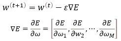
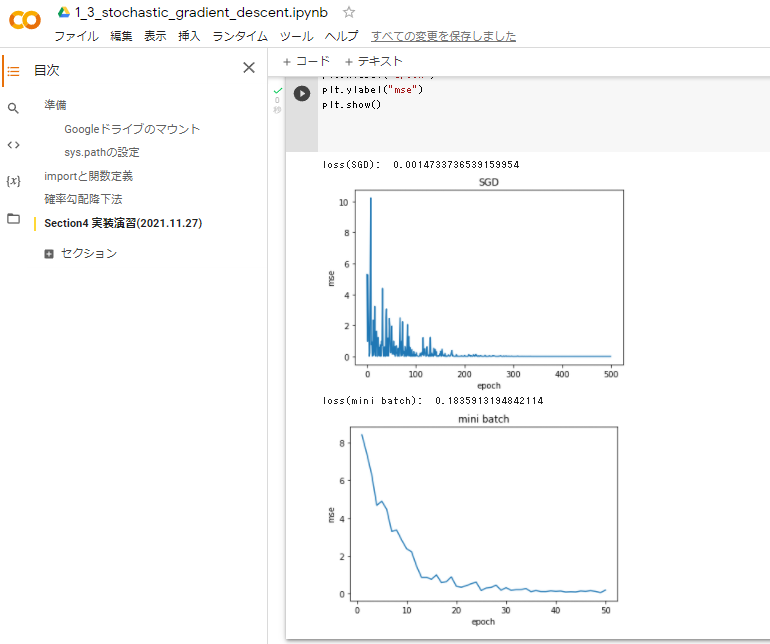
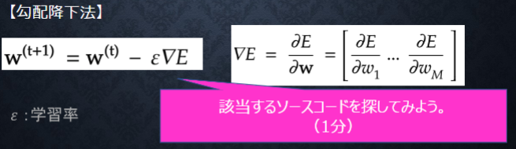
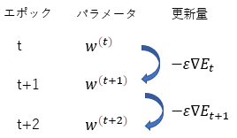

# Section4: 勾配降下法

## 1. 要点まとめ

勾配降下法とは、ニューラルネットワークの誤差E(w)を最小化するパラメータwを推定する手法である。

下式を繰り返し計算することで、パラメータwを少しずつ求める値(Eを最小にするw)に近づけていく。εは学習率であり、大きすぎるとwが発散するリスクが高まり、小さすぎるとwが局所解に陥るリスクが高まったり学習に時間がかかったりする。



勾配降下法には、以下アルゴリズムがある。Adamが比較的よく使われる。
- Momentum
- AdaGrad
- Adadelta
- Adam

「ニューラルネットワークで推論 → 出力の誤差を計算 → パラメータwを更新」というプロセス１回分をエポックと呼ぶ。

通常の勾配降下法では１エポックに学習データの全サンプルを用いる（バッチ学習）が、全サンプルを用いずにランダムに選択した１つのサンプルを用いる方法を確率的勾配降下法と呼ぶ。通常の勾配降下法と比べ、以下メリットがある。

- 計算コスト軽減
- 局所解に陥るリスク軽減
- オンライン学習が可能

一方、ミニバッチ勾配降下法では、ランダムに選択した複数のサンプルを１エポックに用いる方法である。通常の勾配降下法（バッチ学習）に対するメリットとしては以下が挙げられる。

- 小分けしたデータ単位でデータ並列化（SIMD）が可能　→　学習時間の短縮

<div style="page-break-before:always"></div>

-----
## 2. 実装演習

1_3_stochastic_gradient_descent.ipynbの「確率勾配降下法」のコードをベースに、ミニバッチ勾配降下法のコードを作成し、学習の様子を元コード（確率勾配降下法）と比較する。

``` python
from google.colab import drive
import sys
drive.mount('/content/drive')
sys.path.append('/content/drive/My Drive/studyAI/DNN_code_colab_lesson_1_2')

import numpy as np
from common import functions
import matplotlib.pyplot as plt

def print_vec(text, vec):
    print("*** " + text + " ***")
    print(vec)
    #print("shape: " + str(x.shape))
    print("")

def f(x):
    y = 3 * x[0] + 2 * x[1]
    return y

# 初期設定
def init_network2():
    network = {}
    nodesNum = 10
    network['W1'] = np.random.randn(2, nodesNum)
    network['W2'] = np.random.randn(nodesNum)
    network['b1'] = np.random.randn(nodesNum)
    network['b2'] = np.random.randn()
    return network

# 順伝播
def forward2(network, x):
    W1, W2 = network['W1'], network['W2']
    b1, b2 = network['b1'], network['b2']
    u1 = np.dot(x, W1) + b1
    z1 = functions.relu(u1)
    
    u2 = np.dot(z1, W2) + b2
    y = u2    
    return z1, y

# 誤差逆伝播
def backward2(network, x, d, z1, y, batch_size):
    grad = {}
    
    W1, W2 = network['W1'], network['W2']
    b1, b2 = network['b1'], network['b2']

    # 出力層でのデルタ
    delta2 = functions.d_mean_squared_error(d, y)

    if batch_size==1:
      # b2の勾配
      grad['b2'] = np.sum(delta2, axis=0)
      # W2の勾配
      grad['W2'] = np.dot(z1.T, delta2)
      # 中間層でのデルタ
      delta1 = np.dot(delta2, W2.T) * functions.d_sigmoid(z1)
      delta1 = delta1[np.newaxis, :]
      # b1の勾配
      grad['b1'] = np.sum(delta1, axis=0)
      # W1の勾配
      x = x[np.newaxis, :]
      grad['W1'] = np.dot(x.T, delta1)

    else:
      delta2_mean = np.mean(delta2)
      xs = x[0]     # ミニバッチの代表値をとる、という実装でよいのか？が不明..
      z1s = z1[0]   # ミニバッチの代表値をとる、という実装でよいのか？が不明..

      # b2の勾配
      grad['b2'] = np.sum(delta2_mean, axis=0)
      # W2の勾配
      grad['W2'] = np.dot(z1s.T, delta2_mean)
      # 中間層でのデルタ
      delta1 = np.dot(delta2_mean, W2.T) * functions.d_sigmoid(z1s)
      delta1 = delta1[np.newaxis, :]
      # b1の勾配
      grad['b1'] = np.sum(delta1, axis=0)
      # W1の勾配
      xs = xs[np.newaxis, :]
      grad['W1'] = np.dot(xs.T, delta1)

    return grad

# サンプルデータを作成
data_sets_size = 1000
data_sets = [0 for i in range(data_sets_size)]

for i in range(data_sets_size):
    data_sets[i] = {}
    # ランダムな値を設定
    data_sets[i]['x'] = np.random.rand(2)   
    # 目標出力を設定
    data_sets[i]['d'] = f(data_sets[i]['x'])

# 学習率
learning_rate = 0.07
# 抽出数
data_num = 500
# データのランダム抽出
random_datasets = np.random.choice(data_sets, data_num)


# -----------------
# 確率的勾配降下法
# -----------------
losses_s = []
epoch = data_num

# パラメータの初期化
network_s = init_network2()

# 勾配降下の繰り返し
for dataset in random_datasets:
    x, d = dataset['x'], dataset['d']
    z1, y = forward2(network_s, x)
    grad = backward2(network_s, x, d, z1, y, 1)
    # パラメータに勾配適用
    for key in ('W1', 'W2', 'b1', 'b2'):
        network_s[key]  -= learning_rate * grad[key]

    # 誤差
    loss = functions.mean_squared_error(d, y)
    losses_s.append(loss)

# 結果表示 
print("loss(SGD): ", losses_s[epoch-1])
lists = range(epoch)

plt.plot(lists, losses_s, '-')
plt.title("SGD")
plt.xlabel("epoch")
plt.ylabel("mse")
plt.show()

# -----------------
# ミニバッチ勾配降下法
# -----------------
epochs = []
losses_b = []
batch_size = 10

# パラメータの初期化
network_b = init_network2()

# 勾配降下の繰り返し
xs = np.empty((batch_size,2))
ds = np.empty(batch_size)

epoch = 0

for idx_d in range(0,data_num,batch_size):
  batch_dataset = random_datasets[idx_d:idx_d+batch_size-1]
  for idx_b in range(batch_size-1):
    xs[idx_b] = batch_dataset[idx_b]['x']
    ds[idx_b] = batch_dataset[idx_b]['d']

  z1, y = forward2(network_b, xs)
  grad = backward2(network_b, xs, ds, z1, y, batch_size)
  # パラメータに勾配適用
  for key in ('W1', 'W2', 'b1', 'b2'):
      network_b[key]  -= learning_rate * grad[key]

  # 誤差
  loss = functions.mean_squared_error(ds, y)
  epoch+=1
  epochs.append(epoch)
  losses_b.append(loss)

# 結果表示 
print("loss(mini batch): ", losses_b[epoch-1])
plt.plot(epochs, losses_b, '-')
plt.title("mini batch")
plt.xlabel("epoch")
plt.ylabel("mse")
plt.show()

```

<div style="page-break-before:always"></div>

実行結果は下図

- 「確率勾配降下法」(SGD)のほうがエポック数が多い（※）ためか、最終的な誤差値(loss)は小さい。
- ただ、「ミニバッチ勾配降下法」(mini batch)のほうが比較的安定的に誤差が減少しているため、こちらのほうが学習がスムーズに進むと考えられる。

(※)同じ学習データセットで比較したかったので、データ数をそろえる実装にしたことによる



<div style="page-break-before:always"></div>

-----
## 3. 確認テスト



1_3_stochastic_gradient_descent.ipynbから、
勾配降下法に相当するソースを抜き出した結果は以下。

``` python
    # ∇E = dE / dw
    grad = backward(x, d, z1, y)

    # w(t+1) = w(t) - ε ∇E
    for key in ('W1', 'W2', 'b1', 'b2'):
        network[key]  -= learning_rate * grad[key]
```

<div style="page-break-before:always"></div>

-----


学習データを、都度得られたデータを与えて学習すること。システム運用中に得られたデータを使って学習する、といったことを指す。

<div style="page-break-before:always"></div>

-----


エポック毎に、パラメータ$w^t$を更新量$-ε∇E_t$で更新する。$E_t$は、パラメータ$w^t$のネットワークで得られた出力の誤差を表す。


