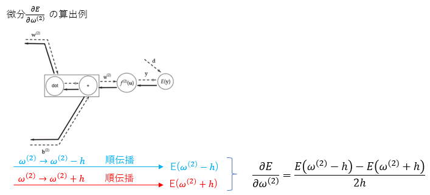
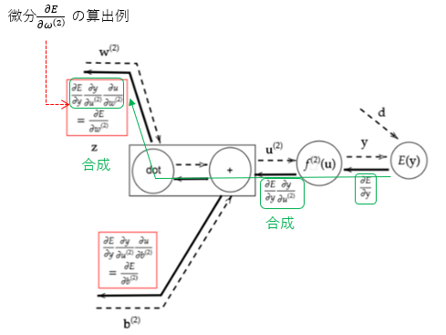
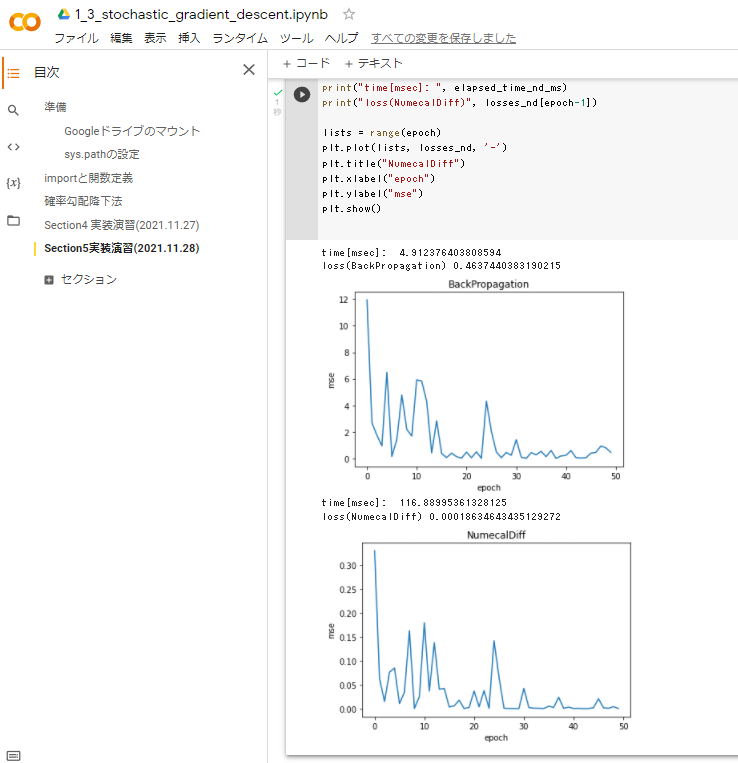
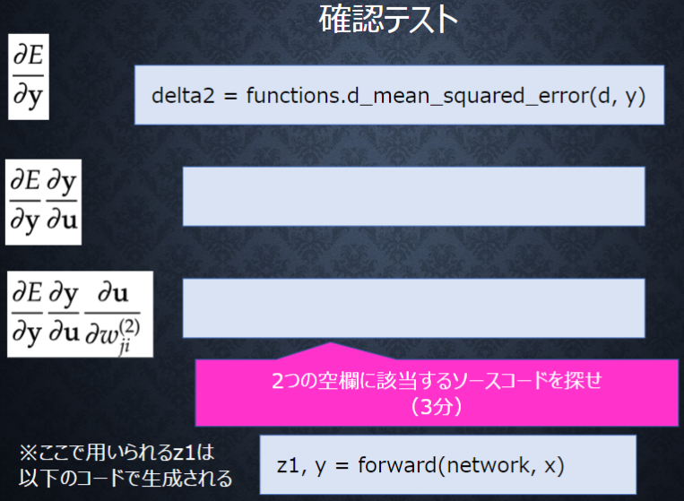

# Section5: 誤差逆伝播法

## 1. 要点まとめ

誤差逆伝播とは、勾配降下法おいて、誤差勾配∇Eの算出＆パラメータ更新を効率的に行う方法である。

誤差勾配∇Eの算出＆パラメータ更新の計算は、数値微分を使った方法だと以下となる。

- あるパラメータ$w_m$に対する微分値を、順伝播で算出 (h=微小量)
    $$\frac{dE}{dw_m} = \frac{E(w_m + h) - E(w_m - h)}{2h}$$
- 算出した$\frac{dE(w)}{dw}$を使ってパラメータ$w_m$を更新
- 上記を全てのパラメータ$w_m$に対して実行



この方法だと、１回の学習で(パラメータ数 x 2)回の順伝播を実行することになり、パラメータ数が多いと計算に非常に時間がかかる。

これを解消するための方法が誤差逆伝播法となる。方法は以下。
個々のノードの結果を再利用できるため、計算量が大幅に削減できる。

- ノード単位で、微分$\frac{dz}{du}$ を算出　（u:ノード入力, z:ノード出力）
- ネットワークを逆にたどり（逆伝播）ながら、ノード単位の微分を微分の連鎖律を使って順次合成




<div style="page-break-before:always"></div>

-----
## 2. 実装演習

1_3_stochastic_gradient_descent.ipynbの「確率勾配降下法」のコードをベースに、数値微分による学習コードを作成し、誤差逆伝播との実行時間の差を確認する。

``` python
from google.colab import drive
import sys
drive.mount('/content/drive')
sys.path.append('/content/drive/My Drive/studyAI/DNN_code_colab_lesson_1_2')
import numpy as np
from common import functions
import matplotlib.pyplot as plt

def print_vec(text, vec):
    print("*** " + text + " ***")
    print(vec)
    #print("shape: " + str(x.shape))
    print("")

# サンプルとする関数
#yの値を予想するAI
def f(x):
    y = 3 * x[0] + 2 * x[1]
    return y

# 初期設定
def init_network3():
    network = {}
    nodesNum = 10
    network['W1'] = np.random.randn(2, nodesNum)
    network['W2'] = np.random.randn(nodesNum)
    network['b1'] = np.random.randn(nodesNum)
    network['b2'] = np.random.randn()
    return network

# 順伝播
def forward3(network, x):
    W1, W2 = network['W1'], network['W2']
    b1, b2 = network['b1'], network['b2']
    u1 = np.dot(x, W1) + b1
    z1 = functions.relu(u1)
    u2 = np.dot(z1, W2) + b2
    y = u2
    return z1, y

# 誤差逆伝播
def backward3(network, x, d, z1, y):
    grad = {}
    
    W1, W2 = network['W1'], network['W2']
    b1, b2 = network['b1'], network['b2']

    # 出力層でのデルタ
    delta2 = functions.d_mean_squared_error(d, y)
    # b2の勾配
    grad['b2'] = np.sum(delta2, axis=0)
    # W2の勾配
    grad['W2'] = np.dot(z1.T, delta2)
    # 中間層でのデルタ
    delta1 = np.dot(delta2, W2.T) * functions.d_relu(z1)
    delta1 = delta1[np.newaxis, :]
    # b1の勾配
    grad['b1'] = np.sum(delta1, axis=0)
    x = x[np.newaxis, :]
    # W1の勾配
    grad['W1'] = np.dot(x.T, delta1)
    return grad

# 数値微分
def numerical_diff(network_org, x, d):
    h = 1e-5
    
    W1_org, W2_org = network_org['W1'], network_org['W2']
    b1_org, b2_org = network_org['b1'], network_org['b2']

    # W1の更新(※ndim≧2前提)
    dE_dW1 = np.zeros(W1_org.shape)
    for idx_row in range(W1_org.shape[0]):
      for idx_col in range(W1_org.shape[1]):
        network_tmp = network_org.copy()
        W1 = network_tmp['W1']

        # E(w+h)の計算
        W1[idx_row][idx_col] += h
        network_tmp['W1'] = W1
        z1_tmp, y_tmp = forward3(network_tmp, x)
        E_hp = functions.mean_squared_error(d, y_tmp)
        # E(w-h)の計算
        W1[idx_row][idx_col] -= 2*h
        network_tmp['W1'] = W1
        z1_tmp, y_tmp = forward3(network_tmp, x)
        E_hm = functions.mean_squared_error(d, y_tmp)
        # dE/dw1の計算
        dE_dW1[idx_row][idx_col] = (E_hp - E_hm) / (2*h)

    # W2の更新(※ndim=1前提)
    dE_dW2 = np.zeros(W2_org.shape)
    for idx_col in range(W2_org.shape[0]):
      network_tmp = network_org.copy()
      W2 = network_tmp['W2']

      # E(w+h)の計算
      W2[idx_col] += h
      network_tmp['W2'] = W2
      z1_tmp, y_tmp = forward3(network_tmp, x)
      E_hp = functions.mean_squared_error(d, y_tmp)
      # E(w-h)の計算
      W2[idx_col] -= 2*h
      network_tmp['W2'] = W2
      z1_tmp, y_tmp = forward3(network_tmp, x)
      E_hm = functions.mean_squared_error(d, y_tmp)
      # dE/dw2の計算
      dE_dW2[idx_col] = (E_hp - E_hm) / (2*h)

    # b1の更新(※ndim=1前提)
    dE_db1 = np.zeros(b1_org.shape)
    for idx_col in range(b1_org.shape[0]):
      network_tmp = network_org.copy()
      b1 = network_tmp['b1']

      # E(w+h)の計算
      b1[idx_col] += h
      network_tmp['b1'] = b1
      z1_tmp, y_tmp = forward3(network_tmp, x)
      E_hp = functions.mean_squared_error(d, y_tmp)
      # E(w-h)の計算
      b1[idx_col] -= 2*h
      network_tmp['b1'] = b1
      z1_tmp, y_tmp = forward3(network_tmp, x)
      E_hm = functions.mean_squared_error(d, y_tmp)
      # dE/db1の計算
      dE_db1[idx_col] = (E_hp - E_hm) / (2*h)
    
    # b2の更新(※スカラー前提)
    network_tmp = network_org.copy()
    b2 = network_tmp['b2']

    # E(w+h)の計算
    b2 += h
    network_tmp['b2'] = b2
    z1_tmp, y_tmp = forward3(network_tmp, x)
    E_hp = functions.mean_squared_error(d, y_tmp)
    # E(w-h)の計算
    b2 -= 2*h
    network_tmp['b2'] = b2
    z1_tmp, y_tmp = forward3(network_tmp, x)
    E_hm = functions.mean_squared_error(d, y_tmp)
    # dE/db2の計算
    dE_db2 = (E_hp - E_hm) / (2*h)

    grad = {}
    grad['W1'] = dE_dW1
    grad['W2'] = dE_dW2
    grad['b1'] = dE_db1
    grad['b2'] = dE_db2

    return grad

# サンプルデータを作成
data_sets_size = 100
data_sets = [0 for i in range(data_sets_size)]
for i in range(data_sets_size):
    data_sets[i] = {}
    data_sets[i]['x'] = np.random.rand(2)
    data_sets[i]['d'] = f(data_sets[i]['x'])

# 抽出数
epoch = 50
# データのランダム抽出
random_datasets = np.random.choice(data_sets, epoch)

# 学習率
learning_rate = 0.07

import time

# --------------------
# 誤差逆伝播
# --------------------
network_bk = init_network3()

start = time.time()

losses_bk = []
for dataset in random_datasets:
    x, d = dataset['x'], dataset['d']
    z1, y = forward3(network_bk, x)
    grad = backward3(network_bk, x, d, z1, y)
    # パラメータに勾配適用
    for key in ('W1', 'W2', 'b1', 'b2'):
        network_bk[key]  -= learning_rate * grad[key]

    # 誤差
    loss = functions.mean_squared_error(d, y)
    losses_bk.append(loss)

elapsed_time_bk_ms = (time.time() - start) * 1000

# 結果表示
print("time[msec]: ", elapsed_time_bk_ms)
print("loss(BackPropagation)", losses_bk[epoch-1])
lists = range(epoch)
plt.plot(lists, losses_bk, '-')
plt.title("BackPropagation")
plt.xlabel("epoch")
plt.ylabel("mse")
plt.show()

# --------------------
# 数値微分
# --------------------
network_nd = init_network3()

start = time.time()

losses_nd = []
for dataset in random_datasets:
    x, d = dataset['x'], dataset['d']
    grad = numerical_diff(network_nd, x, d)
    
    # パラメータに勾配適用
    for key in ('W1', 'W2', 'b1', 'b2'):
        network_nd[key]  -= learning_rate * grad[key]

    # 誤差
    z1, y = forward3(network_nd, x)
    loss = functions.mean_squared_error(d, y)
    losses_nd.append(loss)

elapsed_time_nd_ms = (time.time() - start) * 1000

# 結果表示
print("time[msec]: ", elapsed_time_nd_ms)
print("loss(NumecalDiff)", losses_nd[epoch-1])

lists = range(epoch)
plt.plot(lists, losses_nd, '-')
plt.title("NumecalDiff")
plt.xlabel("epoch")
plt.ylabel("mse")
plt.show()

``` 

<div style="page-break-before:always"></div>

実行結果は以下。

- 誤差逆伝播の実行時間 ≒ 5[ms]
- 数値微分の実行時間 ≒ 117[ms]

パラメータ数41個のかなり小規模なネットワークだが、それでも約23倍もの差がついた。
誤差逆伝播の効率の良さを確認できた。



<div style="page-break-before:always"></div>

-----
## 3. 確認テスト


1_3_stochastic_gradient_descent.ipynbから、該当コードを抽出。

``` python
    # 出力層でのデルタ
    delta2 = functions.d_mean_squared_error(d, y)
    # 中間層でのデルタ
    delta1 = np.dot(delta2, W2.T) * functions.d_relu(z1)
```

<div style="page-break-before:always"></div>

-----



1_3_stochastic_gradient_descent.ipynbから、該当コードを抽出。

$\frac{dE}{dy} \frac{dy}{du}$ の該当コード 

``` python
    delta2 = functions.d_mean_squared_error(d, y)
```
※y=u（恒等写像）なので$\frac{dy}{du}=1$

---

$\frac{dE}{dy} \frac{dy}{du} \frac{du}{dw^{(2)}_{ji}}$ の該当コード
``` python
    delta1 = np.dot(delta2, W2.T) * functions.d_sigmoid(z1)
```
