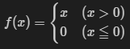
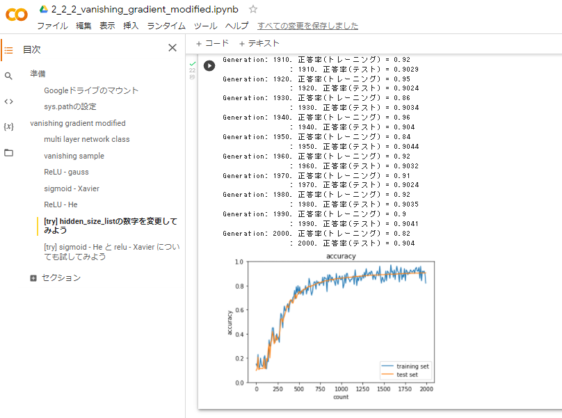
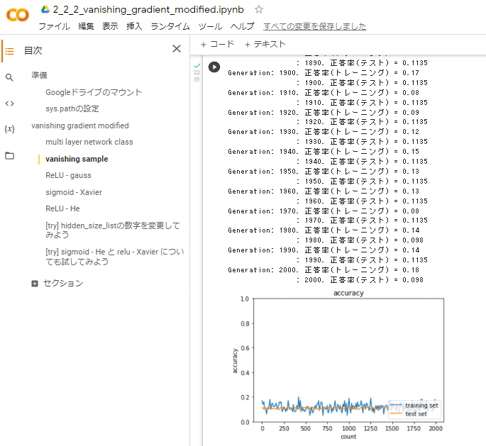
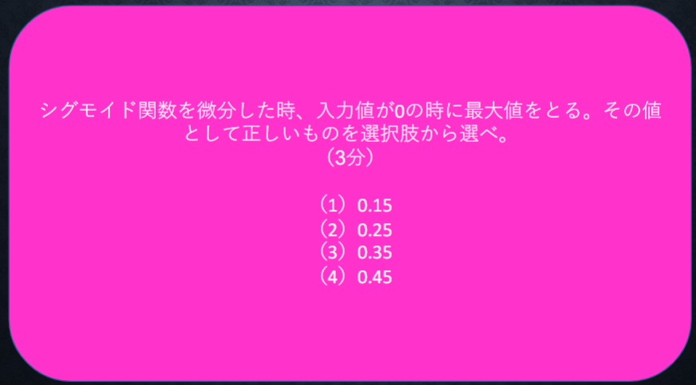
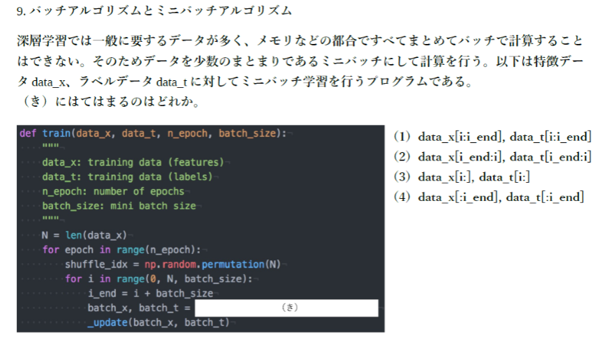

# Section1: 勾配消失問題

## 1. 要点まとめ

勾配消失問題とは、誤差逆伝播法において、下位層（入力層）に進んでいくにつれて勾配が小さくなり学習が進まなくなってしまう問題である。

活性化関数にシグモイド関数を使うと、シグモイド関数の微分の最大値が0.25であるため、下位層に進むにつれて微分の連鎖律で積算する度に微分値が急激に小さくなってしまう。微分値が小さいとパラメータ更新量が非常に小さくなるため、学習がほとんど進まなくなる。
また、浮動小数の桁落ちにより微分値=0になると、以降の層では学習がまったく進まなくなる。勾配消失問題に対しては、以下解決方法がある。

- 活性化関数の選択
- 重みの初期値設定
- バッチ正規化

<div style="page-break-before:always"></div>

### 1.1 活性化関数

勾配消失問題が起きにくく現在最も使われるのはReLU関数である（下式）。微分値は0,1の2値となるので、重みの更新が必要な箇所にだけ、微分値が小さくならずしっかり更新がかかるようになる。また、不必要な重みがなくなることでモデルのスパース化にも効果がある。


<!--
$$
f(x) = 
  \begin{cases}
    x & (x > 0) \\
    0 & (x ≦ 0) \\
  \end{cases}
$$
-->

### 1.2 重みの初期値設定

ニューラルネットワークに多彩な推論ができるよう、重みはなるべくばらつきがあるほうがよい。そのため、重みの初期化は乱数を用いて、ばらつきのある初期値に設定する。とはいえ無秩序な乱数ではなく標準正規分布（平均0、分散1）に基づいた乱数で設定する。

ただ、これだけだと重みの初期値が0,1に偏ってしまい勾配消失問題が発生してしまうので、以下方法が考え出されている。活性化関数によって使い分ける。

| -- | 内容 | 活性化関数 |
|:-----------|:------------|:------------|
| Xavier | 標準正規分布の値を前の層のノード数の平方根で除算した値を設定 | シグモイド関数、tanh関数 |
| He | 標準正規分布の値を前の層のノード数の平方根で除算した値に$\sqrt{2}$をかけた値を設定 | ReLU関数 | 

### 1.3 バッチ正規化

バッチ正規化とは、ミニバッチ単位でデータの偏りを抑制する方法である。具体的には、学習データを平均0、分散1になるように正規化する。正規化により以下効果が現れる。

- 学習の安定化＆高速化
- 過学習の抑制


<div style="page-break-before:always"></div>

-----
## 2. 実装演習

2_2_2_vanishing_gradient_modified.ipynbの「sigmoid - gauss」のコードで、hidden_size_listを１レイヤ減らして、勾配消失の緩和有無を確認する。

``` python
# MultiLayerNetクラス定義コードは省略

# データの読み込み
(x_train, d_train), (x_test, d_test) = load_mnist(normalize=True, one_hot_label=True)

print("データ読み込み完了")

# ★★隠れ層を2→1レイヤに変更。初期値はガウス分布のまま（Xavier, He未使用）★★
#network = MultiLayerNet(input_size=784, hidden_size_list=[40, 20], output_size=10, activation='sigmoid', weight_init_std=0.01)
network = MultiLayerNet(input_size=784, hidden_size_list=[40,], output_size=10, activation='sigmoid', weight_init_std=0.01)

iters_num = 2000
train_size = x_train.shape[0]
batch_size = 100
learning_rate = 0.1

train_loss_list = []
accuracies_train = []
accuracies_test = []

plot_interval=10

for i in range(iters_num):
    batch_mask = np.random.choice(train_size, batch_size)
    x_batch = x_train[batch_mask]
    d_batch = d_train[batch_mask]

    # 勾配
    grad = network.gradient(x_batch, d_batch)
    
    #for key in ('W1', 'W2', 'W3', 'b1', 'b2', 'b3'):
    for key in ('W1', 'W2', 'b1', 'b2'):
        network.params[key] -= learning_rate * grad[key]
    
    loss = network.loss(x_batch, d_batch)
    train_loss_list.append(loss)
    
    if (i + 1) % plot_interval == 0:
        accr_test = network.accuracy(x_test, d_test)
        accuracies_test.append(accr_test)        
        accr_train = network.accuracy(x_batch, d_batch)
        accuracies_train.append(accr_train)

        print('Generation: ' + str(i+1) + '. 正答率(トレーニング) = ' + str(accr_train))
        print('                : ' + str(i+1) + '. 正答率(テスト) = ' + str(accr_test))
        

lists = range(0, iters_num, plot_interval)
plt.plot(lists, accuracies_train, label="training set")
plt.plot(lists, accuracies_test,  label="test set")
plt.legend(loc="lower right")
plt.title("accuracy")
plt.xlabel("count")
plt.ylabel("accuracy")
plt.ylim(0, 1.0)
# グラフの表示
plt.show()
``` 

<div style="page-break-before:always"></div>

実行結果は以下。
- 学習が進むにつれて正解率が向上している。２レイヤの時と比べて勾配消失が緩和していることが確認できた。




参考：２レイヤ（オリジナルの「sigmoid - gauss」のコード）の結果↓



<div style="page-break-before:always"></div>

-----
## 3. 確認テスト


$$
\frac{dz}{dx} = \frac{dz}{dt}・\frac{dt}{dx} = 2t・1 = 2(x+y) 
$$

<div style="page-break-before:always"></div>

-----



<center>
(2) 0.25
</center>

<div style="page-break-before:always"></div>

-----


均一な重みとなることから、モデルの表現力が損なわれ、重みを多数持つ意味がなくなる。重みの更新も同じになってしまう。

<div style="page-break-before:always"></div>

-----


- 学習の安定化＆高速化
- 過学習の抑制
  
<div style="page-break-before:always"></div>

-----



(1) data_x[i:i_end], data_t[i:i_end]
