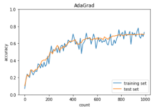
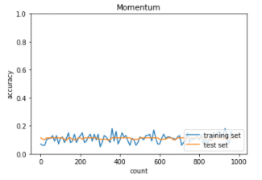
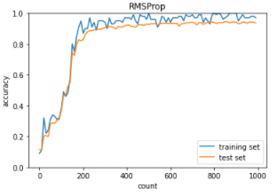
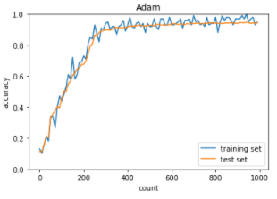

# Section2: 学習率最適化手法

## 1. 要点まとめ

勾配降下法の学習率は、小さすぎると収束に時間がかかったり局所解に陥るリスクが高まるし、大きすぎると最適解にたどりつかず発散するリスクが高まる。また、最適な学習率は個々の状況に応じて変化することから、個々の状況に適した学習率を動的に求める手法が提案されている。主な手法は以下。

- モメンタム
- AdaGrad
- RMSProp
- Adam

### 1.1 モメンタム

誤差勾配に基づく更新量$- ε∇E$に、前回の重み更新量を加えたものを今回の更新量とする手法である。計算式は以下。

$$V_t = μV_{t-1} - ε∇E$$ 
$$w^{t+1} = w^{t} + V_t$$
$$※μ:慣性$$

急勾配に差し掛かると一気に加速する、という特徴があり、大域的最適解にたどり着きやすい。


### 1.2 AdaGrad

これまでの誤差勾配$∇E$の大きさを記録する$h_t$を使って学習率を更新する手法である。計算式は以下。

$$h_0 = Θ$$
$$h_t = h_{t-1} + (∇E)^2$$
$$w^{t+1} = w^{t} - ε\frac{1}{\sqrt{h_t} + Θ}∇E$$

なめらかな勾配だと学習率が大きくなるため最適解に近づきやすくなる一方で、学習率が徐々に小さくなることで鞍点問題（山の峠で学習が停滞）を引き起こすことがある。

<div style="page-break-before:always"></div>

### 1.3 RMSProp

AdaGradの鞍点問題を解消する手法であり、これまでの誤差勾配$∇E$の大きさをどの程度反映するかをαで調整可能としたものである。計算式は以下。

$$h_0 = Θ$$
$$h_t = αh_{t-1} + (1-α)(∇E)^2$$
$$w^{t+1} = w^{t} - ε\frac{1}{\sqrt{h_t} + Θ}∇E$$

鞍点問題を引き起こさず局所解に陥るリスクが少ない。

### 1.4 Adam

モメンタム、AdaGrad（or RMSProp）のいいとこどりをした手法となる。計算式は以下。

$$m_t = ρ_1 m_{t-1} + (1-ρ_1)(∇E)$$
$$v_t = ρ_2 v_{t-1} + (1-ρ_2)(∇E)^2$$
$$\hat{m_t} = \frac{m_t}{1-ρ_1}$$
$$\hat{v_t} = \frac{v_t}{1-ρ_2}$$
$$w^{t+1} = w^{t} - \frac{η}{\sqrt{\hat{v_t} + ε}}\hat{m_t}$$


<div style="page-break-before:always"></div>

-----
## 2. 実装演習

2_4_optimizer.ipynbの「Momentum」のコードをベースにAdaGradを実装し、学習結果をモメンタムと比較する。

``` python
# MultiLayerNetのコードは掲載省略

# データの読み込み
(x_train, d_train), (x_test, d_test) = load_mnist(normalize=True, one_hot_label=True)

print("データ読み込み完了")

use_batchnorm = False
network = MultiLayerNet(input_size=784, hidden_size_list=[40, 20], 
                        output_size=10, activation='sigmoid', 
                        weight_init_std=0.01,
                        use_batchnorm=use_batchnorm)

iters_num = 1000

train_size = x_train.shape[0]
batch_size = 100
learn_rate = 0.01

train_loss_list = []
accuracies_train = []
accuracies_test = []

plot_interval=10

for i in range(iters_num):
    batch_mask = np.random.choice(train_size, batch_size)
    x_batch = x_train[batch_mask]
    d_batch = d_train[batch_mask]

    # 勾配
    grad = network.gradient(x_batch, d_batch)
    if i == 0:
        h = {}
    for key in ('W1', 'W2', 'W3', 'b1', 'b2', 'b3'):
        # ★★ AdaGrad実装ここから ★★
        if i == 0:
            h[key] = np.zeros_like(network.params[key])
        h[key] += grad[key] * grad[key]
        network.params[key] -= learn_rate * grad[key] / (np.sqrt(h[key]) + 1e-7)
        # ★★ AdaGrad実装ここまで ★★
        
        loss = network.loss(x_batch, d_batch)
        train_loss_list.append(loss)
        
    if (i + 1) % plot_interval == 0:
        accr_test = network.accuracy(x_test, d_test)
        accuracies_test.append(accr_test)        
        accr_train = network.accuracy(x_batch, d_batch)
        accuracies_train.append(accr_train)

        print('Generation: ' + str(i+1) + '. 正答率(トレーニング) = ' + str(accr_train))
        print('                : ' + str(i+1) + '. 正答率(テスト) = ' + str(accr_test))
        
lists = range(0, iters_num, plot_interval)
plt.plot(lists, accuracies_train, label="training set")
plt.plot(lists, accuracies_test,  label="test set")
plt.legend(loc="lower right")
plt.title("accuracy")
plt.xlabel("count")
plt.ylabel("accuracy")
plt.ylim(0, 1.0)
# グラフの表示
plt.show()
``` 

<div style="page-break-before:always"></div>

実行結果は以下。
- モメンタム結果と比較するとある程度の正解率の向上が見られる。
- ただ、400回目付近から正解率の向上が微小となっている。
- AdaGradの鞍点問題対処版であるRMSPropではこの傾向が見られないことから、鞍点問題の影響で学習が停滞していると見られる。


| AdaGrad | モメンタム | RMSProp |
|:-----------|:------------|:------------|
|  |  |  |

参考までに、Adamの結果も出力（下図）し、上記で最良出力を得られたRMSPropと比較した。
- RMSPropだと100回目付近でやや停滞している箇所が見られるが、Adamにはそれがなく正解率がほぼ直線状に向上している。
- モメンタムの要素を取り入れたことにより、学習がよりスムーズに進むようになったためだと考えられる。




<div style="page-break-before:always"></div>

-----
## 3. 確認テスト


モメンタムは勾配方向に加速するよう学習率を調整する手法である。

AdaGradは、過去の勾配の大きさを蓄積し、それに反比例するよう学習率を調整する手法だが、一度学習率≒0となると抜け出せなくなる鞍点問題を引き起こすことがある。

RMSPropは、AdaGradの鞍点問題に対処するため、過去の勾配の大きさをどの程度反映するかを調整可能とした手法となる。

