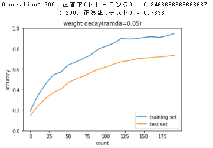
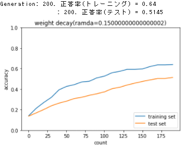
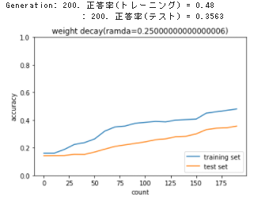
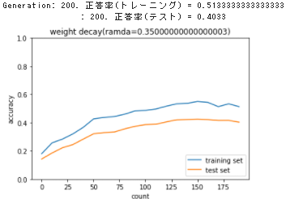
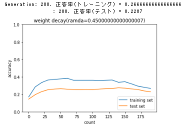
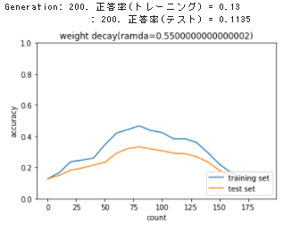
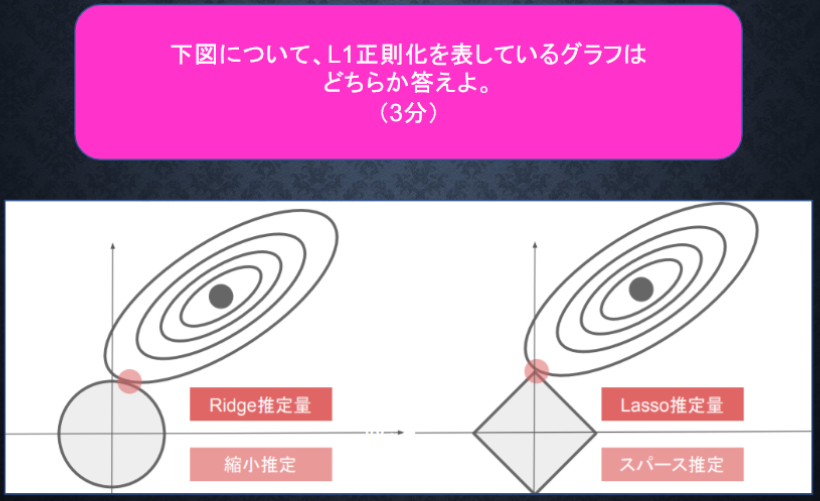
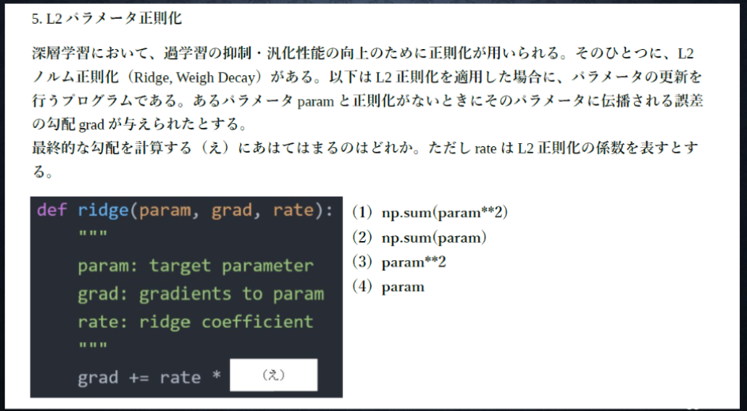
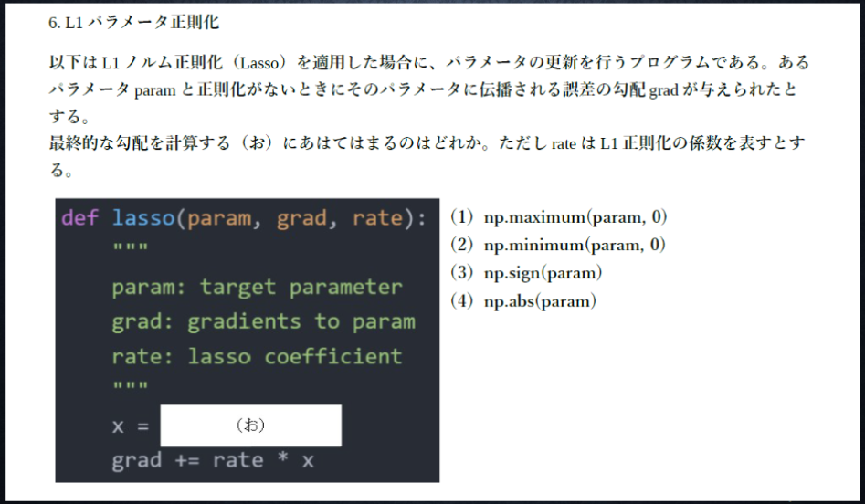

# Section3: 過学習

## 1. 要点まとめ

過学習とは、モデルが学習データに過剰に適合してしまい未知のデータに対する性能（汎化性能）が低下してしまう現象を指す。過学習が発生する原因としては以下が挙げられる。

- 情報量が少ない入力に対してニューラルネットワークが大きい（自由度が高い（パラメータやノードが多いetc.））。

過学習の主な対策としては以下がある。
- L1/L2正則化
- ドロップアウト

### 1.1 L1/L2正則化

パラメータ（重み）の大きさが大きすぎると、一部のデータに対して極端な反応を示してしまうため、過学習の原因となる。そこで、誤差関数に正則化項を加算することでパラメータ（重み）の大きさを制限するのがL1/L2正則化である。計算式は以下。

$$\underset{w}{argmin} \ ( E_n(w) + \frac{1}{p} λ ||x||_p )$$
$$||x||_p = ||W^{(1)}||_p + ... + ||W^{(k)}||_p$$
$$||W^{(k)}||_p = (|W^{(k)}_1|^p + ... + ||W^{(k)}_n|^p)^{\frac{1}{p}}$$
$$※k=レイヤ数-1$$

- p=1の場合、L1正則化（ラッソ回帰）
- p=2の場合、L2正則化（リッジ回帰）

これは、以下の制約条件付きの最適化問題と等価であり、これをラグランジュ未定乗数法で解く式が上式となる。重みのpノルム$||x||_p$に制約がかけられているため、重みを一定以内に抑えることができ、過学習抑制効果が得られる。

$$\underset{w}{argmin} \ E_n(w)$$
$$subject \ to \ ||x||_p < C \ (※C=const)$$

### 1.2 ドロップアウト

ドロップアウトとは、ノードをランダムに削減することでニューラルネットワークの自由度を抑制する手法である。シンプルだが効果は高く、よく用いられる手法となっている。


<div style="page-break-before:always"></div>

-----
## 2. 実装演習


2_5_oberfiting.ipynbの「weight decay - L2」のコードにおいて、weight_decay_lambdaの値を0.05～0.55の間で0.1きざみで変化させた際の学習結果を確認する。

``` python
# MultiLayerNetのコードは掲載省略

(x_train, d_train), (x_test, d_test) = load_mnist(normalize=True)

print("データ読み込み完了")

# 過学習を再現するために、学習データを削減
x_train = x_train[:300]
d_train = d_train[:300]

iters_num = 200
train_size = x_train.shape[0]
batch_size = 100
learning_rate=0.01
plot_interval=10

# 正則化強度設定 ======================================
weight_decay_lambdas = np.arange(0.05,0.56,0.1,dtype = 'float64')
# =================================================

for weight_decay_lambda in weight_decay_lambdas:

  train_loss_list = []
  accuracies_train = []
  accuracies_test = []

  network = MultiLayerNet(input_size=784, 
                          hidden_size_list=[100, 100, 100, 100, 100, 100], 
                          output_size=10)
  hidden_layer_num = network.hidden_layer_num

  for i in range(iters_num):
      batch_mask = np.random.choice(train_size, batch_size)
      x_batch = x_train[batch_mask]
      d_batch = d_train[batch_mask]

      grad = network.gradient(x_batch, d_batch)
      weight_decay = 0
      
      for idx in range(1, hidden_layer_num+1):
          grad['W' + str(idx)] = network.layers['Affine' + str(idx)].dW + weight_decay_lambda * network.params['W' + str(idx)]
          grad['b' + str(idx)] = network.layers['Affine' + str(idx)].db
          network.params['W' + str(idx)] -= learning_rate * grad['W' + str(idx)]
          network.params['b' + str(idx)] -= learning_rate * grad['b' + str(idx)]        
          weight_decay += 0.5 * weight_decay_lambda * np.sqrt(np.sum(network.params['W' + str(idx)] ** 2))

      loss = network.loss(x_batch, d_batch) + weight_decay
      train_loss_list.append(loss)        
          
      if (i+1) % plot_interval == 0:
          accr_train = network.accuracy(x_train, d_train)
          accr_test = network.accuracy(x_test, d_test)
          accuracies_train.append(accr_train)
          accuracies_test.append(accr_test)
          
          print('Generation: ' + str(i+1) + '. 正答率(トレーニング) = ' + str(accr_train))
          print('                : ' + str(i+1) + '. 正答率(テスト) = ' + str(accr_test))               


  lists = range(0, iters_num, plot_interval)
  plt.plot(lists, accuracies_train, label="training set")
  plt.plot(lists, accuracies_test,  label="test set")
  plt.legend(loc="lower right")

  graph_title="weight decay(ramda=" + str(weight_decay_lambda) + ")"
  plt.title(graph_title)
  plt.xlabel("count")
  plt.ylabel("accuracy")
  plt.ylim(0, 1.0)
  # グラフの表示
  plt.show()
``` 

<div style="page-break-before:always"></div>

実行結果は以下。
- 正解率は、weight_decay_lambdaが大きくなるほど低下している。
- ただ、学習データの正解率（青線）と、検証データの正解率（オレンジ）の差は逆に小さくなっており、weight_decay_lambdaを大きくすることで学習データに過剰に適合する現象が抑制されていることが見て取れる。


| 0.05 | 0.15 | 0.25 |
|:-----|:-----|:-----|
|  |  |  |

| 0.35 | 0.45 | 0.55 |
|:-----|:-----|:-----|
|  |  |  |


<div style="page-break-before:always"></div>

-----
## 3. 確認テスト


「(d) リッジ回帰の場合、隠れ層に対して正則化項を加える」が正しい。

<div style="page-break-before:always"></div>



右のグラフ（「Lasso推定量」）がL1正則化を表すグラフ

<div style="page-break-before:always"></div>




(4) param

L2正則化における最適化対象関数は、$E(w) + rate || param ||^2$だが、これをwで微分すると$\frac{E(w)}{dw} + 2・rate ・ param$となる。

つまり、微分値$\frac{E(w)}{dw} (=grad)$に加算する値は、$rate ・param$となる (2はrateに吸収）ため、答えは(4)となる。


<div style="page-break-before:always"></div>



(3) np.sign(param)

L1正則化における最適化対象関数は、$E(w) + rate || param ||$だが、これをwで微分すると$\frac{E(w)}{dw} + rate・sign(param)$となる (※$sign(x)= 1(x>0) \ or \ 0(x=0) \ or \ -1(x<0)$ ）。

つまり、微分値$\frac{E(w)}{dw} (=grad)$に加算する値は、$rate・sign(param)$となるため、答えは(3)となる。

