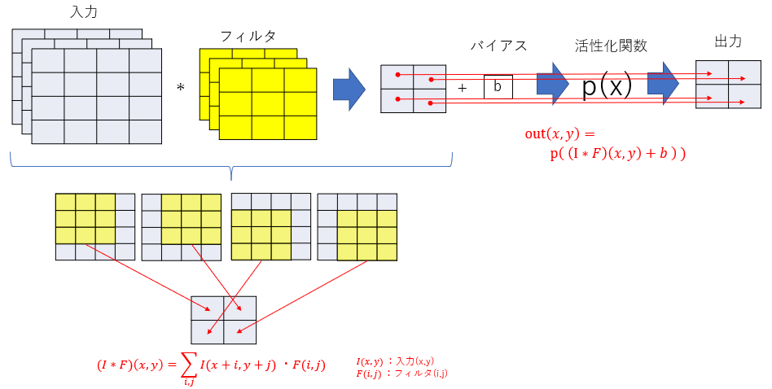
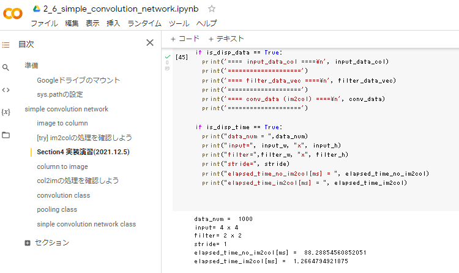
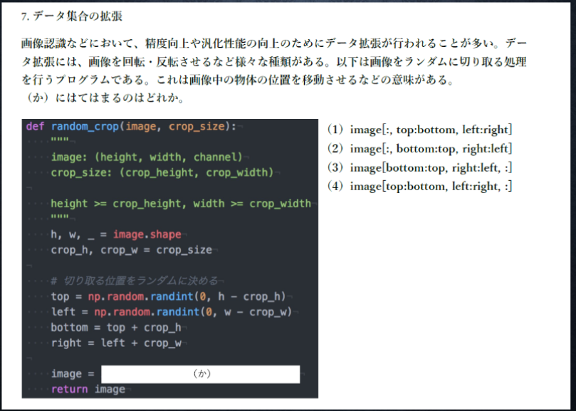

# Section4: 畳み込みニューラルネットワークの概念

## 1. 要点まとめ

畳み込みニューラルネットワーク（CNN）は、画像の識別によく用いられるが、汎用性があり、次元間でつながりがある他のデータ（音声など）にも適用可能である。

CNNでは、これまでの層（全結合層）に加えて、畳み込み層、プーリング層が新たに加わる。


### 1.1 畳み込み層

畳み込み層では、従来の全結合層と同様、重みやバイアスに相当するパラメータで構成されるが、高次元の空間特徴（例：2次元画像だと隣接点の輝度差等）を学習できるという点が異なる。
畳み込み層の全体像は下図。



フィルタは、全結合層における重みに相当するパラメータである。
画像処理におけるフィルタと同様、入力とフィルタを重ねてデータ毎に積算した値の総和を出力する演算を、左上から右下まで行う（上図）。こういう演算は畳み込みと呼ばれており、CNNにおいて中心的な役割を果たす。

バイアスは、フィルタ出力の各画素に対して加算する値である。加算後の値に対して活性化関数を適用し、畳み込み層の出力を得る。

<div style="page-break-before:always"></div>

畳み込み演算（フィルタ処理）では、パディング、ストライドという概念が登場する。これらについて以下説明する。

### 1.1.1 パディング

畳み込み演算（フィルタ処理）において、出力データのサイズは、フィルタを動かす回数となり、入力データサイズより小さくなってしまう。これだと、畳み込み演算を繰り返すとデータサイズが小さくなりすぎることになり都合が悪い。

そこで、畳み込み演算の前にパディングという処理を行う。パディングとは、入力データサイズを拡張し、拡張箇所に固定データを埋め込むことである。サイズ拡張したデータに対して畳み込み演算を行うことで、出力データサイズ＝入力データサイズとなるようにする。

拡張箇所に埋め込むデータは、0固定でもよいが、隣接データの値とすることもできる。

### 1.1.2 ストライド

畳み込み演算で、フィルタを動かす間隔をストライドという。ストライドを大きくするとフィルタを動かす回数が小さくなるため、出力データサイズはより小さくなる。

<div style="page-break-before:always"></div>

### 1.2 プーリング層

プーリング層は、畳み込み層で得た空間特徴を要約する役割を持つ層となる。
畳み込み演算と同様、一定の範囲を少しずつずらしながら、範囲内における統計量を順次算出する。よく用いられる主な統計量は以下。

- 最大値（Max Pooling）
- 平均値（Average Pooling）

プーリング層では、学習の際に調整対象となるパラメータは存在しない。


<div style="page-break-before:always"></div>

-----
## 2. 実装演習


2_6_simple_convolution_network.ipynbの実装において、画像データを畳み込み演算に適した配列に並び変えるim2colの効果を確認する。

具体的には、im2colの有無で、畳み込み演算の処理時間にどのくらい差が出るのかを確認する。


``` python
# im2colのコードは掲載省略

# 入力データ、フィルタ作成
data_num = 1000
input_w = 4
input_h = 4
filter_w = 2
filter_h = 2
stride = 1
is_disp_data = True
is_disp_time = True

if data_num > 10:
  is_disp_data = False

input_data = np.random.rand(data_num, 1, input_h, input_w)*10//1 # N,C,H,W
filter_data = np.random.rand(filter_h, filter_w)*10//1

conv_w = int((input_w - filter_w) / stride) + 1
conv_h = int((input_h - filter_h) / stride) + 1

import time

# --------------------------
#  畳み込み演算(im2colなし)
# --------------------------
start = time.time()

conv_data = np.zeros((data_num, 1, conv_h, conv_w), dtype=float)

for n_idx in range(0,data_num):
  input_data_one = input_data[n_idx,:,:].reshape((input_h, input_w))
  conv_data_one = conv_data[n_idx,:,:].reshape((conv_h, conv_w))
  
  for y_idx in range(0,input_h-1,stride):
    cy_idx = int(y_idx / stride)

    for x_idx in range(0,input_w-1,stride):
      cx_idx = int(x_idx / stride)

      conv_data_one[cy_idx][cx_idx] = 0

      for iy_idx in range(0,filter_h):
        for ix_idx in range(0,filter_w):
          conv_data_one[cy_idx][cx_idx] += \
            input_data_one[y_idx + iy_idx][x_idx + ix_idx] \
             * filter_data[iy_idx][ix_idx]

elapsed_time_no_im2col = (time.time() - start) * 1000

if is_disp_data == True:
  print('==== input_data ====\n', input_data)
  print('====================')
  print('==== filter_data =====\n', filter_data)
  print('======================')
  print('==== conv_data (no im2col) ====\n', conv_data)
  print('====================')

# --------------------------
# 畳み込み演算（im2colあり）
# --------------------------
start = time.time()

input_data_col = im2col(input_data, filter_h=filter_h, 
                        filter_w=filter_w, stride=stride, pad=0)
filter_data_vec = filter_data.reshape((filter_h * filter_w, ))
conv_data = np.dot(input_data_col, filter_data_vec).\
            reshape((data_num, 1, conv_h, conv_w))

elapsed_time_im2col = (time.time() - start) * 1000

if is_disp_data == True:
  print('==== input_data_col ====\n', input_data_col)
  print('====================')
  print('==== filter_data_vec ====\n', filter_data_vec)
  print('====================')
  print('==== conv_data (im2col) ====\n', conv_data)
  print('====================')

if is_disp_time == True:
  print("data_num = ",data_num)
  print("input=", input_w, "x", input_h)
  print("filter=",filter_w, "x", filter_h)
  print("stride=", stride)
  print("elapsed_time_no_im2col[ms] = ", elapsed_time_no_im2col)
  print("elapsed_time_im2col[ms] = ", elapsed_time_im2col)

``` 

<div style="page-break-before:always"></div>

実行結果は以下（データ数1000、チャンネル1、入力サイズ:4x4、フィルタサイズ:2x2、stride:1, padding:1）。
- im2colなしの処理時間(elapsed_time_no_im2col)≒88[ms]
- im2colありの処理時間(elapsed_time_im2col)≒1[ms]

処理時間に約88倍の差が出ている。im2colは処理時間短縮に絶大な効果を発揮することを確認できた。



<div style="page-break-before:always"></div>

-----
## 3. 確認テスト


出力サイズ＝7x7

∵パディング=1で拡張した入力サイズ（=8x8）内を、フィルタ2x2をストライド=1で動かせる回数は、縦横ともに7回

<div style="page-break-before:always"></div>



(4) image[top:bottom, left:right, :]

