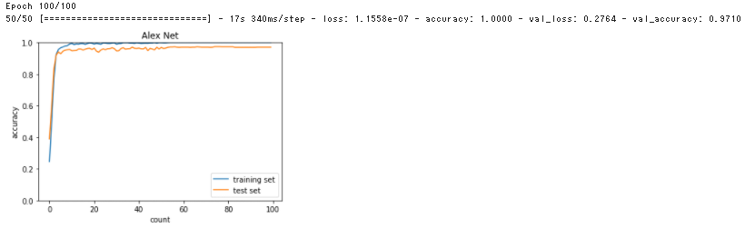

# Section5: 最新のCNN

## 1. 要点まとめ

CNNの概要に触れるのに適した初期の頃のニューラルネットワークにAlexNetがある（最新CNNは複雑すぎるため言及省略）。

AlexNetは、ImageNet（データセット）の分類問題を解く際に適用されたCNNモデルである。
深さは8層で、224x224 3chの画像を入力とし、分類結果（1000種類）を出力する。
入力側の6層は畳み込み層で、出力側の2層が全結合層となっている。

畳み込み層から全結合層へのデータの展開には主に以下手法があるが、AlexNetはFlattenが適用されている。
- Flatten（全データ展開）
- Global Max Pooling（chの最大値を出力）
- Global Average Pooling（chの平均値を出力）

全結合層にドロップアウトが適用されており、過学習を抑制できる。


<div style="page-break-before:always"></div>

-----
## 2. 実装演習

AlexNet（出力は10種類）を実装し、mnistデータセットを入力として学習する。
AlexNetの学習結果を、2_8_deep_convolution_net.ipynbに実装済のDeepConvNetと比較する。

``` python
from data.mnist import load_mnist
import tensorflow as tf
import matplotlib.pyplot as plt
from tensorflow.keras import datasets, layers, models, losses

(x_train, d_train), (x_test, d_test) = load_mnist(flatten=False)
x_train, d_train = x_train[:5000], d_train[:5000]
x_test, d_test = x_test[:1000], d_test[:1000]

# x_train.shape = (5000,1,28,28)
# x_test.shape = (1000,1,28,28)

iters_num = 100
train_size = x_train.shape[0]
batch_size = 100

x_train = x_train.transpose(0,2,3,1) # N,Ch,H,W → N,H,W,Ch
x_test = x_test.transpose(0,2,3,1)

# x_train.shape = (5000,28,28,1)
# x_test.shape = (1000,28,28,1)

x_train = tf.repeat(x_train, 3, axis=3) # Ch: 1→3
x_test = tf.repeat(x_test, 3, axis=3)

# x_train.shape = (5000,28,28,3)
# x_test.shape = (1000,28,28,3)

# -------------
#  AlexNet
#  https://ichi.pro/tensorflow-o-shiyoshita-alexnet-78011207884008 を参照 
# -------------

# モデル作成
model = models.Sequential()
model.add(layers.experimental.preprocessing.Resizing(224, 224, interpolation="bilinear", input_shape=x_train.shape[1:]))
model.add(layers.Conv2D(96, 11, strides=4, padding='same'))
model.add(layers.Lambda(tf.nn.local_response_normalization))
model.add(layers.Activation('relu'))
model.add(layers.MaxPooling2D(3, strides=2))
model.add(layers.Conv2D(256, 5, strides=4, padding='same'))
model.add(layers.Lambda(tf.nn.local_response_normalization))
model.add(layers.Activation('relu'))
model.add(layers.MaxPooling2D(3, strides=2))
model.add(layers.Conv2D(384, 3, strides=4, padding='same'))
model.add(layers.Activation('relu'))
model.add(layers.Conv2D(384, 3, strides=4, padding='same'))
model.add(layers.Activation('relu'))
model.add(layers.Conv2D(256, 3, strides=4, padding='same'))
model.add(layers.Activation('relu'))
model.add(layers.Flatten())
model.add(layers.Dense(4096, activation='relu'))
model.add(layers.Dropout(0.5))
model.add(layers.Dense(4096, activation='relu'))
model.add(layers.Dropout(0.5))
model.add(layers.Dense(10, activation='softmax'))
model.summary()

model.compile(optimizer='adam', 
              loss=losses.sparse_categorical_crossentropy, 
              metrics=['accuracy'])

# 学習実行
history = model.fit(x_train, d_train, 
                    batch_size=batch_size, epochs=iters_num, 
                    validation_data=(x_test, d_test))

# グラフ表示
plt.plot(history.history['accuracy'], label="training set")
plt.plot(history.history['val_accuracy'],  label="test set")
plt.legend(loc="lower right")
plt.title("Alex Net")
plt.xlabel("count")
plt.ylabel("accuracy")
plt.ylim(0, 1.0)
# グラフの表示
plt.show()
``` 

<div style="page-break-before:always"></div>

実行結果は以下（データセット:nmist、学習データ数5000、検証データ数1000、バッチサイズ100、エポック100）。
- DeepConvNetは、学習データ正解率≒89%、検証データ正解率≒87%
- AlexNetは、学習データ正解率(accuracy)＝100%、検証データ正解率(val_accuracy)≒97%

ImageNetより簡単なデータセットであるためか、AlexNetの正解率が非常に高い。
学習データの正解率＝100％は過学習が疑われる数値だが、検証データ正解率も非常に高いため、汎用性能も高いと言える。


| DeepConvNet | AlexNet |
|:-----|:-----|
|  |  |


<div style="page-break-before:always"></div>

-----
## 3. 確認テスト


※Section5は確認テストなし


