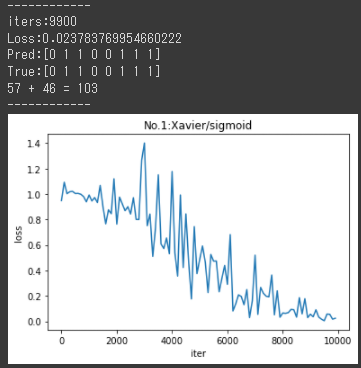
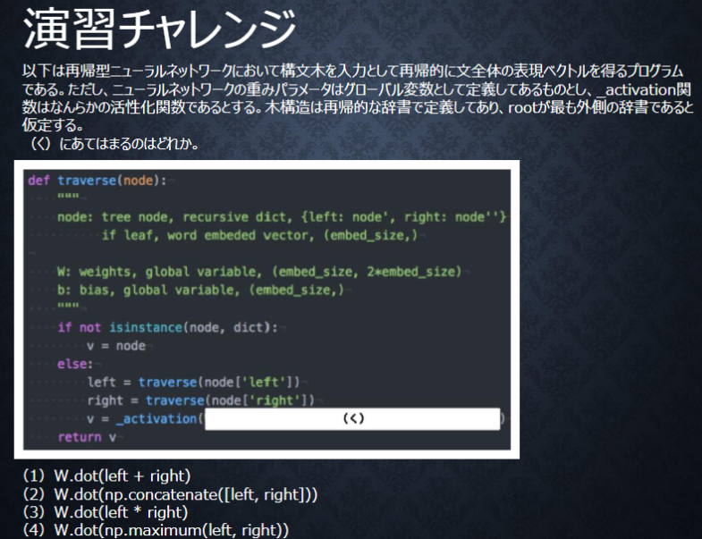
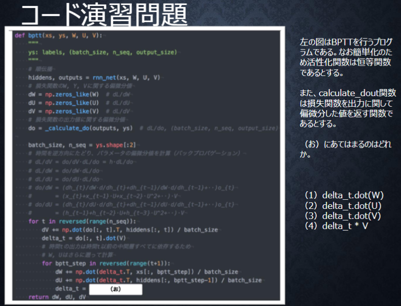

# Section1: 再帰型ニューラルネットワークの概念

## 1. 要点まとめ

RNN(Recurrent Newral Network)とは、時系列データに対応可能なニューラルネットワークである。時系列データとは、時間的順序を追って一定間隔毎に観察され、相互に統計的依存関係が認められるデータ系列であり、例えば、音声データや自然言語などである。

RNNの構造は下図。時刻毎に入力$x_t$、中間層$z_t$、出力$y_t$があり、中間層$z_t$は1つ前の時刻の中間層$z_{t-1}$とつながりがあることがRNNの大きな特徴である。これにより、時間的なつながりも特徴量として抽出できるようになる。重みは以下3つがあり、これが学習の調整対象となる。重みは全時刻共通である。

- 入力と中間層の間の重み$W_{in}$
- 中間層と出力の間の重み$W_{out}$
- 現在の中間層と１つ前の中間層の間の重み$W$


この構造を数式で表すと下式 (b,c: バイアス、f(), g(): 活性化関数）。

- $u_t = W_{in} x_t + W z_{t-1} + b$
- $z_t = f(u_t)$
- $v_t = W_{out} z_t + c = W_{out} f(u_t) + c$
- $y_t = g(v_t)$

学習の際は、誤差逆伝播の派生版であるBPTT(Back Propagation Through Time)で重みを調整する。
調整量を表す、誤差Eを重みやバイアスで微分した式は以下。

- $\frac{dE}{dW_{in}} = \sum_t δ_t x_t$ 　※$δ_t = \frac{dE}{du_t}$
- $\frac{dE}{dW_{out}} = \sum_t δ_{out,t} z_t$ 　※$δ_{out,t} = \frac{dE}{dv_t}$
- $\frac{dE}{dW} = \sum_t δ_t z_{t-1}$
- $\frac{dE}{db} = \sum_t δ_t$
- $\frac{dE}{dc} = \sum_t δ_{out,t}$

上式で現れる$δ_t, δ_{out,t}$（誤差Eを活性化関数前の中間出力$u_t, v_t$で微分した値）の算出式は以下。

- $δ_{out,t} = \frac{dE}{dy_t} g'(v_t)$
- $δ_t = δ_{out,t} \frac{dv_t}{du_t} = δ_{out,t} \{ W_{out} f'(u_t) \}$  
- $δ_{t-1} = δ_t \frac{du_t}{du_{t-1}} = δ_t \{ W f'(u_{t-1}) \}$ 

<div style="page-break-before:always"></div>

-----
## 2. 実装演習

3_1_simple_RNN.ipynbのRNNのコードにおいて、下表No.1, No.2, No.3の重みの初期化方法＆中間層の活性化関数の組み合わせを試行し、学習結果を元コードと比較する。

|   | 重みの初期化 | 中間層の活性化関数 |
|:-----------|:-----------|:------------|
| No.1 | Xavier | シグモイド関数 |
| No.2 | Xavier | tanh関数 |
| No.3 | He | ReLU関数 | 
| 元コード | 標準正規分布 | シグモイド関数 | 

``` python
import numpy as np
from common import functions
import matplotlib.pyplot as plt


def d_tanh(x):
    return 1/(np.cosh(x) ** 2)

# データを用意
# 2進数の桁数
binary_dim = 8
# 最大値 + 1
largest_number = pow(2, binary_dim)
# largest_numberまで2進数を用意
binary = np.unpackbits(np.array([range(largest_number)],dtype=np.uint8).T,axis=1)

input_layer_size = 2
hidden_layer_size = 16
output_layer_size = 1

weight_init_std = 1
learning_rate = 0.1

iters_num = 10000
plot_interval = 100

# 試行パターン
trial_pattern = 3

# ウェイト初期化 (バイアスは簡単のため省略)
if trial_pattern == 0:
  trial_weight_initializer = "std"
  W_in = weight_init_std * np.random.randn(input_layer_size, hidden_layer_size)
  W_out = weight_init_std * np.random.randn(hidden_layer_size, output_layer_size)
  W = weight_init_std * np.random.randn(hidden_layer_size, hidden_layer_size)
elif trial_pattern == 1 or trial_pattern == 2:
  # Xavier
  trial_weight_initializer = "Xavier"
  W_in = np.random.randn(input_layer_size, hidden_layer_size) / (np.sqrt(input_layer_size))
  W_out = np.random.randn(hidden_layer_size, output_layer_size) / (np.sqrt(hidden_layer_size))
  W = np.random.randn(hidden_layer_size, hidden_layer_size) / (np.sqrt(hidden_layer_size))
else:
  # He
  trial_weight_initializer = "He"
  W_in = np.random.randn(input_layer_size, hidden_layer_size) / (np.sqrt(input_layer_size)) * np.sqrt(2)
  W_out = np.random.randn(hidden_layer_size, output_layer_size) / (np.sqrt(hidden_layer_size)) * np.sqrt(2)
  W = np.random.randn(hidden_layer_size, hidden_layer_size) / (np.sqrt(hidden_layer_size)) * np.sqrt(2)

# 活性化関数
func_activate   = [functions.sigmoid,   functions.sigmoid,   np.tanh, functions.relu]
func_d_activate = [functions.d_sigmoid, functions.d_sigmoid, d_tanh,  functions.d_relu]

if trial_pattern == 0 or trial_pattern == 1:
  trial_activation = "sigmoid"
elif trial_pattern == 2:
  trial_activation = "tanh"
else:
  trial_activation = "ReLU"

# 勾配
W_in_grad = np.zeros_like(W_in)
W_out_grad = np.zeros_like(W_out)
W_grad = np.zeros_like(W)

u = np.zeros((hidden_layer_size, binary_dim + 1))
z = np.zeros((hidden_layer_size, binary_dim + 1))
y = np.zeros((output_layer_size, binary_dim))

delta_out = np.zeros((output_layer_size, binary_dim))
delta = np.zeros((hidden_layer_size, binary_dim + 1))

all_losses = []

for i in range(iters_num):
    
    # A, B初期化 (a + b = d)
    a_int = np.random.randint(largest_number/2)
    a_bin = binary[a_int] # binary encoding
    b_int = np.random.randint(largest_number/2)
    b_bin = binary[b_int] # binary encoding
    
    # 正解データ
    d_int = a_int + b_int
    d_bin = binary[d_int]
    
    # 出力バイナリ
    out_bin = np.zeros_like(d_bin)

    # 時系列全体の誤差
    all_loss = 0    
    
    # 順伝播
    for t in range(binary_dim):
        # 入力値
        X = np.array([a_bin[ - t - 1], b_bin[ - t - 1]]).reshape(1, -1)

        # 時刻tにおける正解データ
        dd = np.array([d_bin[binary_dim - t - 1]])
        
        u[:,t+1] = np.dot(X, W_in) + np.dot(z[:,t].reshape(1, -1), W)
        z[:,t+1] = func_activate[trial_pattern](u[:,t+1]) 
        y[:,t] = functions.sigmoid(np.dot(z[:,t+1].reshape(1, -1), W_out))

        #誤差
        loss = functions.mean_squared_error(dd, y[:,t])
        
        delta_out[:,t] = functions.d_mean_squared_error(dd, y[:,t]) * functions.d_sigmoid(y[:,t])        
        
        all_loss += loss

        out_bin[binary_dim - t - 1] = np.round(y[:,t])
    
    # 逆伝播(BPTT)
    for t in range(binary_dim)[::-1]:
        X = np.array([a_bin[-t-1],b_bin[-t-1]]).reshape(1, -1)        

        delta[:,t] = (np.dot(delta[:,t+1].T, W.T) + np.dot(delta_out[:,t].T, W_out.T)) * func_d_activate[trial_pattern](u[:,t+1])

        # 勾配更新
        W_out_grad += np.dot(z[:,t+1].reshape(-1,1), delta_out[:,t].reshape(-1,1))
        W_grad += np.dot(z[:,t].reshape(-1,1), delta[:,t].reshape(1,-1))
        W_in_grad += np.dot(X.T, delta[:,t].reshape(1,-1))
    
    # 勾配適用
    W_in -= learning_rate * W_in_grad
    W_out -= learning_rate * W_out_grad
    W -= learning_rate * W_grad
    
    W_in_grad *= 0
    W_out_grad *= 0
    W_grad *= 0

    if(i % plot_interval == 0):
        all_losses.append(all_loss)        
        print("iters:" + str(i))
        print("Loss:" + str(all_loss))
        print("Pred:" + str(out_bin))
        print("True:" + str(d_bin))

        # out_binを10進数に直す→out_int
        out_int = 0
        for index,x in enumerate(reversed(out_bin)):
            out_int += x * pow(2, index)
        print(str(a_int) + " + " + str(b_int) + " = " + str(out_int))
        print("------------")

lists = range(0, iters_num, plot_interval)
plt.title("No."+str(trial_pattern)+":"+trial_weight_initializer + "/" + trial_activation)
plt.xlabel("iter")
plt.ylabel("loss")
plt.plot(lists, all_losses, label="loss")
plt.show()

``` 

<div style="page-break-before:always"></div>

実行結果は以下

- 学習終了時に誤差(loss)が一番小さかったのはNo.2(Xavier＆tanh)で、収束も早い
- No.1(Xavier＆シグモイド)は、誤差が元コードと同等まで小さくなったものの、収束がやや遅め
- No.3(He＆ReLU)は、
  - 誤差が減少しておらず、学習できていない。
  - 何回か動作させると、出力層のシグモイド関数がNaN(0割り)を返しエラー停止することがある。
  - 0割り(NaN)発生時は、勾配爆発が起きていると考えられる。

|   | 重みの初期化 | 中間層の活性化関数 | 結果(loss) | 結果(グラフ) |
|:-----------|:-----------|:------------|:------------|:------------|
| No.1 | Xavier | シグモイド関数 | 0.02378 |  |
| No.2 | Xavier | tanh関数 | 0.00001 |  |
| No.3 | He | ReLU関数 | 1.04456 |  |
| 元コード | 標準正規分布 | シグモイド関数 | 0.00622 |  |

<div style="page-break-before:always"></div>

-----
## 3. 確認テスト


3x3

※動画では、2x2が正解、とあったが、これはフィルタサイズ5x5の場合の結果。フィルタサイズ3x3の場合は、出力画像3x3が正しい。

<div style="page-break-before:always"></div>

-----


過去の中間層から現在の中間層を定義する際にかけられる重み。

<div style="page-break-before:always"></div>

-----



(2) W.dot(np.concatenate([left, right]))

traverseは再帰的に文全体の表現ベクトルを得る関数のため、
left, rightの数値を保ったまま（四則演算等をしないで）結合する必要がある。よって、(2)が正解。

<div style="page-break-before:always"></div>

-----


$$
\frac{dz}{dx} = \frac{dz}{dt}・\frac{dt}{dx}
  = 2t・1 = 2(x+y)
$$

<div style="page-break-before:always"></div>

-----


- $y_1 = g(W_{(out)} z_1 + c)$
- $z_1 = f(W_{in} x_1 + W z_0 + b)$

<div style="page-break-before:always"></div>

-----



（お）は、以下漸化式を実装した箇所となる。

- $δ_{t-1} = δ_t \frac{du_t}{du_{t-1}}$

$\frac{du_t}{du_{t-1}} = U$ であるため、正解は「(2) delta_t.dot(U)」である。
