# Section2: LSTM / Section3: GRU

## 1. 要点まとめ

### 1.1 LSTM

RNNには、時系列を遡るほどに勾配が消失したり爆発したりするため長い時系列の学習が困難、という課題がある。この課題を解消するため、勾配消失／爆発が起きにくいネットワーク構造にしたものがLSTMとなる。

LSTMの全体像は下図。従来の短期記憶をつかさどる中間層出力$z_t$に加えて、長期記憶をつかさどるCEC（$c_t$）が付加されているのが大きな特徴となる。主要な記憶機能をCECに分離させた構成となっていることで長い時系列の学習を可能としている。

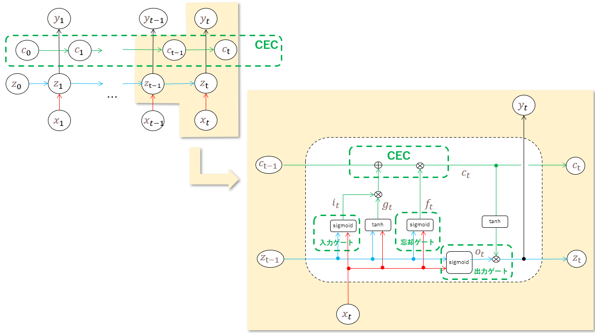

図中の入力ゲート、出力ゲート、忘却ゲートの役割はそれぞれ以下となる。

- 入力ゲート：CECに何を記憶させるかを制御
- 出力ゲート：CECから取り出した記憶をどう扱うかを制御
- 忘却ゲート：不要となった過去の記憶を削除

図中の中間出力の数式は以下となる。

- $i_t = sigmoid(W_{ii} x_t + b_{ii} + W_{zi} z_{t-1} + b_{zi})$　　※$W_{xx}$: 重み、 $b_{xx}$: バイアス
- $g_t = tanh(W_{ig} x_t + b_{ig} + W_{zg} z_{t-1} + b_{zg})$
- $f_t = sigmoid(W_{if} x_t + b_{if} + W_{zf} z_{t-1} + b_{zf})$
- $o_t = sigmoid(W_{io} x_t + b_{io} + W_{zo} z_{t-1} + b_{zo})$
- $c_t = i_t g_t + f_t c_{t-1}$
- $z_t = y_t = o_t tanh(c_t)$

学習の際は、上式の重み、バイアスの微分を連鎖律にて順次算出することになるが、CEC（$c_t$）のパスには直接重みが積算されていないことから勾配消失や勾配爆発に対処可能であると考えられる。

LSTMの派生版として、CEC自身の値を判断材料に使えるよう覗き穴ゲートを設ける構成もある。

<div style="page-break-before:always"></div>

### 1.2 GRU

GRUは、計算負荷が高いというLSTMの課題を解決するために、CECを外すことでLSTMを簡略化しパラメータ数を削減したモデルである。

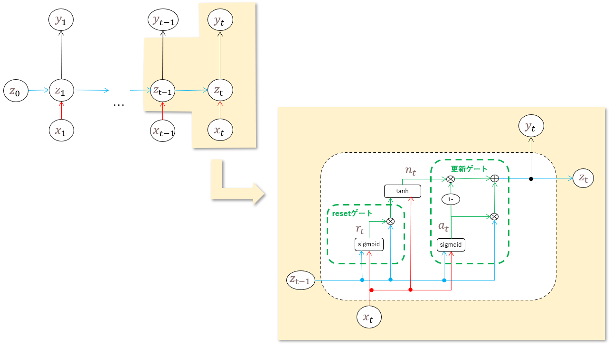

図中のリセットゲート、更新ゲートの役割はそれぞれ以下となる。

- リセットゲート：隠れ層の状態をどのような状態で保持するかを制御
- 出力ゲート：出力に、前回と今回の記憶をどのくらいの割合で含めるかを制御

図中の中間出力の数式は以下となる。

- $r_t = sigmoid(W_{ir} x_t + b_{ir} + W_{zr} z_{t-1} + b_{zr})$　　※$W_{xx}$: 重み、 $b_{xx}$: バイアス
- $a_t = sigmoid(W_{ia} x_t + b_{ia} + W_{za} z_{t-1} + b_{za})$
- $n_t = tanh(W_{in} x_t + b_{in} + r_t * \{ W_{zn} z_{t-1} + b_{zn} \})$
- $z_t = y_t = (1 - a_t) n_t + a_t z_{t-1}$


<div style="page-break-before:always"></div>

-----
## 2. 実装演習

バイナリ加算のモデルをLSTM/GRUで実装し、複数パターンのバイト長で実行した結果を、3_1_simple_RNN_after.ipynbに実装されているSimpleRNNモデルと比較する。

``` python
import numpy as np
from common import functions
import matplotlib.pyplot as plt

# tanh(x)の微分
def d_tanh(x):
    return 1/(np.cosh(x) ** 2)

# 2進数→10進数変換
def conv_int(bin_data):
  out_int = 0
  for index,x in enumerate(reversed(bin_data)):
      out_int += x * pow(2, index)
  return out_int

# 10進数→2進数変換
def conv_bin(int_data, bin_dim_max):
  bin_array = np.zeros(bin_dim_max, dtype='uint8')
  bin_dim = int_data.bit_length()

  for i in range(bin_dim):
    bin_array[i] = int_data % 2
    int_data //= 2
  
  return bin_array[::-1]

# データ作成
def make_rowdata(max_number, bin_dim, data_num):
  data_a_int, data_b_int, data_d_int = [], [], []
  data_a_bin, data_b_bin, data_d_bin = [], [], []

  for i in range(data_num):
    a_int = np.random.randint(max_number)
    a_bin = conv_bin(a_int, bin_dim)
    b_int = np.random.randint(max_number)
    b_bin = conv_bin(b_int, bin_dim)
    d_int = a_int + b_int
    d_bin = conv_bin(d_int, bin_dim)

    data_a_int.append(a_int)
    data_a_bin.append(a_bin)
    data_b_int.append(b_int)
    data_b_bin.append(b_bin)
    data_d_int.append(d_int)
    data_d_bin.append(d_bin)

  return np.array(data_a_int), np.array(data_b_int), np.array(data_d_int), np.array(data_a_bin), np.array(data_b_bin), np.array(data_d_bin)

# RNN入力用にデータを整形
def conv_data(data_a_bin, data_b_bin, data_d_bin):
  data_num = data_a_bin.shape[0]
  dim = data_a_bin.shape[1]

  data = np.zeros((data_num, dim, 2))
  target = np.zeros((data_num, dim))

  for idx, (a_bin, b_bin, d_bin) in enumerate(zip(data_a_bin, data_b_bin, data_d_bin)):
    for t in range(dim):
      data[idx][t] = np.array([a_bin[-t-1], b_bin[-t-1]])
      target[idx][t] = d_bin[-t-1]
  
  return data, target

# モデル出力を2進数データに変換
def conv_outdata(yy):
  out_bin = np.zeros_like(yy)
  dim = yy.shape[0]
  for t in range(dim):
    out_bin[dim - t - 1] = np.round(yy[t])

  return out_bin.astype('uint8')


# --------------
#  データ作成
# --------------

# バイト長
binary_dim = 16
# 最大値 + 1
largest_number = pow(2, binary_dim)
# データ数(iters_num)
iters_num = 10000
plot_interval = 100

# データ作成
data_a_int, data_b_int, data_d_int, data_a_bin, data_b_bin, data_d_bin = make_rowdata(largest_number/2, binary_dim, iters_num)
X_data, y_data = conv_data(data_a_bin, data_b_bin, data_d_bin)

# モデル共通パラメータ
input_layer_size = 2
hidden_layer_size = 16
output_layer_size = 1
learning_rate = 0.1

# --------------
#  simple RNN
# --------------

# ウェイト初期化 (バイアスは簡単のため省略)
# Xavier
W_in = np.random.randn(input_layer_size, hidden_layer_size) / (np.sqrt(input_layer_size))
W_out = np.random.randn(hidden_layer_size, output_layer_size) / (np.sqrt(hidden_layer_size))
W = np.random.randn(hidden_layer_size, hidden_layer_size) / (np.sqrt(hidden_layer_size))

# 勾配
W_in_grad = np.zeros_like(W_in)
W_out_grad = np.zeros_like(W_out)
W_grad = np.zeros_like(W)

u = np.zeros((hidden_layer_size, binary_dim + 1))
z = np.zeros((hidden_layer_size, binary_dim + 1))
y = np.zeros((output_layer_size, binary_dim))

delta_out = np.zeros((output_layer_size, binary_dim))
delta = np.zeros((hidden_layer_size, binary_dim + 1))

all_losses = []

for i in range(iters_num):

    # 出力バイナリ
    out_bin = np.zeros_like(data_d_bin[i])

    # 時系列全体の誤差
    all_loss = 0    
    
    # 順伝播
    for t in range(binary_dim):
        X = X_data[i][t].reshape(1,-1)
        dd = np.array([y_data[i][t]])

        u[:,t+1] = np.dot(X, W_in) + np.dot(z[:,t].reshape(1, -1), W)
        z[:,t+1] = np.tanh(u[:,t+1]) 
        y[:,t] = functions.sigmoid(np.dot(z[:,t+1].reshape(1, -1), W_out))

        #誤差
        loss = functions.mean_squared_error(dd, y[:,t])
        delta_out[:,t] = functions.d_mean_squared_error(dd, y[:,t]) * functions.d_sigmoid(y[:,t])        
        all_loss += loss
        out_bin[binary_dim - t - 1] = np.round(y[:,t])
    
    # 逆伝播(BPTT)
    for t in range(binary_dim)[::-1]:
        X = X_data[i][t].reshape(1,-1)

        delta[:,t] = (np.dot(delta[:,t+1].T, W.T) + np.dot(delta_out[:,t].T, W_out.T)) * d_tanh(u[:,t+1])

        # 勾配更新
        W_out_grad += np.dot(z[:,t+1].reshape(-1,1), delta_out[:,t].reshape(-1,1))
        W_grad += np.dot(z[:,t].reshape(-1,1), delta[:,t].reshape(1,-1))
        W_in_grad += np.dot(X.T, delta[:,t].reshape(1,-1))
    
    # 勾配適用
    W_in -= learning_rate * W_in_grad
    W_out -= learning_rate * W_out_grad
    W -= learning_rate * W_grad
    
    W_in_grad *= 0
    W_out_grad *= 0
    W_grad *= 0

    if(i % plot_interval == 0):
        all_losses.append(all_loss)   

        # 途中経過表示
        print("iters:" + str(i))
        print("Loss:" + str(all_loss))
        #print("Pred:" + str(out_bin))
        #print("True:" + str(data_d_bin[i]))
        print(str(data_a_int[i]) + " + " + str(data_b_int[i]) + " = " + str(conv_int(out_bin)))
        print("------------")

# 結果表示
lists = range(0, iters_num, plot_interval)
plt.title("Simple RNN("+str(binary_dim)+"bit)")
plt.xlabel("iter")
plt.ylabel("loss")
plt.plot(lists, all_losses, label="loss")
plt.show()

# --------------
#  LSTM
#   https://qiita.com/sasayabaku/items/b7872a3b8acc7d6261bf
# --------------
from tensorflow.keras.models import Sequential
from tensorflow.keras.layers import Dense, Activation
from tensorflow.keras.layers import LSTM
#from tensorflow.keras.optimizers import Adam
from tensorflow.keras.optimizers import SGD

# LSTMモデル作成
#   activation='tanh', recurrent_activation='hard_sigmoid'
#   return_sequences=True: 時刻毎に出力
lstm_model = Sequential() 
lstm_model.add(LSTM(hidden_layer_size, 
                    batch_input_shape=(None, binary_dim, input_layer_size), 
                    return_sequences=True)) 
lstm_model.add(Dense(output_layer_size)) 

#lstm_model.compile(loss='mean_squared_error', 
#                   optimizer=Adam() , 
#                   metrics = ['accuracy'])
lstm_model.compile(loss='mean_squared_error', 
                   optimizer=SGD(learning_rate=learning_rate) , 
                   metrics = ['accuracy'])
lstm_model.summary()

# 学習 
#   ※パラメータ更新回数＝データ数となるよう、
#     エポック数＆バッチサイズを調整（simple RNNに合わせる）)
batch_size = 5
epoch_num = batch_size

hist = lstm_model.fit(X_data, y_data,
                      epochs=epoch_num,
                      verbose=1,
                      batch_size=batch_size)

# 予測
y_pred = lstm_model.predict(X_data[0].reshape(1, binary_dim, 2))
y_pred_bin = conv_outdata(y_pred.reshape(binary_dim))

# 結果表示
print("X[0] (a_bin=",data_a_bin[0], ",b_bin=",data_b_bin[0],") y_bin=",y_pred_bin)
print("a(",conv_int(data_a_bin[0]), ") + b(",conv_int(data_b_bin[0]),") = ",conv_int(y_pred_bin))

plt.title("LSTM("+str(binary_dim)+"bit)")
plt.xlabel("iter")
plt.ylabel("loss")
plt.plot(hist.history['loss'],label="train set")
plt.show()

# --------------
#  GRU
# --------------
from tensorflow.keras.layers import GRU

# GRUモデル作成
#   activation='tanh', recurrent_activation='hard_sigmoid'
#   return_sequences=True: 時刻毎に出力
gru_model = Sequential() 
gru_model.add(GRU(hidden_layer_size, 
                   batch_input_shape=(None, binary_dim, input_layer_size), 
                   return_sequences=True)) 
gru_model.add(Dense(output_layer_size)) 

#gru_model.compile(loss='mean_squared_error', 
#                   optimizer=Adam() , 
#                   metrics = ['accuracy'])
gru_model.compile(loss='mean_squared_error', 
                   optimizer=SGD(learning_rate=learning_rate) , 
                   metrics = ['accuracy'])
gru_model.summary()

# 学習 
#   ※パラメータ更新回数＝データ数(iter_num)となるよう、
#     エポック数＆バッチサイズを調整（simple RNNに合わせる）)
batch_size = 5
epoch_num = batch_size

hist = gru_model.fit(X_data, y_data,
                     epochs=epoch_num,
                     verbose=1,
                     batch_size=batch_size)

# 予測
y_pred = gru_model.predict(X_data[0].reshape(1, binary_dim, 2))
y_pred_bin = conv_outdata(y_pred.reshape(binary_dim))

# 結果表示
print("X[0] (a_bin=",data_a_bin[0], ",b_bin=",data_b_bin[0],") y_bin=",y_pred_bin)
print("a(",conv_int(data_a_bin[0]), ") + b(",conv_int(data_b_bin[0]),") = ",conv_int(y_pred_bin))

plt.title("GRU("+str(binary_dim)+"bit)")
plt.xlabel("iter")
plt.ylabel("loss")
plt.plot(hist.history['loss'],label="train set")
plt.show()
``` 

<div style="page-break-before:always"></div>

実行結果は以下。

- 誤差(loss)は、最大でも0.125005であり、どのモデルも十分学習できている
- バイト長が長くなるとLSTM, GRUが有利になると予想したが、今回の結果からはLSTM, GRUの優位性は見られなかった
  - 32ぐらいの長さであればSimpleRNNでも十分性能を発揮できている
  - LSTM, GRUの学習では安定して誤差が減少しているが、これはモデルの違いよりもむしろバッチ処理の有無によるものと考えられる（SimpleRNNはバッチ処理をしていないため不安定）ため、この結果からはLSTMが優位とは言えない
- LSTMとGRUを比較すると、GRUのほうが誤差(loss)が小さく、収束も早い
  - 32ぐらいの長さで、今回のような比較的簡単な問題だとGRUのほうが性能がよい


| バイト長 | SimpleRNN | LSTM | GRU |
|:--------|:-----------|:------------|:------------|
| 8bit　  | loss=0.000012 <br/>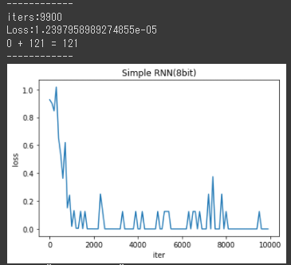 | loss=0.000877 <br/>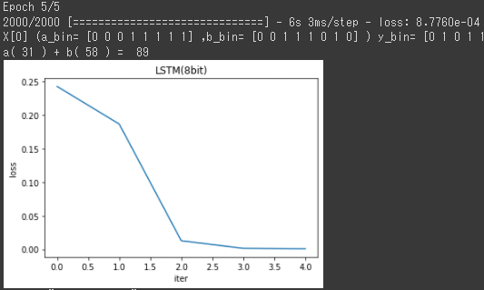 | loss=0.000309 <br/>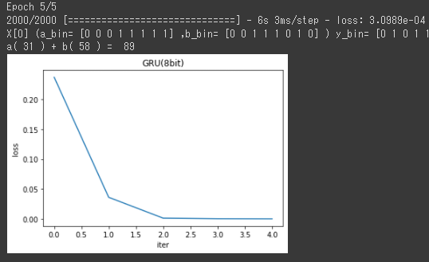 |
| 16bit　  | loss=0.125005 <br/>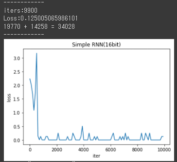 | loss=0.0012 <br/>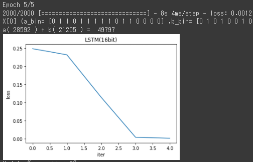 | loss=0.000425 <br/>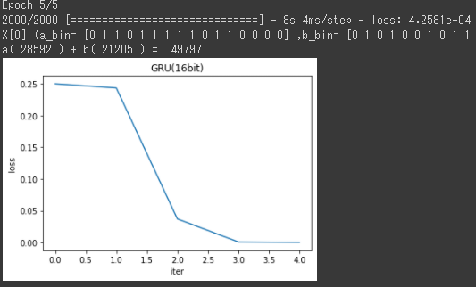 |
| 32bit　  | loss=0.000002 <br/>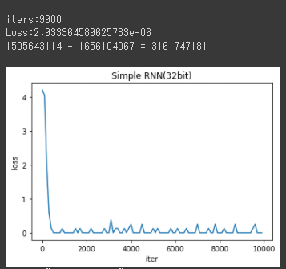 | loss=0.0019 <br/>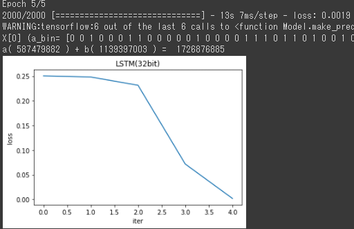 | loss=0.000362 <br/>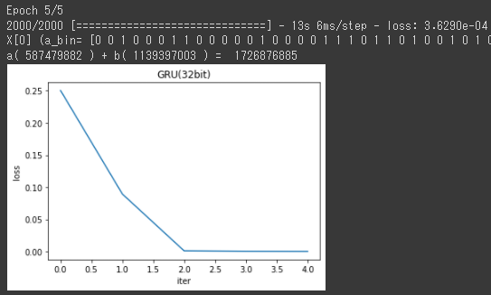 |

LSTM/GRUパラメータ数を比較してみた（下表）。GRUのほうが2割程度少ない。また、バイト長（時系列長）の違いはパラメータ数に影響していないことから、LSTM, GRU共に全時刻同じ重みとなっていることがわかる。

| バイト長 | LSTM | GRU  |
|:--------|:-----|:-----|
| 8bit　  |  1233 | 977  |
| 16bit　  | 1233 | 977  |
| 32bit　  | 1233 | 977  |


<div style="page-break-before:always"></div>

-----
## 3. 確認テスト

### 3.1 LSTM


(2) 0.25

<div style="page-break-before:always"></div>

-----

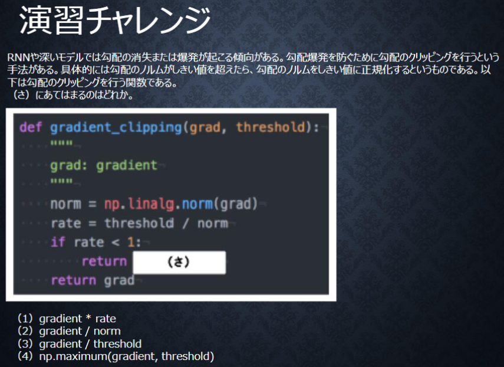

normをthresholdに正規化する計算式は、$grad * \frac{threshold}{norm}$となる。$\frac{threshold}{norm} = rate$なので、正解は「(1) gradient * rate」


<div style="page-break-before:always"></div>

-----


なくなっても影響を及ぼさない＝不要になった情報なので、「忘却ゲート」の作用で削除される。

<div style="page-break-before:always"></div>

-----

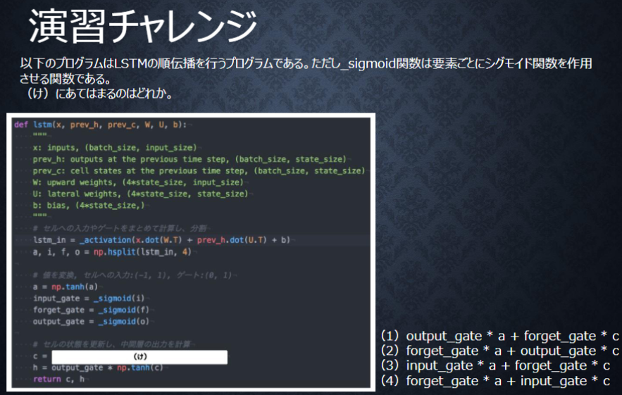

(3) input_gate * a + forget_gate * c

<div style="page-break-before:always"></div>

-----

### 3.2 GRU


LSTMは、パラメータ数が多くなり計算量が大きくなるのが課題である。

CECは、学習機能がないことが課題である。学習機能がないため、入力ゲートや忘却ゲート、出力ゲートが別途必要となり、LSTMのパラメータ肥大化の課題の要因となっている。

<div style="page-break-before:always"></div>

-----

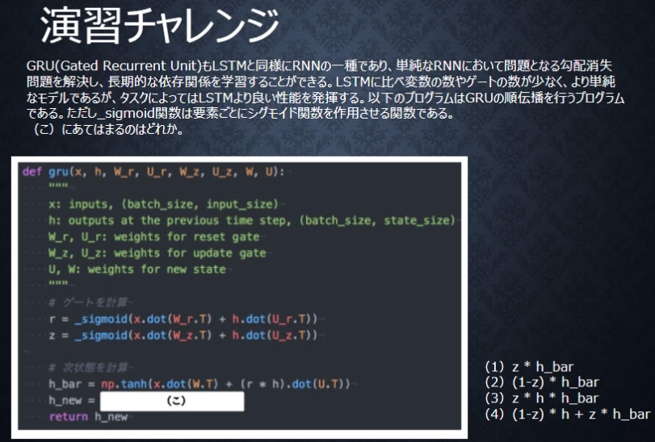

(4) (1-z) * h + z * h_bar

<div style="page-break-before:always"></div>

-----


主な違いはCECの有無となる。GRUには、パラメータ肥大化の要因となっているCECがないため、LSTMと比較してパラメータ数が少なく、計算量も小さい。

<div style="page-break-before:always"></div>

