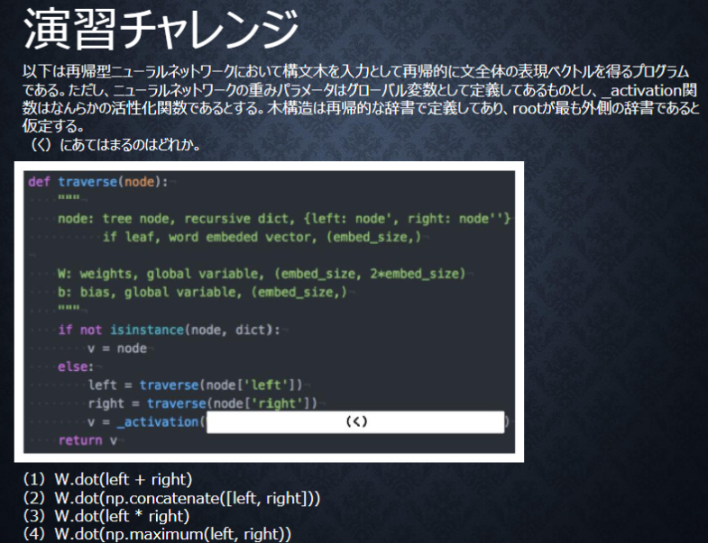
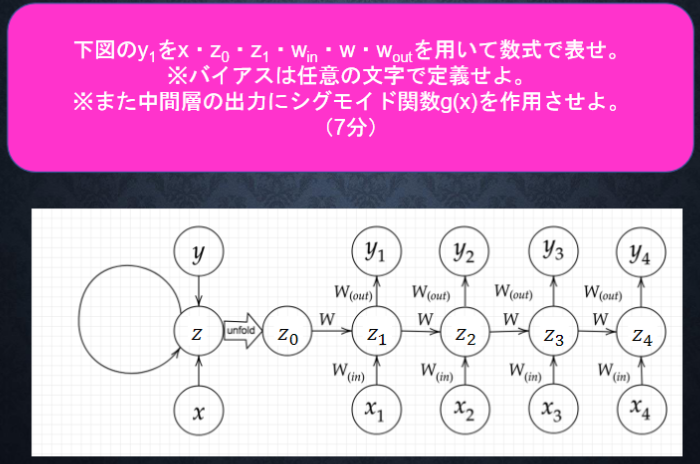
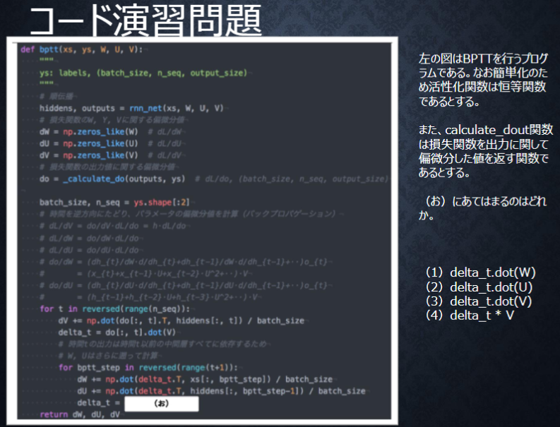

# Section3: GRU

## 1. 要点まとめ


<div style="page-break-before:always"></div>

-----
## 2. 実装演習

1_3_stochastic_gradient_descent.ipynbの「確率勾配降下法」のコードをベースに、数値微分による学習コードを作成し、誤差逆伝播との実行時間の差を確認する。

``` python


``` 

<div style="page-break-before:always"></div>

実行結果は以下。

| バイト長 | SimpleRNN | LSTM |
|:-----------|:-----------|:------------|
| 8　　　 | loss=0.000014 <br/> | loss=0.0026 <br/> |
| 16　　　 | loss=0.000015 <br/> | loss=0.0013 <br/> |
| 32　　　 | loss=0.000006 <br/> | loss=0.0011 <br/> |


<div style="page-break-before:always"></div>

-----
## 3. 確認テスト


<div style="page-break-before:always"></div>

-----



<div style="page-break-before:always"></div>

-----


<div style="page-break-before:always"></div>

-----



<div style="page-break-before:always"></div>

-----



