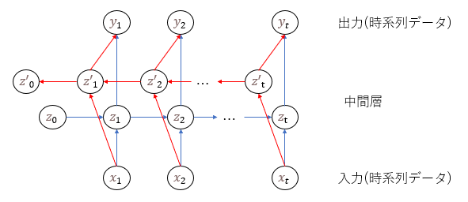
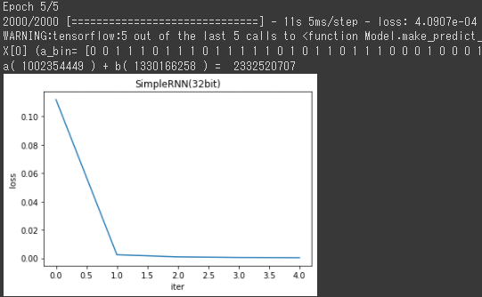
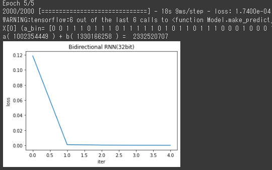
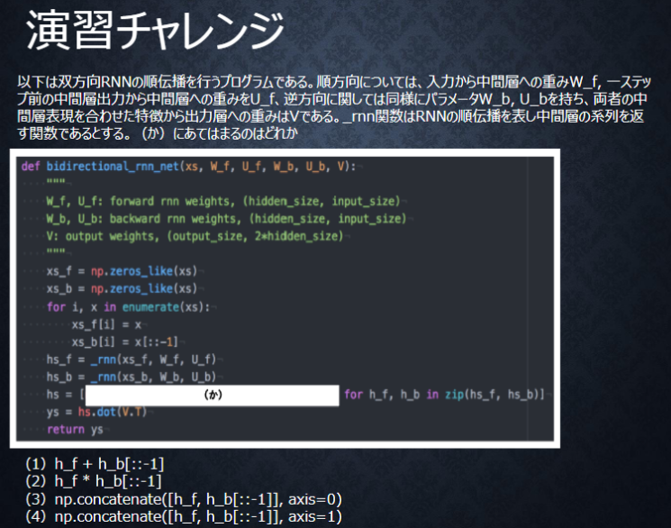
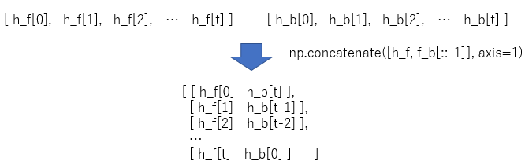

# Section4: 双方向RNN

## 1. 要点まとめ

双方向RNNとは、過去の情報だけでなく未来の情報を加味することができるモデルである。これにより、これまでと比べてモデルの精度向上が期待できる。

中間層の伝播が過去から未来方向だけだった従来のRNNに加えて、未来から過去方向への伝播が加わったことが大きな特徴である。全体構成は下図




<div style="page-break-before:always"></div>

-----
## 2. 実装演習

3_1_simple_RNN_after.ipynbのバイナリ加算を行うモデルをRNN(SimpleRNN)と双方向RNNで構築し、結果を比較する。

``` python
import numpy as np
from common import functions
import matplotlib.pyplot as plt

# 2進数→10進数変換
def conv_int(bin_data):
  out_int = 0
  for index,x in enumerate(reversed(bin_data)):
      out_int += x * pow(2, index)
  return out_int

# 10進数→2進数変換
def conv_bin(int_data, bin_dim_max):
  bin_array = np.zeros(bin_dim_max, dtype='uint8')
  bin_dim = int_data.bit_length()

  for i in range(bin_dim):
    bin_array[i] = int_data % 2
    int_data //= 2
  
  return bin_array[::-1]

# データ作成
def make_rowdata(max_number, bin_dim, data_num):
  data_a_int, data_b_int, data_d_int = [], [], []
  data_a_bin, data_b_bin, data_d_bin = [], [], []

  for i in range(data_num):
    a_int = np.random.randint(max_number)
    a_bin = conv_bin(a_int, bin_dim)
    b_int = np.random.randint(max_number)
    b_bin = conv_bin(b_int, bin_dim)
    d_int = a_int + b_int
    d_bin = conv_bin(d_int, bin_dim)

    data_a_int.append(a_int)
    data_a_bin.append(a_bin)
    data_b_int.append(b_int)
    data_b_bin.append(b_bin)
    data_d_int.append(d_int)
    data_d_bin.append(d_bin)

  return np.array(data_a_int), np.array(data_b_int), np.array(data_d_int), np.array(data_a_bin), np.array(data_b_bin), np.array(data_d_bin)

# RNN入力用にデータを整形
def conv_data(data_a_bin, data_b_bin, data_d_bin):
  data_num = data_a_bin.shape[0]
  dim = data_a_bin.shape[1]

  data = np.zeros((data_num, dim, 2))
  target = np.zeros((data_num, dim))

  for idx, (a_bin, b_bin, d_bin) in enumerate(zip(data_a_bin, data_b_bin, data_d_bin)):
    for t in range(dim):
      data[idx][t] = np.array([a_bin[-t-1], b_bin[-t-1]])
      target[idx][t] = d_bin[-t-1]
  
  return data, target

# モデル出力を2進数データに変換
def conv_outdata(yy):
  out_bin = np.zeros_like(yy)
  dim = yy.shape[0]
  for t in range(dim):
    out_bin[dim - t - 1] = np.round(yy[t])

  return out_bin.astype('uint8')

# --------------
#  データ作成
# --------------

# バイト長
binary_dim = 32
# 最大値 + 1
largest_number = pow(2, binary_dim)
# データ数(iters_num)
iters_num = 10000

# データ作成
data_a_int, data_b_int, data_d_int, data_a_bin, data_b_bin, data_d_bin = make_rowdata(largest_number/2, binary_dim, iters_num)
X_data, y_data = conv_data(data_a_bin, data_b_bin, data_d_bin)

# モデル共通パラメータ
input_layer_size = 2
hidden_layer_size = 16
output_layer_size = 1
learning_rate = 0.1

# --------------
#  SimpleRNN
# --------------
from tensorflow.keras.models import Sequential
from tensorflow.keras.layers import Dense, Activation
from tensorflow.keras.layers import SimpleRNN
from tensorflow.keras.optimizers import SGD

# SimpleRNNモデル作成
#   activation='tanh', recurrent_activation='hard_sigmoid'
#   return_sequences=True: 時刻毎に出力
rnn_model = Sequential() 
rnn_model.add(SimpleRNN(hidden_layer_size, 
                        batch_input_shape=(None, binary_dim, input_layer_size), 
                        return_sequences=True)) 
rnn_model.add(Dense(output_layer_size)) 

rnn_model.compile(loss='mean_squared_error', 
                   optimizer=SGD(learning_rate=learning_rate) , 
                   metrics = ['accuracy'])
rnn_model.summary()

# 学習 
batch_size = 5
epoch_num = batch_size

hist = rnn_model.fit(X_data, y_data,
                      epochs=epoch_num,
                      verbose=1,
                      batch_size=batch_size)

# 予測
y_pred = rnn_model.predict(X_data[0].reshape(1, binary_dim, 2))
y_pred_bin = conv_outdata(y_pred.reshape(binary_dim))

# 結果表示
print("X[0] (a_bin=",data_a_bin[0], ",b_bin=",data_b_bin[0],") y_bin=",y_pred_bin)
print("a(",conv_int(data_a_bin[0]), ") + b(",conv_int(data_b_bin[0]),") = ",conv_int(y_pred_bin))

plt.title("SimpleRNN("+str(binary_dim)+"bit)")
plt.xlabel("iter")
plt.ylabel("loss")
plt.plot(hist.history['loss'],label="train set")
plt.show()

# --------------
#  双方向RNN
# --------------
from tensorflow.keras.layers import Bidirectional

# 双方向RNNモデル作成
#   activation='tanh', recurrent_activation='hard_sigmoid'
#   return_sequences=True: 時刻毎に出力
bi_rnn_model = Sequential() 
rnn_layer = SimpleRNN(hidden_layer_size, 
                      return_sequences=True)
bi_rnn_model.add(Bidirectional(rnn_layer, 
                 batch_input_shape=(None, binary_dim, input_layer_size)))

bi_rnn_model.add(Dense(output_layer_size)) 

bi_rnn_model.compile(loss='mean_squared_error', 
                     optimizer=SGD(learning_rate=learning_rate) , 
                     metrics = ['accuracy'])
bi_rnn_model.summary()

# 学習 
batch_size = 5
epoch_num = batch_size

hist = bi_rnn_model.fit(X_data, y_data,
                        epochs=epoch_num,
                        verbose=1,
                        batch_size=batch_size)

# 予測
y_pred = bi_rnn_model.predict(X_data[0].reshape(1, binary_dim, 2))
y_pred_bin = conv_outdata(y_pred.reshape(binary_dim))

# 結果表示
print("X[0] (a_bin=",data_a_bin[0], ",b_bin=",data_b_bin[0],") y_bin=",y_pred_bin)
print("a(",conv_int(data_a_bin[0]), ") + b(",conv_int(data_b_bin[0]),") = ",conv_int(y_pred_bin))

plt.title("Bidirectional RNN("+str(binary_dim)+"bit)")
plt.xlabel("iter")
plt.ylabel("loss")
plt.plot(hist.history['loss'],label="train set")
plt.show()
``` 

<div style="page-break-before:always"></div>

実行結果は以下。バイト長は32bitで実行した。

- 誤差(loss)はどちらも微小であり、十分に学習できている。収束の違いもグラフ上では見られない。
  - 今回のバイナリ加算の問題に対しては、SimpleRNNで十分であり、双方向RNNはオーバースペックであると言える。

| SimpleRNN | Bidirectional RNN |
|:-----------|:------------|
| loss=0.000409 <br/> | loss=0.000174 <br/> |

モデルパラメータと学習の詳細ログは以下。

- パラメータの数が双方向RNNはSimpleRNNの2倍（321 vs 641）になっており、処理時間もパラメータ数に比例して約2倍になっている（5ms/step vs 9ms/step）

### SimpleRNN
``` 
_________________________________________________________________
 Layer (type)                Output Shape              Param #   
=================================================================
 simple_rnn_9 (SimpleRNN)    (None, 32, 16)            304       
                                                                 
 dense_9 (Dense)             (None, 32, 1)             17        
                                                                 
=================================================================
Total params: 321
Trainable params: 321
Non-trainable params: 0
_________________________________________________________________
Epoch 1/5
2000/2000 [==============================] - 11s 5ms/step - loss: 0.1119 - accuracy: 0.8249
Epoch 2/5
2000/2000 [==============================] - 11s 5ms/step - loss: 0.0025 - accuracy: 1.0000
Epoch 3/5
2000/2000 [==============================] - 11s 5ms/step - loss: 9.8147e-04 - accuracy: 1.0000
Epoch 4/5
2000/2000 [==============================] - 11s 5ms/step - loss: 5.5468e-04 - accuracy: 1.0000
Epoch 5/5
2000/2000 [==============================] - 11s 5ms/step - loss: 4.0907e-04 - accuracy: 1.0000
X[0] (a_bin= [0 0 1 1 1 0 1 1 1 0 1 1 1 1 1 0 1 0 1 1 0 1 1 1 0 0 0 1 0 0 0 1] ,b_bin= [0 1 0 0 1 1 1 1 0 1 0 0 1 0 0 0 1 0 1 1 1 0 0 1 1 1 1 1 0 0 1 0] ) y_bin= [1 0 0 0 1 0 1 1 0 0 0 0 0 1 1 1 0 1 1 1 0 0 0 1 0 0 0 0 0 0 1 1]
a( 1002354449 ) + b( 1330166258 ) =  2332520707
``` 

### 双方向RNN
``` 
_________________________________________________________________
 Layer (type)                Output Shape              Param #   
=================================================================
 bidirectional_6 (Bidirectio  (None, 32, 32)           608       
 nal)                                                            
                                                                 
 dense_10 (Dense)            (None, 32, 1)             33        
                                                                 
=================================================================
Total params: 641
Trainable params: 641
Non-trainable params: 0
_________________________________________________________________
Epoch 1/5
2000/2000 [==============================] - 19s 9ms/step - loss: 0.1187 - accuracy: 0.8116
Epoch 2/5
2000/2000 [==============================] - 18s 9ms/step - loss: 9.5872e-04 - accuracy: 1.0000
Epoch 3/5
2000/2000 [==============================] - 18s 9ms/step - loss: 4.0208e-04 - accuracy: 1.0000
Epoch 4/5
2000/2000 [==============================] - 18s 9ms/step - loss: 2.4707e-04 - accuracy: 1.0000
Epoch 5/5
2000/2000 [==============================] - 18s 9ms/step - loss: 1.7400e-04 - accuracy: 1.0000
X[0] (a_bin= [0 0 1 1 1 0 1 1 1 0 1 1 1 1 1 0 1 0 1 1 0 1 1 1 0 0 0 1 0 0 0 1] ,b_bin= [0 1 0 0 1 1 1 1 0 1 0 0 1 0 0 0 1 0 1 1 1 0 0 1 1 1 1 1 0 0 1 0] ) y_bin= [1 0 0 0 1 0 1 1 0 0 0 0 0 1 1 1 0 1 1 1 0 0 0 1 0 0 0 0 0 0 1 1]
a( 1002354449 ) + b( 1330166258 ) =  2332520707
``` 


<div style="page-break-before:always"></div>

-----
## 3. 確認テスト



正解は、(4) np.concatenate([h_f, f_b[::-1]], axis=1)

これにより、下図の配列が生成される。


