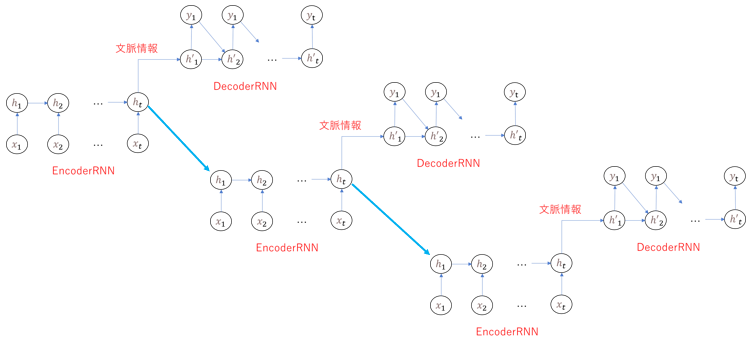

# Section5: Seq2Seq

## 1. 要点まとめ

Seq2Seqとは、文章から別の文章を生成する、といったことを行うEncoder-Decoderモデルの一種である。機械翻訳などに適用されることが多い。

Seq2Seqの全体構成は下図。
EncoderRNNとDecoderRNNの２つのネットワークで構成されており、入力された文章をEncoderRNNで文脈情報に相当するベクトルに変換し、それをDecoderRNNで別の文章に変換する、といった動作を行う。


EncoderRNNの入力は文章を単語等に分割したトークンとなるが、RNNは言葉を直接扱えないので数値に変換したものを入力$x_t$として与える。

言葉等の記号を数値化する場合、One-Hot Vectorにするのが通例であるが、One-Hot Vectorは記号を表す箇所以外は全て0埋めされたベクトルであり冗長である。そこでOne-Hot Vectorを短縮したembedding表現が用いられる。One-Hot Vectorからembedding表現への変換は別のRNN（教師なし）で行う。

EncoderRNNの中間層の末尾$h_t$が入力した文の意味（文脈）を表すデータで、これがDecoderRNNの中間層$h'_1$に渡される。

DecoderRNNでは、出力データが単語等のトークンごとに生成される。各時刻の出力データは、次の時刻出力のための入力ともなっており、これが全時刻（全トークン）に渡って繰り返される。

<div style="page-break-before:always"></div>

### HRED/VHRED

seq2seqは、１つの文に対して１つの答えしか返せない。これを改善し、過去の文脈まで加味した推論を行うモデルがHREDとなる。
複数のseq2seqをRNN（Context RNN）でつなぎ合わせた構造となっている（下図）。



ただ、HREDは、多様性に欠け、短い応答しか返さなくなりがちな傾向がある。

この課題を解決するモデルとしてVHREDがある。VHREDは、HREDにVAE（オートエンコーダー）を加えることで出力に多様性を与えたモデルである。

### オートエンコーダー、VAE

オートエンコーダーとは、入力の特徴を保持しつつデータ量を一度圧縮し（次元圧縮）、重要な特徴量だけを残した後、再度元の次元に復元処理を行うアルゴリズムである。

VAE（Variational Autoencoder（変分オートエンコーダー））は、オートエンコーダーに
確率分布（標準正規分布）を導入し、確率分布に従う潜在変数を作り出す機能を追加したモデルである。これにより、入力とは少し異なる出力を生成できるようになり、多様性が生まれる。


<div style="page-break-before:always"></div>

-----
## 2. 実装演習

3_1_simple_RNN_after.ipynbのバイナリ加算を行うモデルをseq2seqモデルで構築し、学習結果を確認する。


``` python
import numpy as np
from common import functions
import matplotlib.pyplot as plt

# 2進数→10進数変換
def conv_int(bin_data):
  out_int = 0
  for index,x in enumerate(reversed(bin_data)):
      out_int += x * pow(2, index)
  return out_int

# 10進数→2進数変換
def conv_bin(int_data, bin_dim_max):
  bin_array = np.zeros(bin_dim_max, dtype='uint8')
  bin_dim = int_data.bit_length()

  for i in range(bin_dim):
    bin_array[i] = int_data % 2
    int_data //= 2
  
  return bin_array[::-1]

# データ作成
def make_rowdata(max_number, bin_dim, data_num):
  data_a_int, data_b_int, data_d_int = [], [], []
  data_a_bin, data_b_bin, data_d_bin = [], [], []

  for i in range(data_num):
    a_int = np.random.randint(max_number)
    a_bin = conv_bin(a_int, bin_dim)
    b_int = np.random.randint(max_number)
    b_bin = conv_bin(b_int, bin_dim)
    d_int = a_int + b_int
    d_bin = conv_bin(d_int, bin_dim)

    data_a_int.append(a_int)
    data_a_bin.append(a_bin)
    data_b_int.append(b_int)
    data_b_bin.append(b_bin)
    data_d_int.append(d_int)
    data_d_bin.append(d_bin)

  return np.array(data_a_int), np.array(data_b_int), np.array(data_d_int), np.array(data_a_bin), np.array(data_b_bin), np.array(data_d_bin)

# RNN入力用にデータを整形
def conv_data(data_a_bin, data_b_bin, data_d_bin):
  data_num = data_a_bin.shape[0]
  dim = data_a_bin.shape[1]

  data = np.zeros((data_num, dim, 2))
  target = np.zeros((data_num, dim))

  for idx, (a_bin, b_bin, d_bin) in enumerate(zip(data_a_bin, data_b_bin, data_d_bin)):
    for t in range(dim):
      data[idx][t] = np.array([a_bin[-t-1], b_bin[-t-1]])
      target[idx][t] = d_bin[-t-1]
  
  return data, target

# モデル出力を2進数データに変換
def conv_outdata(yy):
  out_bin = np.zeros_like(yy)
  dim = yy.shape[0]
  for t in range(dim):
    out_bin[dim - t - 1] = np.round(yy[t])

  return out_bin.astype('uint8')

# --------------
#  データ作成
# --------------

# バイト長
binary_dim = 8
# 最大値 + 1
largest_number = pow(2, binary_dim)
# データ数(iters_num)
iters_num = 10000

# データ作成
data_a_int, data_b_int, data_d_int, data_a_bin, data_b_bin, data_d_bin = make_rowdata(largest_number/2, binary_dim, iters_num)
X_data, y_data = conv_data(data_a_bin, data_b_bin, data_d_bin)

# モデル共通パラメータ
input_layer_size = 2
hidden_layer_size = 16
output_layer_size = 1
learning_rate = 0.1

# --------------
#  seq2seq
#   参考: https://orangesrv.dip.jp/wordpress/archives/1063
# --------------
from tensorflow.keras.models import Sequential
from tensorflow.keras.layers import Dense, Activation
from tensorflow.keras.layers import SimpleRNN
from tensorflow.keras.optimizers import SGD
from keras.layers.core import RepeatVector
from tensorflow.keras.utils import plot_model

# seq2seqモデル作成
seq_model = Sequential() 
# Encoder
seq_model.add(SimpleRNN(hidden_layer_size, 
                        batch_input_shape=(None, binary_dim, input_layer_size), 
                        return_sequences=False)) 
# Decoder
seq_model.add(RepeatVector(binary_dim))
seq_model.add(SimpleRNN(hidden_layer_size, 
                        batch_input_shape=(None, binary_dim, input_layer_size), 
                        return_sequences=True))
seq_model.add(Dense(output_layer_size)) 

seq_model.compile(loss='mean_squared_error', 
                   optimizer=SGD(learning_rate=learning_rate) , 
                   metrics = ['accuracy'])
seq_model.summary()
plot_model(seq_model, show_shapes=True)

# 学習 
batch_size = 5
epoch_num = batch_size

hist = seq_model.fit(X_data, y_data,
                      epochs=epoch_num,
                      verbose=1,
                      batch_size=batch_size)

# 予測
y_pred = seq_model.predict(X_data[0].reshape(1, binary_dim, 2))
y_pred_bin = conv_outdata(y_pred.reshape(binary_dim))

# 結果表示
print("X[0] (a_bin=",data_a_bin[0], ",b_bin=",data_b_bin[0],") y_bin=",y_pred_bin)
print("a(",conv_int(data_a_bin[0]), ") + b(",conv_int(data_b_bin[0]),") = ",conv_int(y_pred_bin))

plt.title("SimpleRNN("+str(binary_dim)+"bit)")
plt.xlabel("iter")
plt.ylabel("loss")
plt.plot(hist.history['loss'],label="train set")
plt.show()
``` 

<div style="page-break-before:always"></div>

実行結果は以下。

- 8bitは学習ができており正解も出せているが、16bit, 32bitは学習ができておらず予測結果も不正解となった。
  - SimpleRNN単体の試行時と異なりEncoderでは全時刻の出力データを使っていない。
  - また、中間層の固定長出力に集約するというseq2seqの仕組み上、長期記憶が難しい。
  - よって、Encoderで情報消失したことが考えられる。

| バイト長 | seq2seq |
|:--------|:---------|
| 8bit  | loss=0.0066 <br/> | 
| 16bit　| loss=0.1735 <br/> | 
| 32bit　| loss=0.2471 <br/> | 


<div style="page-break-before:always"></div>

-----
## 3. 確認テスト


正解は(2)

    (2) RNNを用いたEncoder-Decoderモデルの一種であり、機械翻訳などのモデルに使われる。

他の選択肢はそれぞれ以下についての説明となる。

- (1) 双方向RNN
- (3) 構文木
- (4) LSTM


<div style="page-break-before:always"></div>

-----


(1) E.dot(w)

Eは、word(one-hot vector)を特徴量に変換するMatrixであり、Eとwordのdot積を取ることで特徴量を抽出できる。
この関数内では、抽出した特徴量eを活性化関数に通して出力するという処理を時刻毎（単語毎）に行っており、RNNの順伝播と同様の処理となっている。

<div style="page-break-before:always"></div>

-----


HREDはSeq2Seqの改良版であり、複数のSeq2SeqをContext RNNでつなぎ合わせた構造をしたモデルである。これにより、１つの文に対して１つの答えしか返せないseq2seqの欠点を改善し、過去の文脈まで加味した推論を行うことを可能にしている。

VHREDはHREDの改良版であり、HREDにVAE（オートエンコーダー）を加えたモデルである。これにより、多様性に欠け短い応答しか返さなくなりがちな傾向があるHREDの欠点を改善し、多様性のある出力を返すことができるようになる。


<div style="page-break-before:always"></div>

-----


空欄に当てはまる言葉は、「確率分布」

