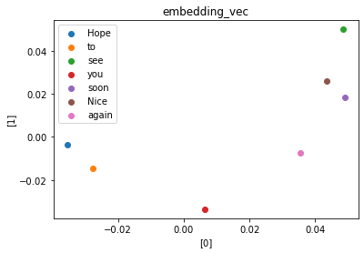

# Section6: word2vec / Section7: AttentionMechanism

## 1. 要点まとめ

### 1.1 word2vec

word2vecとは、単語をベクトル表現（embedding表現）にする手法である。

単語のベクトル表現としてはone-hotベクトルがあるが、次元＝ボキャブラリ数となり、しかも、1つの次元以外は全て0であるためかなり冗長である。そこで、one-hotベクトルの冗長性を排除し、意味が近い単語同士の距離が近くなるようなベクトル（embedding表現）を獲得する手法がword2vecとなる。

one-hotベクトルを入力とし、変換表（行列）によって変換することでembedding表現を得る。変換表（行列）は機械学習によって求める。

### 1.2 Attention Mechanism

seq2seqは、Encoder中間層の最終出力のみをDecoderへの入力としているため、最終出力に集約しきれなかった情報はDecoderへ入力されない。長文だと最終出力に集約しきれなくなる情報が多くなることから、長文への対応が困難である。この課題を解消するための手法がAttention Mechanismである。

Attention Mechanismでは、特定の入力単語やその周辺の単語にフォーカスしたEncoder中間層出力をDecoderに入力する。これにより、Encoder中間層の最終出力に集約しきれなかった情報も入力可能となるため、長文にも対応できるようになる。

<div style="page-break-before:always"></div>

-----
## 2. 実装演習

word2vecの肝となるembedding表現についての理解を深めるため、以下URLを参考にkerasのEmbeddingレイヤで作成したモデルで文章からembedding表現を得るコードを実装し、結果を確認する。

https://qiita.com/9ryuuuuu/items/e4ee171079ffa4b87424


``` python
import numpy as np
from numpy.random import seed
from tensorflow import keras

# 辞書作成（単語―IDの対応表を作成）
def make_worddic(sencentes):
    worddic = {}
    for sentence in sentences:
        for word in sentence:
            if not word in worddic.keys():
                worddic[word] = len(worddic)
    return worddic

# 文章中の単語をID列に変換
def conv_sentences2vec(worddic, sentences):
    num_sentence = len(sentences)
    lenmax_sentence = 0
    for sentence in sentences:
        len_sentence = len(sentence)
        if len_sentence > lenmax_sentence:
            lenmax_sentence = len_sentence

    n_array = np.zeros((num_sentence,lenmax_sentence))
    for idx_s,sentence in enumerate(sentences):
        n_array[idx_s] = np.zeros(lenmax_sentence)
        for idx_w,word in enumerate(sentence):
            n_array[idx_s][idx_w] = worddic[word]

    return n_array

# OneHot Vector作成
def make_onehot(sentences_vec, dim):
    onehot_vec = np.zeros((sentences_vec.shape[0], sentences_vec.shape[1], dim))
    for idx_s,sentence_array in enumerate(sentences_vec):
        for idx_w, word in enumerate(sentence_array):
            onehot_vec[idx_s][idx_w][int(word)] = 1

    return onehot_vec

# 毎回の計算結果を同一にするための設定
seed(1)
tf.random.set_seed(2)

# ================
#  入力データ作成
# ================
# サンプル文章(2文)
sentences = [
    ['Hope', 'to', 'see', 'you', 'soon'],
    ['Nice', 'to', 'see', 'you', 'again']
]
worddic = make_worddic(sentences)
sentences_vec = conv_sentences2vec(worddic, sentences)
print("worddic=",worddic)
print("[input] sentences_vec=",sentences_vec)

vocab_size = len(worddic)
embed_size = 2

# ===================
#  OneHot Vector作成
# ===================
output_onehot_vec = make_onehot(sentences_vec, vocab_size)

# ===================
#  embedding表現作成
# ===================
embed_model = keras.Sequential()
embed_model.add(keras.layers.Embedding(vocab_size, embed_size))
embed_model.compile(optimizer='rmsprop', loss='mse')
embed_model.summary()
output_embedding_vec = embed_model.predict(sentences_vec)

# ===================
#  結果出力
# ===================
import matplotlib.pyplot as plt

print("[output] onehot_vec=",output_onehot_vec)
print("[output] embedding_vec=",output_embedding_vec)
print("[output] embed_model.get_weights()[0]=",embed_model.get_weights()[0])

plt.figure(facecolor="white")
plt.title("embedding_vec")
plt.xlabel("[0]")
plt.ylabel("[1]")
for word, embed_vec in zip(worddic.keys(), embed_model.get_weights()[0]):
    plt.scatter(embed_vec[0], embed_vec[1], label=word)

plt.legend(loc="upper left") 
``` 

<div style="page-break-before:always"></div>

実行結果は以下。

- 7次元のOneHotベクトルが2次元ベクトルに圧縮され、冗長性削減されている
- embedding表現を可視化した散布図では、"Nice"と"soon"の距離が近い
  - これらが意味的に近いようには思えない
  - 文例や単語数が非常に少ないため、意味的に近いもの同士が近づく、といったところまでは実現できていない


``` python
#入力文章（以下２文）
- Hope to see you soon.
- Nice to see you again

# 辞書（単語 - ID対応表）
worddic= {'Hope': 0, 'to': 1, 'see': 2, 'you': 3, 'soon': 4, 'Nice': 5, 'again': 6}

# 単語をIDに変換したベクトル（２文）
[input] sentences_vec= [[0. 1. 2. 3. 4.]
 [5. 1. 2. 3. 6.]]

# 出力1: OneHotベクトル
[output] onehot_vec= [[[1. 0. 0. 0. 0. 0. 0.]
  [0. 1. 0. 0. 0. 0. 0.]
  [0. 0. 1. 0. 0. 0. 0.]
  [0. 0. 0. 1. 0. 0. 0.]
  [0. 0. 0. 0. 1. 0. 0.]]

 [[0. 0. 0. 0. 0. 1. 0.]
  [0. 1. 0. 0. 0. 0. 0.]
  [0. 0. 1. 0. 0. 0. 0.]
  [0. 0. 0. 1. 0. 0. 0.]
  [0. 0. 0. 0. 0. 0. 1.]]]

# 出力2: embedding表現
[output] embedding_vec= [[[-0.03530975 -0.00357432]
  [-0.02751002 -0.01471115]
  [ 0.04857408  0.04991024]
  [ 0.00648881 -0.03362492]
  [ 0.04890269  0.0181414 ]]

 [[ 0.04361813  0.0260351 ]
  [-0.02751002 -0.01471115]
  [ 0.04857408  0.04991024]
  [ 0.00648881 -0.03362492]
  [ 0.03557707 -0.00729815]]]
```
<div style="page-break-before:always"></div>

出力3: embedding表現の可視化（散布図）



<div style="page-break-before:always"></div>

-----
## 3. 確認テスト


RNNは、入力層／中間層／出力層が時刻毎に配置された、時系列データに適したニューラルネットワークである。

word2vecは、one-hotベクトルの冗長性を排除し、意味が近い単語同士の距離が近くなるようなベクトル（embedding表現）を獲得する手法である。

seq2seqは、１つの時系列データから別の時系列データを得る、Encoder-Decoderモデルのニューラルネットワークである。

Attentionは、関連性の高いEncoder中間層出力をDecoder中間層に入力できるようにしたモデルで、seq2seqが苦手とする長文に強いモデルである。

