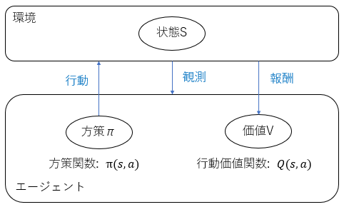
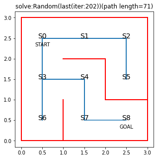
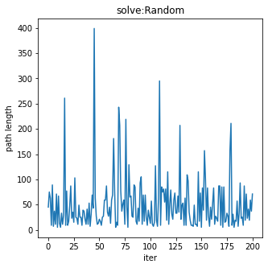
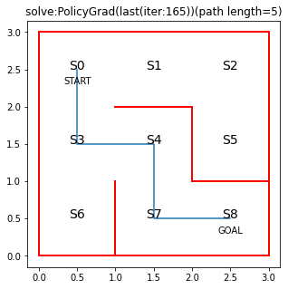
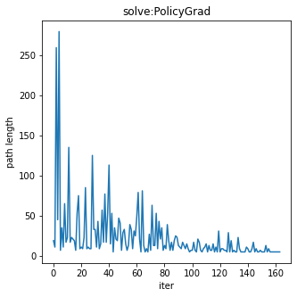

# Section1: 強化学習 / Section2: AlphaGo

## 1. 要点まとめ

### 1.1 強化学習

強化学習とは、エージェントに目的を与えてそれを達成するための方法（方策）を学習させることである。エージェントがある方策に基づいた行動を起こすと環境の状態が変化し、行動と変化後の状態に見合った報酬がエージェントに対して与えられ、エージェントは報酬に応じて価値を向上させる。報酬を最大化する（＝エージェントの価値を高める）方策をエージェントに学習させることが強化学習の目的となる。

具体的には、エージェントの方策と価値を関数化し、関数最適化を行うこととなる。
これは理論的には、方策と価値を関数に近似する関数近似法と、行動するたびに行動価値関数のパラメータ更新を行うＱ学習を組み合わせたものとなっている。

- 方策関数: $π(s,a)$　※s:状態、a:行動
- 価値関数: $Q(s,a)$



価値関数とは、目標設定に当たる関数となり、エージェントの価値を出力する関数となる。以下２つがあるが、行動価値関数のほうがよく用いられる。

- 行動価値関数: 状態s＆行動aから価値を算出する
- 状態価値関数: 状態sから価値を算出する

方策関数とは、エージェントが行動を決定するための関数である。価値関数とは密接な関係にあり、価値関数が出力する価値を最大化するように行動を決定する。

方策関数の学習は、方策勾配法で行う。数式は以下。2式目は、ある状態sの下での全行動の報酬の総和を表す。1式目で、この報酬の総和が増える方向にパラメータを更新する。

- $Θ^{t+1} = Θ^t + ε∇J(Θ)$　※Θ: 方策関数内部パラメータ（NNの重みに相当）
- $∇J(Θ) = ∇\sum_{a\in{A}}{π(a|s)Q(s,a)}$

<div style="page-break-before:always"></div>

### 1.2 AlphaGo

AlphaGoは、囲碁を行うプログラムをAIで実装したものである。AlphaGoのバージョンはいくつかあるが、代表的なものは「AlphaGo Lee」「AlphaGo Zero」である。

#### AlphaGo Lee

AlphaGo Leeは、２代目バージョンである。以下3つの関数で構成される。

- PolicyNet: 方策関数
- ValueNet: 価値関数
- RollOutPolicy：線形の方策関数

PolicyNetは方策関数であり、CNNにて実装される。
入力は19x19、48chのデータで、石の配置や、人が定義した囲碁固有の特徴量で構成される。
出力は次の１手をどこに打てばよいか？の確率であり、19x19のデータで出力する。

ValueNetは価値関数であり、これもCNNで実装される。
入力はPolicyNetとほぼ同様である。出力は勝てそうかどうかを-1～1のスカラーで出力する。

RollOutPolicyは、線形の方策関数であり、精度よりもスピード重視の関数である。PolicyNetの計算量を減らすために導入されている。

学習は以下３段階で行われる。

- PolicyNet、RollOutPolicyを教師あり学習で学習
- PolicyNetの強化学習
- ValueNetの強化学習

ValueNetの学習では、モンテカルロ木探索が行われる。探索は、RoolOutPolicyを使って高速に実行される。

#### AlphaGo Zero

AlphaGo Zeroは、４代目バージョンである。「AlphaGo Lee」との主な違いは以下

- 教師あり学習を使わない
- 入力をシンプル化（石の配置のみにし、人が定義した囲碁固有の特徴量を排除）
- PolicyNetとValueNetを１つにした

PolicyNetとValueNetを１つにしたネットワークはCNNで実装され、入力は19x19 17chとなる。途中で２つに枝分かれし、出力がPolicy出力、Value出力の２つになる。

また、ネットワークにショートカット構造を追加したResidualブロックによって、勾配消失を抑えたり、違うネットワークを組み合わせたような効果（アンサンブル効果）が得られる工夫が適用されている。


<div style="page-break-before:always"></div>

-----
## 2. 実装演習

簡単な迷路を解く問題を強化学習（方策勾配法）で実装し、方策なしでランダムに迷路を解いた結果と比較して強化学習（方策勾配法）の効果を確認する。

``` python
# 参考URL: https://book.mynavi.jp/manatee/detail/id=88297

import numpy as np
import matplotlib.pyplot as plt
%matplotlib inline

# 迷路定義
#  [↑、→、↓、←]
MAZE_DEF = np.array(
    [[[np.nan, 1, 1, np.nan], [np.nan, 1, np.nan, 1], [np.nan, np.nan, 1, 1]], 
    [[1, 1, 1, np.nan], [np.nan, np.nan, 1, 1], [1, np.nan, np.nan, np.nan]], 
    [[1, np.nan, np.nan, np.nan], [1, 1, np.nan, np.nan], [np.nan, np.nan, np.nan, 1]]])

MAZE_INFO={ "W":MAZE_DEF.shape[1], 
            "H":MAZE_DEF.shape[0], 
            "S":0, 
            "G":MAZE_DEF.shape[0]*MAZE_DEF.shape[1]-1 }

# 方策パラメータthetaを行動方策piに変換: softmax
def softmax_convert_into_pi_from_theta(theta):
    # 行ける方向(≠np.nan)全てにソフトマックス関数で均等に確率を割り当てる
    [m, n] = theta.shape
    pi = np.zeros((m, n))
    exp_theta = np.exp(1.0 * theta)

    for i in range(0, m):
        pi[i, :] = exp_theta[i, :] / np.nansum(exp_theta[i, :])

    # 行けない方向(=nan)には確率0を割り当て
    pi = np.nan_to_num(pi)  
    return pi

# 行動aと1step移動後の状態sを求める関数を定義
def get_action_and_next_s(pi, s, maze_w):
    direction = ["up", "right", "down", "left"]
    # pi[s,:]の確率に従って、directionが選択される
    next_direction = np.random.choice(direction, p=pi[s, :])

    if next_direction == "up":
        action = 0
        s_next = s - maze_w  # 上に移動
    elif next_direction == "right":
        action = 1
        s_next = s + 1  # 右に移動
    elif next_direction == "down":
        action = 2
        s_next = s + maze_w  # 下に移動
    elif next_direction == "left":
        action = 3
        s_next = s - 1  # 左に移動

    return [action, s_next]


# 迷路を解く関数の定義、状態と行動の履歴を出力
def goal_maze_ret_s_a(pi, state_s, state_g, maze_w):
    s = state_s  # スタート地点
    s_a_history = [[state_s, np.nan]]  # エージェントの移動を記録するリスト

    while (1):  # ゴールするまでループ
        [action, next_s] = get_action_and_next_s(pi, s, maze_w)

        # 現在の状態（つまり一番最後なのでindex=-1）の行動を代入
        s_a_history[-1][1] = action

        # 次の状態を代入。行動はまだ分からないのでnanにしておく
        s_a_history.append([next_s, np.nan])

        if next_s == state_g:  # ゴール地点なら終了
            break
        else:
            s = next_s

    return s_a_history

# theta(各状態(位置)における行動(方向)回数)の更新
#   ゴールまで到達したパス(s_a_history)に含まれる方向(行動a)の回数を大きくする
def update_theta(theta, pi, s_a_history):
    eta = 0.1 # 学習率
    T = len(s_a_history) - 1  # ゴールに至るパス長

    [stat_dim, act_dim] = theta.shape
    delta_theta = theta.copy()

    # ゴールまで到達したパスに含まれる行動＝価値大
    # パス長が小さいほど価値が大きい
    for s in range(0, stat_dim):
        for a in range(0, act_dim):
            if not(np.isnan(theta[s, a])):  # thetaがnanでない場合

                # 状態sで行動した総回数: N_s
                SA_s = [SA for SA in s_a_history if SA[0] == s]
                N_s = len(SA_s) 

                # 状態sで行動aをとった回数: N_sa
                SA_sa = [SA for SA in s_a_history if SA == [s, a]]
                N_sa = len(SA_sa)

                # {状態sで行動aをとる回数の実績(N_sa) + 予測値(N_s * π(s,a))} / パス長T
                delta_theta[s, a] = (N_sa + pi[s, a] * N_s) / T

    new_theta = theta + eta * delta_theta

    return new_theta


# 迷路、移動履歴の描画
def draw_maze_history(maze_def, maze_w, maze_h, state_s, state_g, state_hist, result_name):
    fig = plt.figure(facecolor="white", figsize=(5, 5))
    ax = plt.gca()
    for y in range(maze_h):
        for x in range(maze_w):
            state = y * maze_w + x

            # 状態を示す文字S0～S8を描く
            ax.text(float(x)+0.5, float(maze_h-y)-0.5, 
                    "S"+str(state), size=14, ha="center")
            if state == state_s:
                ax.text(float(x)+0.5, float(maze_h-y)-0.7, 'START', ha='center')
            elif state == state_g:
                ax.text(float(x)+0.5, float(maze_h-y)-0.7, 'GOAL', ha='center')

            # 壁描画
            for diridx, dir in enumerate(maze_def[y][x]):
                if np.isnan(dir):
                    # dir= [↑、→、↓、←]
                    if diridx == 0:
                        x0 = x
                        y0 = maze_h-y
                        x1 = x0 + 1
                        y1 = y0
                    elif diridx == 1:
                        x0 = x + 1
                        y0 = maze_h-y
                        x1 = x0
                        y1 = y0 - 1
                    elif diridx == 2:
                        x0 = x
                        y0 = maze_h-y-1
                        x1 = x0 + 1
                        y1 = y0
                    else:
                        x0 = x
                        y0 = maze_h-y
                        x1 = x0
                        y1 = y0 - 1

                    ax.plot([x0, x1], [y0, y1], color='red', linewidth=2)

    # 移動履歴の描画
    loc_history_x = []
    loc_history_y = []
    
    for state, _ in state_hist:
        loc_x = float(state % maze_w) + 0.5
        loc_y = float(maze_h - int(state / maze_w)) - 0.5
        loc_history_x.append(loc_x)
        loc_history_y.append(loc_y)

    str_title = result_name + "(path length=" + str(len(state_hist)) + ")"

    ax.set_title(str_title)
    ax.plot(loc_history_x, loc_history_y)
    return

# パス長変化の描画
def draw_len_path_history(len_hist, result_name):
    fig = plt.figure(facecolor="white", figsize=(5, 5))
    ax = plt.gca()

    x_iter = range(0, len(len_hist))
    ax.set_title(result_name)
    ax.set_xlabel("iter")
    ax.set_ylabel("path length")
    ax.plot(x_iter, len_hist)
    return

# 迷路を解く方式(0:ランダム、1:方策勾配法)
solve_method = 0

freq_draw = 40    # 可視化頻度
iter_th = 200     # 終了閾値: 繰り返し回数（閾値以上で強制打ち切り）

len_path_history = []

# 初期の方策π0を設定（動ける方向すべてに均等確率を与える）
theta_0 = MAZE_DEF.reshape(MAZE_INFO["W"] * MAZE_INFO["H"], 4)
pi_0 = softmax_convert_into_pi_from_theta(theta_0)

if solve_method == 0:
    # [迷路を解く方式＝ランダム]
    solve_method_str="Random"

    is_continue = True
    iter = 1
    while is_continue:  
        # 初期の方策π0で迷路を解く
        s_a_history = goal_maze_ret_s_a(pi_0, 
                        MAZE_INFO["S"], MAZE_INFO["G"], MAZE_INFO["W"])

        len_path = len(s_a_history)
        len_path_history.append(len_path)

        if iter > iter_th:
            is_continue = False

        # 今回の結果を可視化
        if (iter-1) % freq_draw == 0:
            draw_maze_history(MAZE_DEF, MAZE_INFO["W"], MAZE_INFO["H"], 
                MAZE_INFO["S"], MAZE_INFO["G"], s_a_history, 
                "solve:"+solve_method_str+"(iter:" + str(iter) + ")")
        iter += 1

elif solve_method == 1:
    # [迷路を解く方式＝方策勾配法]
    solve_method_str="PolicyGrad"

    diff_lenpath_stop_th = 1.0  # 学習終了閾値: パス長の変化（閾値以下になったら学習終了）

    theta = theta_0
    pi = pi_0

    len_path_prev = MAZE_INFO["W"] * MAZE_INFO["H"]
    diff_len_path_ave = len_path_prev

    is_continue = True
    iter = 1
    while is_continue:  
        # 方策πで迷路を解く
        s_a_history = goal_maze_ret_s_a(pi, 
                        MAZE_INFO["S"], MAZE_INFO["G"], MAZE_INFO["W"])  

        # 方策πを、ゴールまで到達したパスで更新
        #   ゴールまで到達したパスに含まれる方向の確率が大きくなるように更新
        new_theta = update_theta(theta, pi, s_a_history)
        new_pi = softmax_convert_into_pi_from_theta(new_theta)
 
        # 終了判定（ゴール到達パス長の変化小 or 回数大）
        len_path = len(s_a_history)
        len_path_history.append(len_path)

        # パス長変化（移動平均を取る）
        diff_len_path_ave = diff_len_path_ave * 0.8 
        diff_len_path_ave += abs(len_path - len_path_prev) * 0.2
        
        len_path_prev = len_path

        if (diff_len_path_ave < diff_lenpath_stop_th) or (iter > iter_th):
            is_continue = False
        else:
            theta = new_theta
            pi = new_pi

        # 今回の結果を可視化
        if (iter-1) % freq_draw == 0:
            print("diff_len_path_ave(iter:",str(iter),")=",diff_len_path_ave)
            draw_maze_history(MAZE_DEF, MAZE_INFO["W"], MAZE_INFO["H"], 
                MAZE_INFO["S"], MAZE_INFO["G"], 
                s_a_history, "solve:"+solve_method_str+"(iter:" + str(iter) + ")")

        iter += 1

    print("diff_len_path_ave(last(iter:",str(iter),"))=",diff_len_path_ave)

# 最終結果を可視化
draw_maze_history(MAZE_DEF, MAZE_INFO["W"], MAZE_INFO["H"], 
        MAZE_INFO["S"], MAZE_INFO["G"], 
        s_a_history, "solve:"+solve_method_str+"(last(iter:" + str(iter) + "))")

# パス長変化を可視化
draw_len_path_history(len_path_history, "solve:"+solve_method_str)

``` 

<div style="page-break-before:always"></div>

実行結果は以下

- 方策勾配法では、Goalまでの最短パスが出力されている
- パス長の推移も、ランダム（方策なし）と比べて、徐々に収束していることがわかる


|       | 結果                            | パス長の推移   |
| ----- | ------------------------------- | ------------- |
| ランダム（方策なし）  |      |      |
| 方策勾配法 |  |  |


<div style="page-break-before:always"></div>

-----
## 3. 確認テスト

※Section1、Section2は確認テストなし
