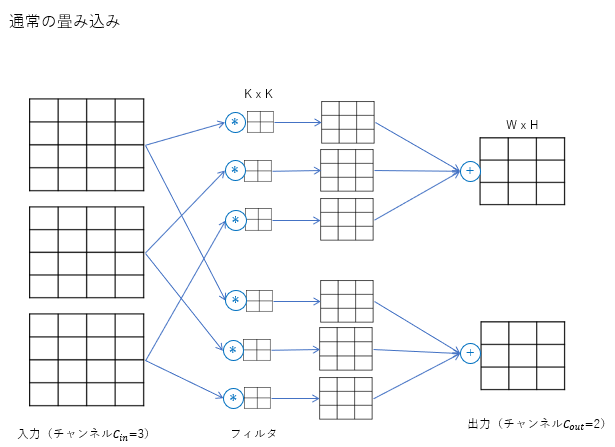
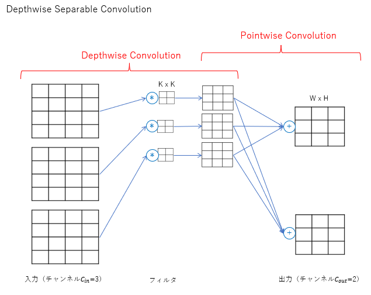
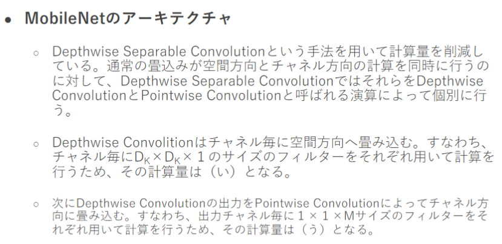
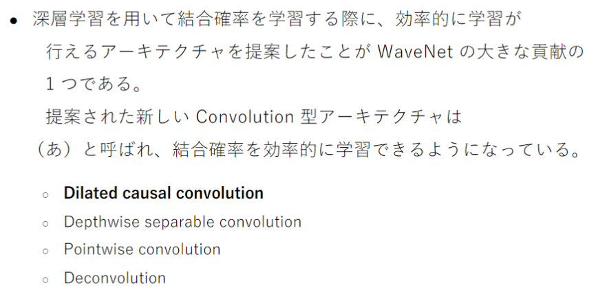
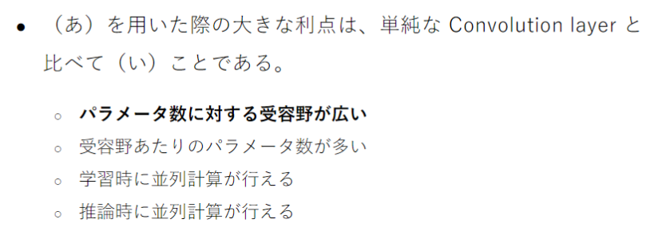

# Section4: 応用モデル

## 1. 要点まとめ

### 1.1 MobileNet

画像認識モデルは、2017年あたりで精度は頭打ちとなっており、以後は軽量化が進んでいる。MobileNetはその１つである。

MobileNetでは、通常の畳み込みをDepthwise Separable Convolutionという畳み込みに置き換えることで計算量を削減している。計算量はそれぞれ下表となり、通常の畳み込みと比較して計算量は$\frac{K \times K + C_{out}}{K \times K \times C_{out}}$倍となる。

|  | 計算量（※記号は下図参照） |
|:-----------|:-----------|
| 通常の畳み込み　　| $W \times H \times K \times K \times C_{in} \times C_{out}$ |
| Depthwise Separable Convolution | $(W \times H \times K \times K \times C_{in}) + (W \times H \times C_{in} \times C_{out})$ |





<div style="page-break-before:always"></div>

### 1.2 DenseNet

DenseNetもMobileNetと同様、画像認識のCNNモデルである。

CNNの勾配消失問題に対応するため、畳み込みをスキップするパスが追加された構造となっている。

複数のレイヤからなるDenseBlockを持ち、DenseBlock内のレイヤでは、前レイヤの出力に、レイヤ出力を新チャンネルとして順次結合していく。このため、レイヤを通る度にチャンネルが増えていく。増えすぎたチャンネルを減らすために、TransitionLayerを設け、ここでチャンネルを減らす。

同じようにスキップするパスを持つCNNにResNetがあるが、前レイヤの出力に、レイヤ出力を足し合わせるだけで、チャンネルを増やさない点がDenseNetと異なる。

### 1.3 正規化

各レイヤの出力分布を正規化して偏りをなくすことで学習の効率化を図る手法の一つとして、BatchNormalizationがある。

BatchNormalizationは、レイヤ間を流れるデータ分布をミニバッチ単位で平均0、分散1になるよう正規化する手法である。過学習の抑制などに効果があるが、バッチサイズが小さいと効果が薄れてしまう課題がある。バッチサイズは計算デバイス（GPU等）の都合で固定値を設定せざるを得ない場合もあり、その点が使いづらい。

この点を改善する手法としてLayerNormalizationがある。
LayerNormalizationは、1枚の画像の全チャンネルの全Pixelに対して平均0、分散1の分布に正規化する。バッチサイズに依存しなくなる他、入力データや重みのスケール変化に対してロバストになるという効果も得られる。

InstanceNormalizationも、バッチサイズ非依存の正規化手法となる。1枚の画像の１つのチャンネルの全Pixelに対して平均0、分散1の分布に正規化する。

### 1.4 Wavenet

Wavenetは、音声（時系列データ）生成モデルである。時系列データに対してCNNを適用したモデルとなっている。Wavenetには、Dilated convolutionという畳み込みが適用される。これは、従来の畳み込みと比べて受容野を広く（隣接データの間隔を広く）することで、長時間の時系列データを扱えるようにした手法となっている。


<div style="page-break-before:always"></div>

-----
## 2. 実装演習

画像認識の軽量モデルであるMobileNetを試行する。同じ画像認識モデルであるVGG16と比較し、軽量性を確認する。

``` python
# 参考URL: https://qiita.com/simonritchie/items/f6d6196b1b0c41ca163c
# 
# ※データセット(Flowers Recognition)の前処理コードは掲載省略
#   MobileNet_Sample.ipynb を参照

import os
import pandas as pd
import numpy as np
from sklearn import preprocessing
from keras.utils import np_utils

# --------------------------
#  前処理済データセットロード
# --------------------------
flowers_topdir = "work_section4/flowers/"
train_meta_df = pd.read_csv(flowers_topdir + "../flowers_dataset_train.csv")
test_meta_df = pd.read_csv(flowers_topdir + "../flowers_dataset_test.csv")

NUM_TRAIN = len(train_meta_df)
NUM_TEST = len(test_meta_df)
IMG_SIZE = 224
NUM_BATCH = 128
NUM_EPOCH = 40

X_train = np.memmap(
    filename=flowers_topdir + "../X_train.npy", dtype=np.float16, 
    mode='r', shape=(NUM_TRAIN, IMG_SIZE, IMG_SIZE, 3) )
y_train = train_meta_df['class'].values

le = preprocessing.LabelEncoder()
le.fit(y_train)
NUM_CLASSES = len(le.classes_)
y_train = le.transform(y_train)
y_train = np_utils.to_categorical(y=y_train, num_classes=NUM_CLASSES)

X_test = np.memmap(
    filename=flowers_topdir + "../X_test.npy", dtype=np.float16, 
    mode='r', shape=(NUM_TEST, IMG_SIZE, IMG_SIZE, 3))
y_test = test_meta_df['class'].values
y_test = le.transform(y_test)
y_test = np_utils.to_categorical(y=y_test, num_classes=NUM_CLASSES)

# --------------------------
#  モデル作成：MobileNetV2
# --------------------------
from keras.applications.mobilenet_v2 import MobileNetV2
from tensorflow.keras.optimizers import Adam

model_mnv2 = MobileNetV2(
    input_shape=(IMG_SIZE, IMG_SIZE, 3),
    alpha=0.5, weights=None,
    classes=NUM_CLASSES)
model_mnv2.compile(
    loss='categorical_crossentropy', optimizer=Adam(), metrics=["accuracy"])

hist = model_mnv2.fit(
    x=X_train, y=y_train, batch_size=NUM_BATCH, epochs=NUM_EPOCH, 
    verbose=1, validation_data=(X_test, y_test))

model_mnv2.summary()
model_mnv2.save(filepath=flowers_topdir+"../model_flowers_mobilenetv2.h5")

%matplotlib inline
import matplotlib.pyplot as plt

plt.figure(facecolor="white")
plt.title("Mobile Net V2")
plt.xlabel("iter")
plt.ylabel("accuracy")
plt.plot(hist.history["accuracy"],label="train set")
plt.plot(hist.history["val_accuracy"],label="test set")
plt.legend(loc='upper left')
plt.show()

# --------------------
#  モデル作成：VGG16
# --------------------
from keras.applications.vgg16 import VGG16

model_vgg16 = VGG16(
    weights=None,
    input_shape=(IMG_SIZE, IMG_SIZE, 3),
    classes=NUM_CLASSES)

model_vgg16.compile(
    loss='categorical_crossentropy', optimizer=Adam(), metrics=["accuracy"])

hist_vgg16 = model_vgg16.fit(
    x=X_train, y=y_train, batch_size=NUM_BATCH, epochs=NUM_EPOCH, 
    verbose=1, validation_data=(X_test, y_test))

model_vgg16.summary()
model_vgg16.save(filepath=flowers_topdir+"../model_flowers_vgg16.h5")

plt.figure(facecolor="white")
plt.title("VGG16")
plt.xlabel("iter")
plt.ylabel("accuracy")
plt.plot(hist_vgg16.history["accuracy"],label="train set")
plt.plot(hist_vgg16.history["val_accuracy"],label="test set")
plt.legend(loc='upper left')
plt.show()
``` 

<div style="page-break-before:always"></div>

実行結果は以下。

- MobileNet V2は、VGG16と比べて学習時間が約1/10。パラメータ数／モデルサイズも桁違いに軽量
- 学習はどちらもうまくいっていない
  - MobileNetは汎化性能が向上していない
  - VGG16は訓練／テストデータともにAccuracyに変化が見られない。勾配消失が起こってパラメータ更新が停止しているのかもしれない

| モデル | 学習時間 | パラメータ数(Total) | モデルサイズ | 学習の様子(accuracy) | 
|:-----------|:-----------|:------------|:------------|:------------|
| MobileNet V2 | 167分36秒 | 712,629 | 9 [MB] |  | 
| VGG16 | 1536分50秒 | 134,281,029 | 1500 [MB] |  | 

※補足: データセット(前処理済)のデータ数

- 訓練データ(X_train, Y_train): 10,473
- テストデータ(X_test, Y_test): 2,000

※補足: PCスペック（上記実行ではGPU未使用）

- CPU: AMD Ryzen 3700X (8コア16スレッド)
- Memory: 32GB (DDR4)

※補足: Python環境(Version)

- Python: 3.9.6
- Keras: 2.7.0
- tensorflow: 2.7.0


<div style="page-break-before:always"></div>

-----
## 3. 確認テスト



- (い) $\frac{1}{C}$　※C: チャネル数
- (う) $\frac{1}{K * K}$　※K*K：カーネルサイズ


<div style="page-break-before:always"></div>

-----



正解は「Dliated causal convolution」

他の選択肢は以下

- Depthwise separable convolution
  - MobileNetで使われる畳み込み。カーネルを全チャンネル共通化　＆　フィルタ数を１つのみにするDepthwiseConvolution、および、1x1カーネルで畳み込みを行うPointwiseConvolutionの２つを合わせた手法であり、従来の畳み込みと比べて軽量となっている。
- Pointwise convolution
  - MobileNetで使われる畳み込み。1x1カーネルで畳み込みを実施する。
- Deconvolution
  - 逆畳み込み。小さな画像を大きくするために使われる。


<div style="page-break-before:always"></div>

-----



正解は「パラメータ数に対する受容野が広い」

同じパラメータ数でより広範囲のデータを扱えるようにすることがDilatedConvolutionの目的。学習／推論時の並列計算は単純なConvolutionLayerでも可能。


