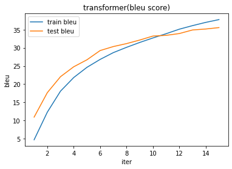
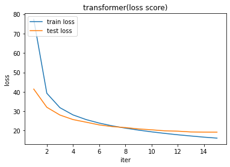
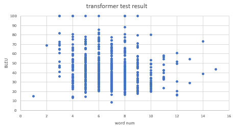
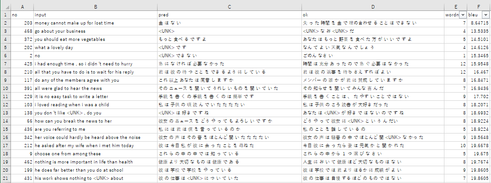
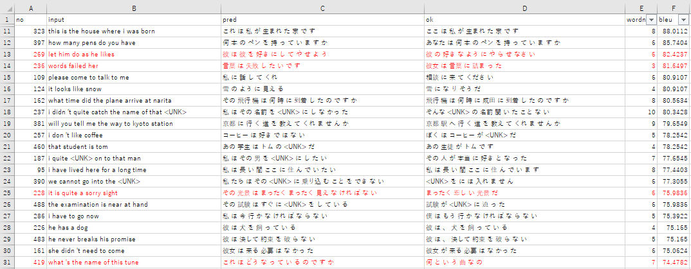

# Section5: Transformer

## 1. 要点まとめ

ニューラル機械翻訳を行うモデルとして代表的なのはseq2seqだが、これはEncoderで入力文章全体を１つの固定長ベクトルに集約してDecoderに渡すモデルであるため、入力文章が長くなるとうまくいかなくなるという課題がある。

この課題を解決するためにAttentionという手法がある。入力文章全体ではなく特定の箇所を切り取ってDecoderに渡す、という手法である。特定の箇所は、翻訳中の個々の単語に関連がある箇所を選ぶ。このAttentionを取り入れたモデルがTransformerである。

Transformerは、Attentionのみを用いて作られたモデルであり、RNNを使っていない。seq2seq等と同様、Encoder/Decoderで構成される。

Encoderでの処理概要は以下

1. 入力ベクトル（埋め込み表現）に対し、単語の位置情報（時刻情報）を付与（Position Encoding）
2. 複数のAttentionを生成（Multi-Head Attention）
3. 複数のAttentionを位置毎（時刻毎）に全結合して出力

Decoderでの処理概要は以下

1. Encoder出力とDecoderでの前時刻までの出力を入力
   - Decoder出力に対しては、「前時刻までの出力」に限定するためにマスクがかけられる(Masked Multi-Head Attention)
2. 入力から複数Attentionを生成（Multi-Head Attention）
3. 複数のAttentionを位置毎（時刻毎）に全結合して出力


Attentionの生成方法は以下

1. 各入力単語に対しQuery/Key/Valueベクトルを生成
   - Transformerでは、Query/Key/Valueベクトル全てを入力ベクトル（埋め込み表現）から生成（Self Attention）
   - 入力に対してQuery/Key/Valueに対応する重み行列を積算することで生成
2. Query/Keyベクトルを内積＆Softmax関数で加工
   - Softmax関数への入力が大きくなりすぎて勾配消失が起きないよう、Query/Keyベクトルの内積に対して次元でスケーリングを施す（Scaled Dot Production）
3. 加工したベクトルと、Valueベクトルを積算


<div style="page-break-before:always"></div>

-----
## 2. 実装演習

DNN_code_colab_bert1bert2/lecture_chap2_exercise_public.ipynb に実装されているtransformerモデルを動作させ、学習の様子や推論結果を確認する。

``` python
# ※評価用に改変したセルのコードのみ掲載

# 訓練
%matplotlib inline
import matplotlib.pyplot as plt

num_epochs = 15
hist_epoch = []
hist_train_loss = []
hist_train_bleu = []
hist_val_loss = []
hist_val_bleu = []

best_valid_bleu = 0.

for epoch in range(1, num_epochs+1):
    start = time.time()
    train_loss = 0.
    train_refs = []
    train_hyps = []
    valid_loss = 0.
    valid_refs = []
    valid_hyps = []
    # train
    for batch in train_dataloader:
        batch_X, batch_Y = batch
        loss, gold, pred = compute_loss(
            batch_X, batch_Y, model, criterion, optimizer, is_train=True
            )
        train_loss += loss
        train_refs += gold
        train_hyps += pred
    # valid
    for batch in valid_dataloader:
        batch_X, batch_Y = batch
        loss, gold, pred = compute_loss(
            batch_X, batch_Y, model, criterion, is_train=False
            )
        valid_loss += loss
        valid_refs += gold
        valid_hyps += pred
    # 損失をサンプル数で割って正規化
    train_loss /= len(train_dataloader.data) 
    valid_loss /= len(valid_dataloader.data) 
    # BLEUを計算
    train_bleu = calc_bleu(train_refs, train_hyps)
    valid_bleu = calc_bleu(valid_refs, valid_hyps)

    # validationデータでBLEUが改善した場合にはモデルを保存
    if valid_bleu > best_valid_bleu:
        ckpt = model.state_dict()
        torch.save(ckpt, ckpt_path)
        best_valid_bleu = valid_bleu

    elapsed_time = (time.time()-start) / 60
    print('Epoch {} [{:.1f}min]: train_loss: {:5.2f}  train_bleu: {:2.2f}  valid_loss: {:5.2f}  valid_bleu: {:2.2f}'.format(
            epoch, elapsed_time, train_loss, train_bleu, valid_loss, valid_bleu))
    print('-'*80)

    hist_epoch.append(epoch)
    hist_train_loss.append(train_loss)
    hist_train_bleu.append(train_bleu)
    hist_val_loss.append(valid_loss)
    hist_val_bleu.append(valid_bleu)

plt.figure(facecolor='white')
plt.title("transformer(bleu score)")
plt.xlabel("iter")
plt.ylabel("bleu")
plt.plot(hist_epoch, hist_train_bleu, label="train bleu")
plt.plot(hist_epoch, hist_val_bleu,label="test bleu")
plt.legend(loc='upper left')
plt.show()

plt.figure(facecolor='white')
plt.title("transformer(loss score)")
plt.xlabel("iter")
plt.ylabel("loss")
plt.plot(hist_epoch, hist_train_loss, label="train loss")
plt.plot(hist_epoch, hist_val_loss,label="test loss")
plt.legend(loc='upper left')
plt.show()

# ... (省略) ...

import pandas as pd
from google.colab import files

def trim_end(sentence):
    if '.' in sentence:
      return sentence[:sentence.index('.')]
    elif '?' in sentence:
      return sentence[:sentence.index('?')]
    elif '!' in sentence:
      return sentence[:sentence.index('!')]
    elif '。' in sentence:
      return sentence[:sentence.index('。')]
    elif '？' in sentence:
      return sentence[:sentence.index('？')]
    else:
      return sentence 


# BLEUの評価
test_dataloader = DataLoader(
    test_X, test_Y, 128,
    shuffle=False
    )

input_list = []
refs_list = []
hyp_list = []

for batch in test_dataloader:
    batch_X, batch_Y = batch
    preds, *_ = test(model, batch_X)
    preds = preds.data.cpu().numpy().tolist()
    refs = batch_Y[0].data.cpu().numpy()[:, 1:].tolist()
    input_ids = batch_X[0].data.cpu().numpy()[:, 1:].tolist()
    refs_list += refs
    hyp_list += preds
    input_list += input_ids

bleu = calc_bleu(refs_list, hyp_list)
print("bleu (max:100)=", bleu)

input_sentence_list = []
pred_sentence_list = []
ref_sentence_list = []
input_word_num_list = []
blue_score_list = []

for idx, (input_ids, pred, ref) in enumerate(zip(input_list, hyp_list, refs_list)):
  input_sentence_words = trim_end(ids_to_sentence(vocab_X, input_ids))
  input_sentence = ' '.join(input_sentence_words)
  pred_sentence = ' '.join(trim_end(ids_to_sentence(vocab_Y, pred)))
  ref_sentence = ' '.join(trim_end(ids_to_sentence(vocab_Y, ref)))
  word_num = len(input_sentence_words)
  bleu = calc_bleu([ref], [pred])

  input_sentence_list.append(input_sentence)
  pred_sentence_list.append(pred_sentence)
  ref_sentence_list.append(ref_sentence)
  input_word_num_list.append(word_num)
  blue_score_list.append(bleu)

  if idx < 5:
    print("[",str(idx),"] ", input_sentence, " , num=", str(word_num))
    print("    --> (pred)", pred_sentence)
    print("    --> (ok) ", ref_sentence)
    print("    --> bleu= ", bleu)

result_df = pd.DataFrame({ 'input'  : input_sentence_list,
                           'pred'   : pred_sentence_list,
                           'ok'     : ref_sentence_list,
                           'wordnum': input_word_num_list,
                           'bleu'   : blue_score_list })
result_df.to_csv("transformer_test_result.csv", encoding="shift-jis")
files.download('transformer_test_result.csv')

``` 

<div style="page-break-before:always"></div>

実行結果は以下。

学習の様子
- 訓練データ(train)/テストデータ(test)どちらも、epoch(iter)が大きくなるにつれて、bleuは増加＆lossは減少傾向
- 学習が順調に進んでいることがうかがえる
  



<div style="page-break-before:always"></div>

テストデータの各文に対して学習済transformerモデルで推論を行い、各文の推論結果の入力単語数(word num)とBLEUスコアの関係を下図にグラフ化した。

- 単語数≦9の文では、BLEUスコアに明確な差は見られない
- 単語数≧10になると、高いBLEUスコア（80以上）の文が現れなくなっている



<div style="page-break-before:always"></div>

BLEUスコアとモデル精度（翻訳精度）の関係を確認するため、BLEUスコアが低い順、高い順にそれぞれ20サンプルずつ抽出し、推論結果(列pred)を正解(列ok)と比較した。

- ワースト20の推論結果は、意味不明 or 意味が全然違う結果が大半を占める
  - BLEUスコア小であれば翻訳精度も低いと言える
- ベスト20の推論結果（※BLUE=100除く）は、意味が正解と同等なものが多いが、中には正解とかなりかけ離れた結果もある（赤字）
  - BLUEスコア大であれば概ね翻訳精度は高いと言えるが、低い翻訳精度の結果も交じっている。
  - ただ、そういう結果は2割弱であり、大局的にモデル全体の精度評価を行う際にはあまり問題にはならないと思われる。

BLEUスコアが低い結果（ワースト20）


BLEUスコアが高い結果（ベスト20　※BLEU=100は除外（∵完全一致なので自明））



<div style="page-break-before:always"></div>

-----
## 3. 確認テスト

※Section5は確認テストなし
