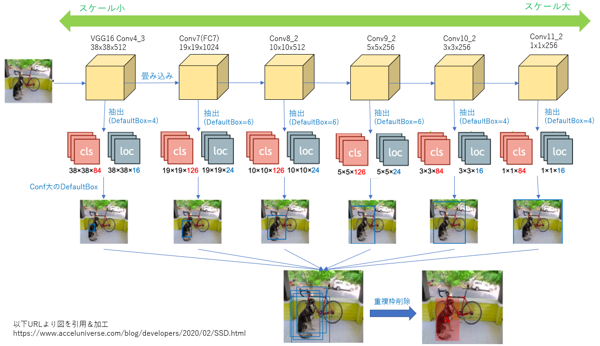
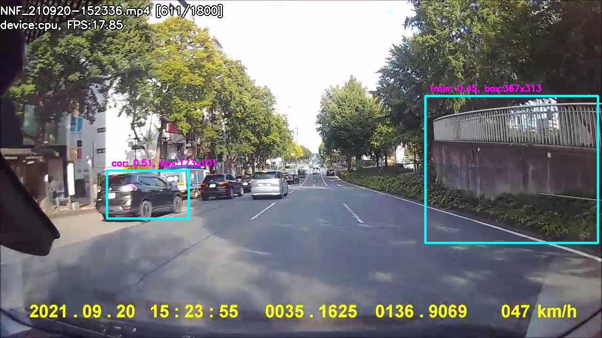
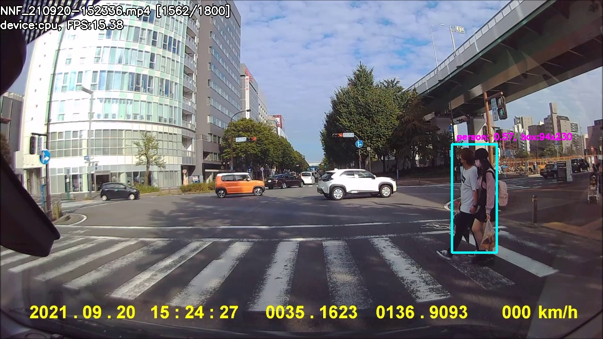

# Section6: 物体検知・セグメンテーション

## 1. 要点まとめ

物体認識タスクには下表がある。下のタスクほど難易度が高い。

| タスク                            | 概要                    | 出力                   |
| ------------------------------ | --------------------- | -------------------- |
| 分類                             | 画像内物体のクラス識別           | クラスラベル               |
| 物体検知                           | 画像内物体の位置検出、クラス識別      | クラスラベル、BoundingBox   |
| 意味領域分割 （Semantic Segmentation） | 画像内Pixelのクラス識別        | Pixel毎のクラスラベル        |
| 個体領域分割（Instance Segmentation）  | 画像内Pixelのクラス/インスタンス識別 | Pixel毎のクラス／インスタンスラベル |


### 1.1 データセット

評価、学習のデータセットで代表的なものは下表がある。いづれも物体検出コンペティションで用いられたデータセットである。

| データセット    | クラス | データ数    | 1画像あたりの物体数(平均) |
| --------- | --- | ------- | -------------- |
| VOC12     | 20  | 11540   | 2.4            |
| ILSVRC17  | 200 | 476668  | 1.1            |
| MS COCO18 | 80  | 123287  | 7.3            |
| OICOD18   | 500 | 1743042 | 7.0            |

データセットは、作成予定のモデルの目的に沿ったものを選ぶ必要がある。

クラス数は、多ければよいというものではなく、モデル目的にあった分類がされているデータセットが最良である（例：人を検出して衝突検知に応用することが目的のモデルなら、性別／国籍等の詳細分類までは不要）。

1画像あたりの物体数(平均)は、１に近いものは実世界とはかけ離れた実験用、高いものは実世界に近いデータセットとみなすことができ、データセットを選ぶ指標として重要である。

<div style="page-break-before:always"></div>

### 1.2 評価指標

分類における評価指標の１つとして、Confusion Matrixがある。これは、物体検知やセグメンテーションにも有用な評価指標である。

分類では、Confusion Matrix中の指標（TP,FP,TN,FN）は、モデルが出力したconfidence(信頼度　※クラスに所属する確率)を閾値処理して算出する。

物体検知では、confidenceとIoUを閾値処理してTP,FP,TN,FNを算出する。IoUは、位置精度を表す指標で、モデルが出力したBoundingBoxから算出する。計算式は以下

$$IoU = \frac{(GroundTruthBB \cap PredictedBB)の面積}{(GroundTruthBB \cup PredictedBB)の面積}$$

- GroundTruthBB: 正解Bounding Box
- PredictedBB: モデルが出力（予測）したBounding Box

IoUが、より解釈しやすい「GroundTruthBB or PredictedBBに対する占有面積」になっていないのは、GroundTruthBBとPredictedBBが包含関係にある場合に実精度と乖離した値になる等の不都合があるためである。

TP,FP,TN,FNを指標化した値として、Precision、Recallがある。数式は以下。PrecisionはPositive予測中の正解率（分母が、Positive予測したサンプル数）、RecallはPositiveサンプル中の正解率（分母が、真値＝Positiveであるサンプル数）を表す。

$$Precision = \frac{TP}{TP + FP}$$
$$Recall = \frac{TP}{TP+FN}$$

confidence(信頼度)の閾値を変化させたときのPrecision, Recall値をプロットしたグラフがPR曲線である。PR曲線から得られる指標としてAP（Average Precision）、APの全クラス平均であるmAPがある。計算式は以下。APはPR曲線の下側面積を表す。

$$AP = \int_{0}^{1} P(R)dR$$
$$mAP = \frac{1}{C} \sum_{c=1}^{C} AP_{c}$$

なお、物体検知においては、mAPをIOU閾値を変化させて複数算出して平均をとった$mAP_{COCO}$もある。

$$mAP_{COCO} = \frac{mAP_{IoU_1} + mAP_{IoU_2} + … + mAP_{IoU_N}}{IoU_N}$$

<div style="page-break-before:always"></div>

### 1.3 物体検知

従来、物体検知は人が定義した局所特徴量（SIFT等）主体で行われてきたが、2012年のAlexNetの登場を皮切りに主体が深層畳み込みニューラルネットワーク（DCNN）に移っていく。

物体検知は、ベースとなるDCNN（VGGNet, MobileNet等）を組み合わせたフレームワークで実現される。フレームワークには、領域候補検出とクラス分類を別々に行う「２段階検出器」、および、これらを一度に行う「１段階検出器」に大別される。「２段階検出器」は、精度が高い反面、処理時間も大きくなる傾向があり、「１段階検出器」は逆の傾向を持つ。「１段階検出器」の代表例としてSSD(Single Shot Detector)がある。

#### 1.3.1 SSD(Single Shot Detector)

SSD(Single Shot Detector)は、VGG16がベースとなっているフレームワークである。SSDに組み込まれているVGG16は、解像度やレイヤ構成の一部がカスタマイズされている。様々な位置／スケールの物体を検出可能にするために、マルチスケール特徴マップという手法が取られていることが大きな特徴である。BoundingBoxを色々動かして都度畳み込み演算を行う従来手法とは異なり、1パスの畳み込み演算で領域候補検出とクラス分類の両方行う手法となっており、従来手法と比べて高速に動作する。

マルチスケール特徴マップでは、様々なスケールを表すレイヤ毎に、位置（アンカー）毎に複数の初期矩形（DefaultBox）を用意し、各レイヤの特徴マップからDefaultBox毎に特徴を抽出し領域候補検出とクラス分類結果を出力する。全スケールの結果を単純にマージすると１つの物体に重複枠が多数存在するため、IoUがある程度大きいものの中でconfが最も大きなBoundingBoxのみ残す（Non-Maximum Suppression）といった重複枠削除を行う。



<div style="page-break-before:always"></div>

### 1.4 Segmentation

Semantic Segmentationは、Pixel単位でクラス分類を行う。通常のCNNでは、受容野を大きくするためPoolingにより徐々に解像度を低下させる。このため、出力をPixel単位にするには解像度を元に戻すUpSamplingが必要となる。

Segmentationの代表的なモデルにFCN（Fully Convolutional Network）がある。これは、全結合層をなくして畳み込み層だけにしたものであり、チャネル毎の特徴マップが中間出力となる。このHeatMap（特徴マップ）を元解像度までUpSamplingする手法として、Deconvolutionがある。Deconvolutionの処理手順は以下。通常の畳み込みとの違いは拡大処理（1）の有無だけである。

1. 特徴マップをstride倍拡大
2. 周りにpadding付与
3. 畳み込み演算

ただし、低解像度の特徴マップを元解像度に一気にUpSampleしてしまうと、輪郭等の局所特徴が失われたままとなってしまう。このため、段階的にUpSampleを行い、UpSampleの度に、Pooling前の同解像度の特徴マップを要素毎に加算する処理を挟む（Skip-connection）。

Segmentationのもう１つの代表的なモデルとしてU-Netがある。Encoder/Decoderで構成されており、EncoderではDownSampling、DecoderではUpSamplingが行われる。EncoderとDecoderの各レイヤに設けられるSkip-connectionでは、UpSamplingした特徴マップに、Encoder側で同解像度の特徴マップを合成する処理が行われる。U-Netのskip-connectionでは、FCNとは異なり、チャネル方向に結合する。

UpSampling手法としてはUnpoolingもある。Poolingしたときの位置情報を保持しておき、UpSampling時に位置情報を復元する手法となっている。

Poolingの目的である、受容野を広げる、を実現する方法としては、Poolingの他にDilatedConvolutionがある。これは、カーネル内部に隙間を設けることで、範囲を広げて畳み込みを行う手法となる。Wavenetへの適用例がある。

<div style="page-break-before:always"></div>

-----
## 2. 実装演習

物体検知のモデルの1つであるMobileNet-SSDを試行し、検知精度や検知速度等を確認する。

``` python
# https://github.com/qfgaohao/pytorch-ssd 
#  run_ssd_live_demo.py を評価用に一部改変
import torch

if torch.cuda.is_available():
#if False: # force cpu
    device_name = 'cuda:0'
    output_dir = 'output_cuda'
else:
    device_name = 'cpu'
    output_dir = 'output_cpu'

device = torch.device(device_name)

from vision.ssd.mobilenetv1_ssd import create_mobilenetv1_ssd, create_mobilenetv1_ssd_predictor
from vision.utils.misc import Timer
import cv2
import os

def draw_text(img, text, loc, scale, col, thick, is_bound):
    if is_bound == True:
        col_bg = [255-c for c in col]
        cv2.putText(img, text, loc, 
                    cv2.FONT_HERSHEY_SIMPLEX, scale, col_bg, thick*3)
    cv2.putText(img, text, loc, 
                cv2.FONT_HERSHEY_SIMPLEX, scale, col, thick)
    return

# ログ出力用
os.makedirs(output_dir)

# モデルのロード
net_type = 'mb1-ssd'
model_path = 'models/mobilenet-v1-ssd-mp-0_675.pth'
label_path = 'models/voc-model-labels.txt'

class_names = [name.strip() for name in open(label_path).readlines()]
num_classes = len(class_names)

net = create_mobilenetv1_ssd(len(class_names), is_test=True, device=device)
net.load(model_path)
predictor = create_mobilenetv1_ssd_predictor(net, candidate_size=200, device=device)

# 入力動画読み込み
cap_file_name = 'NNF_210920-152336.mp4'
cap = cv2.VideoCapture(cap_file_name)  
cap_num_frame = int(cap.get(cv2.CAP_PROP_FRAME_COUNT))

timer = Timer()
while True:
    # 入力画像読み込み
    cap_frame_no = int(cap.get(cv2.CAP_PROP_POS_FRAMES))
    ret, orig_image = cap.read()

    if not (orig_image is None):
        image = cv2.cvtColor(orig_image, cv2.COLOR_BGR2RGB)

        # 物体検知実行
        timer.start()
        boxes, labels, probs = predictor.predict(image, 10, 0.4)
        interval = timer.end()

        # 検知結果の表示
        # Draw FPS
        cap_info = cap_file_name+' ['+str(cap_frame_no)+'/'+str(cap_num_frame)+']'
        proc_info = "device:" + device_name + ", FPS:" + str(int((1.0/interval)*100)/100.)
        draw_text(orig_image, cap_info, (0, 30), 0.75, (255,255,255), 2, True)
        draw_text(orig_image, proc_info, (0, 60), 0.75, (255,255,255), 2, True)

        num_box = boxes.size(0)
        for i in range(num_box):
            box = boxes[i, :]
            box_w = int(box[2] - box[0])
            box_h = int(box[3] - box[1])
            label = f"{class_names[labels[i]]}: {probs[i]:.2f}, box:{box_w}x{box_h}"
            cv2.rectangle(orig_image, (box[0], box[1]), (box[2], box[3]), (255, 255, 0), 4)
            draw_text(orig_image, label, (box[0]+10, box[1]-10), 0.6, (255,0,255), 2, False)

        cv2.imshow('annotated', orig_image)

        if num_box > 0:
            log_imgfile_path = output_dir + '/F' + str(cap_frame_no) + '.jpg'
            cv2.imwrite(log_imgfile_path, orig_image)

    key = cv2.waitKey(1) & 0xFF
    if key == ord('q'):
        break

cap.release()
cv2.destroyAllWindows()
``` 

<div style="page-break-before:always"></div>

Input
- モデルパラメータ: 学習済の以下パラメータを適用
  - https://storage.googleapis.com/models-hao/mobilenet-v1-ssd-mp-0_675.pth
  - https://storage.googleapis.com/models-hao/voc-model-labels.txt
- 入力動画
  - ドライブレコーダー(CELLSTAR CSD-670FH)撮影動画 
    - 1280x720にリサイズ, 30fps, 1分
    - Totalフレーム数=1800
    - 全フレームに、人 or 車あり

実行環境
- PC
  - CPU: AMD Ryzen 3700X (8コア16スレッド)
  - GPU: NVIDIA GeForce GTX 1660 SUPER
  - Memory: 32GB (DDR4)
- Python環境(Version)
  - Python: 3.7.11
  - Pytorch: 1.10.1

<div style="page-break-before:always"></div>

実行結果
- 検知精度
  - 検知あり＝577フレーム （全体の32%）
  - 大きい車 or 人であれば検出できているが、サイズが小さいと検知できておらず、検知ありフレームが少ない要因の１つとなっている
  - train等の誤検知も散見される
    - 車載動画で衝突検知等の用途では不要と思われるカテゴリ(train, chair, diningtable等)がモデルvoc-model-labels.txtに含まれている
    - 用途にあったカテゴリで再学習が必要と考えられる
- 検知速度
  - CPU: 15～20fps
  - GPU(CUDA): 70～80fps
    - GPUで検知実行した場合はリアルタイムに十分な速度が出ている
    - 検知精度は同じ（検知ありフレーム数は同数）
    - 組み込み機器への実装の際も、GPUが利用可能であれば極力利用を推奨

車両検出例（正検知（左車両）、誤検知（右の壁）、未検知（左側の車列（サイズ小））） <br/>


人検出例 <br/>



<div style="page-break-before:always"></div>

-----
## 3. 確認テスト

※Section6は確認テストなし

