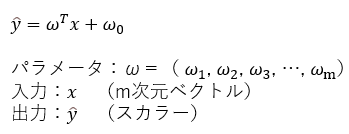
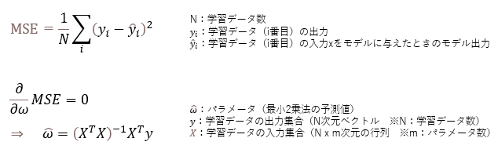
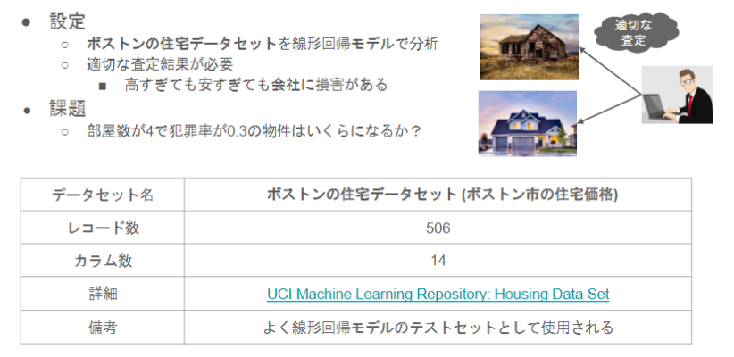
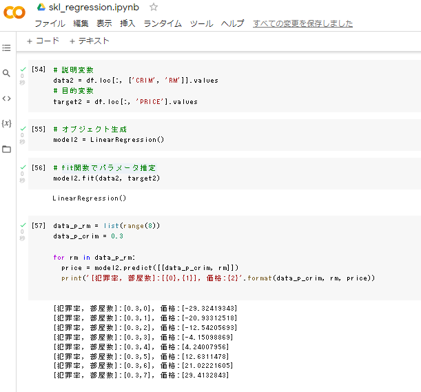

# 線形回帰モデル

## 1. 要点まとめ

線形回帰モデルとは、回帰問題を解くための機械学習モデルの１つで、モデルが線形（2次元なら直線、3次元なら平面）のものを指す。

分類問題とは異なり、連続値を予測するモデルである。
入力（説明変数）はm次元ベクトル、出力（目的変数）はスカラーである（ベクトルのこともある）。

モデルのパラメータは、入力が出力に対してどのように影響を与えるかを決定する重み集合の意味である。
モデルの式は以下。




モデルの学習では、学習データ（入力xと出力yの組の集合）を与え、モデルのパラメータwを最小二乗法で推定する。

具体的には、与えられた出力yと、モデル出力y^の差の2乗値の平均MSEが最小になるようなパラメータwを求める。MSEをwで微分し、微分値＝0として方程式を解けば求まる。なお、MSEは外れ値に弱いため、学習データから外れ値を除いた上で学習したほうがよい。



-----
## 2. 実装演習

以下課題を実施



ソースは以下
※study_ai_ml_google/skl_ml/skl_regression.ipynbを一部改変

``` python
from sklearn.datasets import load_boston
from pandas import DataFrame
import numpy as np
boston = load_boston()
df = DataFrame(data=boston.data, columns = boston.feature_names)
df['PRICE'] = np.array(boston.target)

## sklearnモジュールからLinearRegressionをインポート
from sklearn.linear_model import LinearRegression
# 説明変数
data2 = df.loc[:, ['CRIM', 'RM']].values
# 目的変数
target2 = df.loc[:, 'PRICE'].values
# オブジェクト生成
model2 = LinearRegression()
# fit関数でパラメータ推定
model2.fit(data2, target2)
data_p_rm = list(range(8))
data_p_crim = 0.3
# モデルで物件価格を予測
for rm in data_p_rm:
  price = model2.predict([[data_p_crim, rm]])
  print('[犯罪率, 部屋数]:[{0},{1}], 価格:{2}'.format(data_p_crim, rm, price))
```

実行結果は以下（snapshot）

⇒　犯罪率0.3、部屋数4の価格は4.24



他の部屋数の場合の価格の予測値を見ると、部屋数3までの価格がマイナスになっている。

部屋数が少ない場合に、価格が正しく予測できない、安すぎる価格を予測するモデルとなっていると考えられる。
犯罪率0.3、部屋数4の予測価格4.24も、実際より安い価格である可能性が高い。
