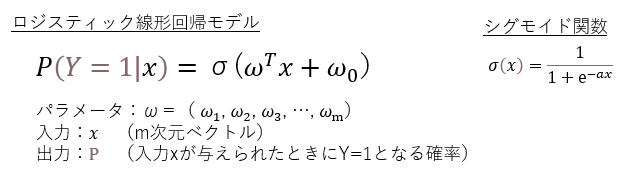
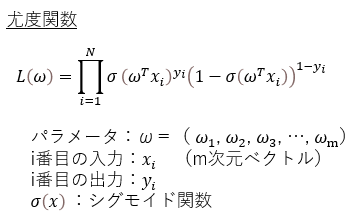
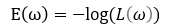
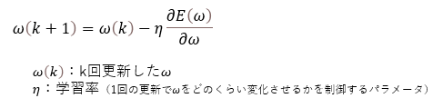
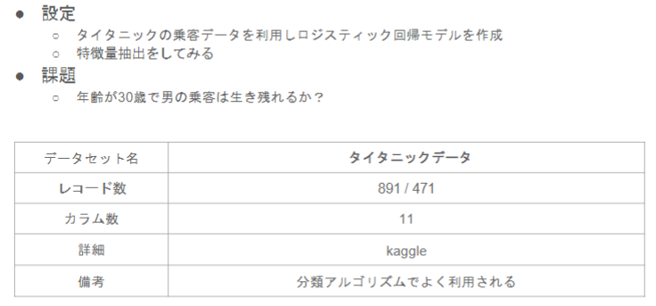
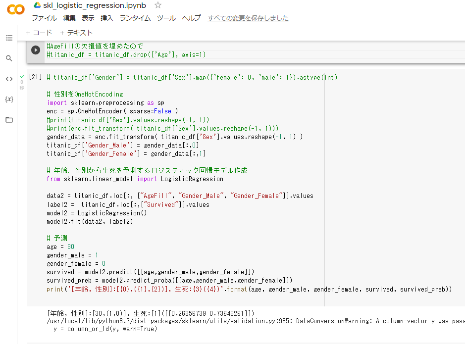

# ロジスティック回帰モデル

## 1. 要点まとめ

-----
### 1.1 ロジスティック線形回帰モデル

ロジスティック線形回帰モデルは、分類問題を解くための教師あり学習モデルである。m次元ベクトルの入力から、分類結果を表す2値(0 or 1)を求めるモデルである。入力xが与えられたときに分類＝1となる確率がモデル出力である。

具体的な式は、線形回帰モデルと、出力を0～1の確率に変換する関数を結合した形となっている。0～1の確率に変換する関数には、シグモイド関数が用いられる。




ロジスティック線形回帰モデルの学習は、最尤推定で行う。
学習データ（入力と出力の組）を生成するに至った尤もらしいパラメータwを推定する。
具体的には、パラメータを変数として学習データ（入力と出力の組）が得られる確率（同時確率）を出力する関数（尤度関数）を最大化するパラメータを推定する。



実際の推定は、尤度関数L(w)の最大化問題を、L(w)の対数を取ってマイナスをかけた関数E(w)の最小化問題に置き換えて行う。
対数をとる理由は、0～1の積を何回も計算すると値が小さくなりすぎて桁落ちが発生するため、和に変換して桁落ち防止を図るためである。
それ以外にも、微分が簡単になるなどの理由がある。



関数E(w)（尤度関数L(w)）にはシグモイド関数が含まれていることもあり、E(w)を最小化するwを解析的に求める（方程式を解いて一意に求める）のは困難である。したがって、E(w)が小さくなる方向にwを更新することを繰り返すことで、求める値に段階的に近づけていく勾配降下法で求める。



E(w)の勾配算出では全データ分の和を求める必要があるが、計算に時間がかかる。そこで、全データを使わずにどれか１つだけランダムに選んで勾配を計算するのが、確率的勾配降下法である。


-----
## 2. 実装演習

以下課題を実施



ソースは以下
※study_ai_ml_google/skl_ml/skl_logistic_regression.ipynbを一部改変


``` python
from google.colab import drive
drive.mount('/content/drive')

import pandas as pd
from pandas import DataFrame
import numpy as np
import matplotlib.pyplot as plt
import seaborn as sns

%matplotlib inline

# ====================
#  データロード、前処理
# ====================
titanic_df = pd.read_csv('/content/drive/My Drive/studyAI/study_ai_ml_google/data/titanic_train.csv')
titanic_df.drop(['PassengerId', 'Name', 'Ticket', 'Cabin'], axis=1, inplace=True)
titanic_df['AgeFill'] = titanic_df['Age'].fillna(titanic_df['Age'].mean())

# 性別をOneHotEncoding
import sklearn.preprocessing as sp
enc = sp.OneHotEncoder( sparse=False )
gender_data = enc.fit_transform( titanic_df['Sex'].values.reshape(-1, 1) )
titanic_df['Gender_Male'] = gender_data[:,0]
titanic_df['Gender_Female'] = gender_data[:,1]

# ====================
#  モデル作成
# ====================
# 年齢、性別から生死を予測するロジスティック回帰モデル作成
from sklearn.linear_model import LogisticRegression

data2 = titanic_df.loc[:, ["AgeFill", "Gender_Male", "Gender_Female"]].values
label2 =  titanic_df.loc[:,["Survived"]].values
model2 = LogisticRegression()
model2.fit(data2, label2)

# ====================
#  予測
# ====================
age = 30
gender_male = 1
gender_female = 0
survived = model2.predict([[age,gender_male,gender_female]])
survived_preb = model2.predict_proba([[age,gender_male,gender_female]])
print('[年齢, 性別]:[{0},({1},{2})], 生死:{3}({4})'.format(age, gender_male, gender_female, survived, survived_preb))

```

実行結果は以下（snapshot）

⇒　生存（死亡26%、生存74%）




