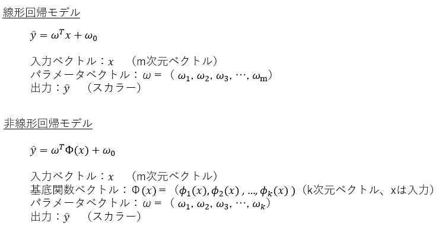
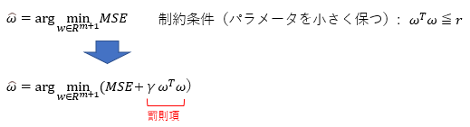
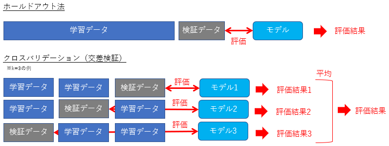
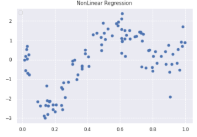
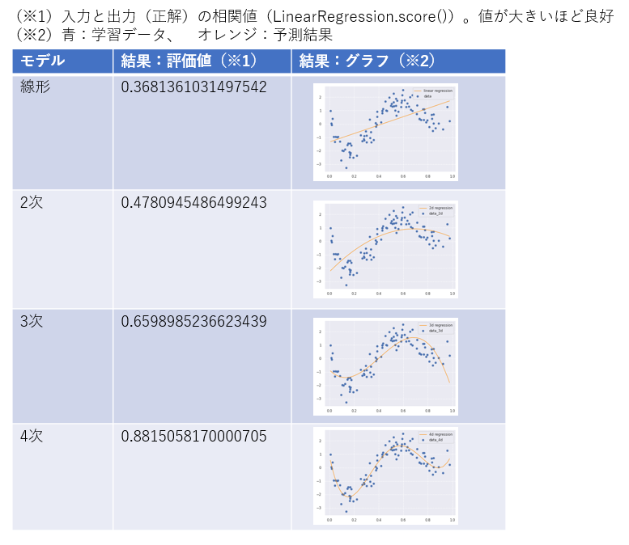

# 非線形回帰モデル

## 1. 要点まとめ

-----
### 1.1 非線形回帰モデル
非線形回帰モデルとは、回帰問題を解くための機械学習モデルの１つで、モデルが非線形（2次元なら放物線等）のものを指す。

線形回帰モデルとは異なり、非線形なデータを予測するモデルである。

線形回帰モデルは、入力（説明変数）ベクトルとパラメータベクトルの線形結合で表された式だったが、
非線形回帰モデルでは、入力を非線形な基底関数で変換した値を並べたベクトルとパラメータベクトルの線形結合で表された式となる。



モデルの式はパラメータに対しては線形であるため、モデルの学習（パラメータwの推定）は、線形モデルと同様の最小二乗法で推定できる。

よく使われる基底関数としては以下がある。
- 多項式関数
- ガウス型基底関数
- スプライン関数/Bスプライン関数

-----
### 1.2 未学習、過学習

学習データに対して十分小さな誤差が得られないモデルは未学習であり、学習データに対しては小さな誤差が得られたが未知データに対する誤差が大きいモデルは過学習である。

未学習は、モデルの表現力が低すぎることで発生する。よって、表現力の高いモデルを利用することで対処できる（例：線形モデルを2次関数モデルにする）。

過学習は、逆にモデルの表現力が高すぎることで発生する。対策としては以下がある。
1. 学習データの数を増やす（適切な表現力のモデルを浮かび上がらせる）
1. 不要な基底関数(説明変数)を削除
1. 正則化法を利用し、パラメータwをコントロール

このうち、正則化法とは、パラメータwを小さく保ちつつMSEを小さくするwを推定する方法である。wを小さく保つことで、基底関数(説明変数)の重要度を抑制できるためモデルの表現力が抑えられる。
具体的には、MSEに罰則項をつけた関数の最小化を行うことでwを推定する。
罰則項によって「パラメータwを小さく保つ」という制約条件を課すことができる。
罰則項が2次ノルムの場合の推定量を「Ridge推定量」、1次ノルムの場合は「Lasso推定量」という。




-----
### 1.3 汎化性能

汎化性能とは、学習データではなく未知のデータに対する予測性能を指す。モデルの良し悪しは汎化性能で決まる。
汎化性能の評価方法としては以下方法がある。

- ホールドアウト法
- クロスバリデーション（交差検証）

ホールドアウト法は、データを2分割し、一方を学習データ、もう一方を検証データとして、学習データでモデル生成、検証データで汎化性能を評価する方法である。

クロスバリデーション（交差検証）では、データをk個に分割し、１つを検証データ、残りを学習データとして、学習データでモデル生成、検証データで汎化性能を評価する。これをk個のデータ全てが1回ずつ検証データとなるよう、学習＆評価をk回繰り返し、評価結果の平均を最終評価結果とする方法である。



ホールドアウト法は、分割したデータに偏りがあると学習＆評価がうまくいかないが、クロスバリデーションはそのリスクが軽減される。


-----
## 2. 実装演習

非線形分布データ例（※）に対し、非線形回帰モデル（多項式関数基底）を試作＆適用した。2次、3次、4次のモデルを試作し、線形回帰モデルの結果と比較して効果を確認した。

（※）study_ai_ml_google/skl_ml/skl_nonregression.ipynbのデータ例（4次関数にノイズを付与した分布）




``` python
import numpy as np
import matplotlib.pyplot as plt
import seaborn as sns

%matplotlib inline

sns.set()
sns.set_style("darkgrid", {'grid.linestyle': '--'})
sns.set_context("paper")

# ========================
#  データセット作成
# ========================

# 真の関数からノイズを伴うデータを生成
def true_func(x):
    z = 1-48*x+218*x**2-315*x**3+145*x**4
    return z 

def linear_func(x):
    z = x
    return z 

n=100
data = np.random.rand(n).astype(np.float32)
data = np.sort(data)
target = true_func(data)
noise = 0.5 * np.random.randn(n) 
target = target  + noise

plt.scatter(data, target)
plt.title('NonLinear Regression')
plt.legend(loc=2)

# ========================
#  線形回帰モデル（比較用）
# ========================
from sklearn.linear_model import LinearRegression

# 入力(data): n個のスカラー(xi)
data = data.reshape(-1,1)
# 出力(target)：n個のスカラー
target = target.reshape(-1,1)
# モデル作成（1次式 y = w0 + w1 * xiにフィッティング）
clf = LinearRegression()
clf.fit(data, target)

p_lin = clf.predict(data)

plt.scatter(data, target, label='data')
plt.plot(data, p_lin, color='darkorange', marker='', linestyle='-', linewidth=1, markersize=6, label='linear regression')
plt.legend()
print(clf.score(data, target))

# ============================
#  非線形回帰モデル試作（2次）
# ============================
from sklearn.preprocessing import PolynomialFeatures

# 元の入力xi(スカラー)を3次元ベクトル( (1,xi,xi^2) ) に変換 → data_2d
conv2d = PolynomialFeatures(degree = 2)
data_2d = conv2d.fit_transform(data)

# モデル作成（2次式 y = w0 + w1 * xi + w2 * xi^2 にフィッティング）
model_2d = LinearRegression()
model_2d.fit(data_2d, target)

p_2d = model_2d.predict(data_2d)

plt.scatter(data, target, label='data_2d')
plt.plot(data, p_2d, color='darkorange', marker='', linestyle='-', linewidth=1, markersize=6, label='2d regression')
plt.legend()
print(model_2d.score(data_2d, target))

# ============================
#  非線形回帰モデル試作（3次）
# ============================

# 元の入力xi(スカラー)を4次元ベクトル( (1,xi,xi^2,xi^3) ) に変換 → data_3d
conv3d = PolynomialFeatures(degree = 3)
data_3d = conv3d.fit_transform(data)

# モデル作成（3次式 y = w0 + w1 * xi + w2 * xi^2 + w3 * xi^3 にフィッティング）
model_3d = LinearRegression()
model_3d.fit(data_3d, target)

p_3d = model_3d.predict(data_3d)

plt.scatter(data, target, label='data_3d')
plt.plot(data, p_3d, color='darkorange', marker='', linestyle='-', linewidth=1, markersize=6, label='3d regression')
plt.legend()
print(model_3d.score(data_3d, target))

# ============================
#   非線形回帰モデル試作（4次）
# ============================

# 元の入力xi(スカラー)を5次元ベクトル( (1,xi,xi^2,xi^3,xi^4) ) に変換 → data_4d
conv4d = PolynomialFeatures(degree = 4)
data_4d = conv4d.fit_transform(data)

# モデル作成（4次式 y = w0 + w1 * xi + w2 * xi^2 + w3 * xi^3 + w4 * xi^4 にフィッティング）
model_4d = LinearRegression()
model_4d.fit(data_4d, target)

p_4d = model_4d.predict(data_4d)

plt.scatter(data, target, label='data_4d')
plt.plot(data, p_4d, color='darkorange', marker='', linestyle='-', linewidth=1, markersize=6, label='4d regression')
plt.legend()
print(model_4d.score(data_4d, target))


```

実行結果は以下（snapshot）

⇒　次元を上げるごとに性能が良好となっていく（真の分布である4次モデルの性能が一番良好）ことを確認できた。



