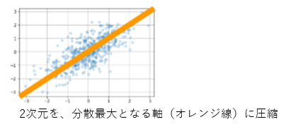
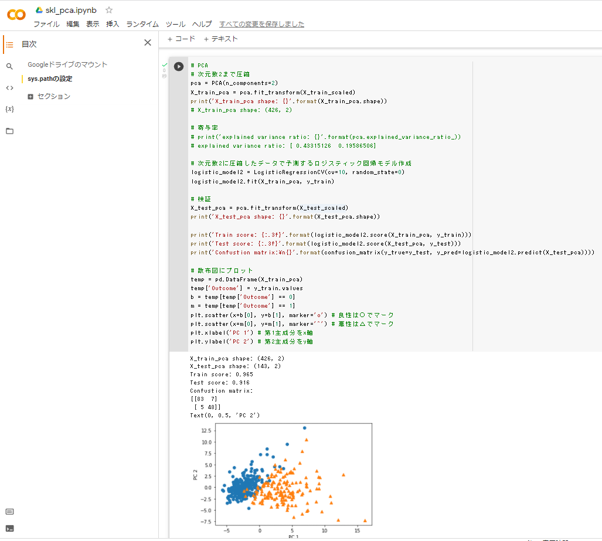

# 主成分分析

## 1. 要点まとめ

高次元のデータを低次元に圧縮する方法である。
情報損失がなるべく小さくなるようにするため、分散が最大（≒情報量最大）となる軸に圧縮する。
低次元に圧縮することで、データの可視化が可能となったり、特徴的なデータの抽出が可能となったりする。

具体的な算出方法は、ノルム1の制約条件の下で分散最大化問題を解く。
制約条件が等式なのでラグランジュの未定乗数法で解ける。
算出結果は元データの分散共分散行列の固有値と固有ベクトルと一致するため、分散共分散行列から解いてもよい。



-----
## 2. 実装演習

以下課題を実施


ソースは以下
※study_ai_ml_google/skl_ml/skl_pca.ipynbを一部改変


``` python
# ====================
#  データロード、前処理
# ====================
from google.colab import drive
drive.mount('/content/drive')

import pandas as pd
from sklearn.model_selection import train_test_split
from sklearn.preprocessing import StandardScaler
from sklearn.linear_model import LogisticRegressionCV
from sklearn.metrics import confusion_matrix
from sklearn.decomposition import PCA
import matplotlib.pyplot as plt
%matplotlib inline

cancer_df = pd.read_csv('/content/drive/My Drive/studyAI/study_ai_ml_google/data/cancer.csv')
cancer_df.drop('Unnamed: 32', axis=1, inplace=True)

# ====================
#  次元圧縮なしモデル
#    診断結果(目的変数)、id以外の全データで予測するロジスティック回帰モデル作成＆検証
# ====================

# 目的変数の抽出
y = cancer_df.diagnosis.apply(lambda d: 1 if d == 'M' else 0)
# 説明変数の抽出
X = cancer_df.loc[:, 'radius_mean':]

# 学習用とテスト用でデータを分離
X_train, X_test, y_train, y_test = train_test_split(X, y, random_state=0)

# 標準化
scaler = StandardScaler()
X_train_scaled = scaler.fit_transform(X_train)
X_test_scaled = scaler.transform(X_test)

# ロジスティック回帰で学習
logistic = LogisticRegressionCV(cv=10, random_state=0)
logistic.fit(X_train_scaled, y_train)

# 検証
print('Train score: {:.3f}'.format(logistic.score(X_train_scaled, y_train)))
print('Test score: {:.3f}'.format(logistic.score(X_test_scaled, y_test)))
print('Confustion matrix:\n{}'.format(confusion_matrix(y_true=y_test, y_pred=logistic.predict(X_test_scaled))))

# ====================
#  次元圧縮ありモデル
#    次元数2に圧縮したデータで予測するロジスティック回帰モデル作成＆検証
# ====================

# 次元数2まで圧縮
pca = PCA(n_components=2)
X_train_pca = pca.fit_transform(X_train_scaled)

logistic_model2 = LogisticRegressionCV(cv=10, random_state=0)
logistic_model2.fit(X_train_pca, y_train)

# 検証
X_test_pca = pca.fit_transform(X_test_scaled)
print('X_test_pca shape: {}'.format(X_test_pca.shape))

print('Train score: {:.3f}'.format(logistic_model2.score(X_train_pca, y_train)))
print('Test score: {:.3f}'.format(logistic_model2.score(X_test_pca, y_test)))
print('Confustion matrix:\n{}'.format(confusion_matrix(y_true=y_test, y_pred=logistic_model2.predict(X_test_pca))))

# 散布図にプロット
temp = pd.DataFrame(X_train_pca)
temp['Outcome'] = y_train.values
b = temp[temp['Outcome'] == 0]
m = temp[temp['Outcome'] == 1]
plt.scatter(x=b[0], y=b[1], marker='o') # 良性は○でマーク
plt.scatter(x=m[0], y=m[1], marker='^') # 悪性は△でマーク
plt.xlabel('PC 1') # 第1主成分をx軸
plt.ylabel('PC 2') # 第2主成分をy軸

```

実行結果は以下

| モデル | 検証スコア |
|:-----------|:------------|
| 次元圧縮なし | 97% |
| 次元圧縮あり | 92% |

次元圧縮なしモデルと比較して検証スコアはやや低下したが、90%台をキープしている。
削減した次元数（30次元削減）が多いわりにスコア低下は限定的であり、今回のデータでは、主成分分析による次元圧縮効果が高いと言える。

次元圧縮後のデータを可視化した散布図を見ても、青（良性）とオレンジ（悪性）をうまく判別できそうなことがうかがえる（下図snapshot）。


