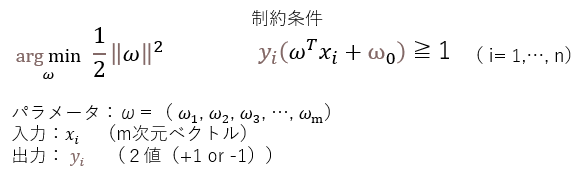
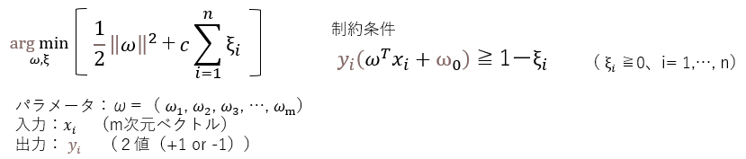
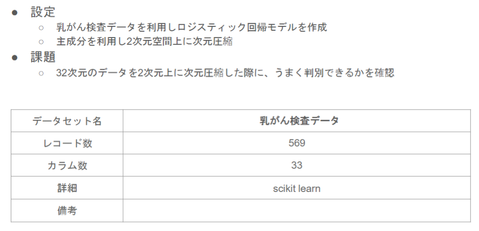
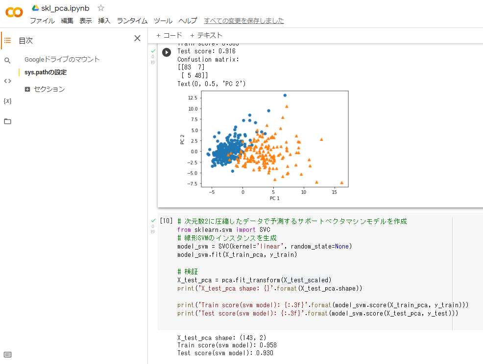

# サポートベクタマシン

## 1. 要点まとめ

サポートベクタマシンとは、主に2クラス分類問題を解くモデルである。特徴ベクトルxを入力すると、分類結果y（2値(+1,-1)）を出力する。

モデル内部では入力xを変数とする決定関数f(x)が定義され、f(x)の符号が出力となる分類結果を表す。f(x)=0は、分類の境界線を意味する。
決定関数f(x)は、線形回帰と同様、xとパラメータベクトルw(xと同じ次元)の内積で表される。

モデルの学習では、決定関数f(x)のパラメータベクトルwを推定する。
線形回帰とは異なり、分類境界を挟んで2つのクラスがどのくらい離れているかを示すマージンが最大となるよう、wを推定する。
より詳細には、分類境界f(x) = 0と分類境界から最も近くにあるデータxiとの距離（＝マージン）を最大化するようwを推定する。
分類境界から最も近くにあるデータxiをサポートベクトルと呼ぶ。
計算式は以下。サポートベクトルxiと分類境界との距離最大化の式を整理すると得られる。



上式は、線形分離できることを仮定したもので、ハードマージンと呼ぶ。

これを、線形分離不可能なデータにも適用できるよう拡張したものをソフトマージンと呼ぶ。
計算式は以下。誤分類されたデータに対する誤差を表すスラック変数ξを導入し、マージン最大化かつξ（分類の誤差）最小化を行う。係数Cは正則化係数と呼ばれる正の定数で、Cが大きいほどハードマージンに近づき、Cが小さいほど誤分類を許容する。
ハードマージン、ソフトマージン共に、ラグランジュの未定乗数法を用いて解ける。



決定関数f(x)を非線形にするには、カーネルトリックと呼ばれる方法を適用する。カーネルトリックとは、データを線形分離可能な高次元空間に写像して線形分離を行うカーネル法を適用した際、高次元空間におけるベクトル内積計算を元空間の関数に置き換える方法である。置き換えた元空間の関数をカーネル関数と呼ぶ。代表的なカーネル関数には以下がある。

- 多項式カーネル
- ガウスカーネル(RBF)
- シグモイドカーネル


-----
## 2. 実装演習

PCAレポートで実施した以下課題において、2次元に圧縮したデータに対してサポートベクタマシンでモデル作成し、ロジスティック回帰と検証スコアを比較する。



ソースは以下
※study_ai_ml_google/skl_ml/skl_pca.ipynbを一部改変

``` python
# ====================
#  データロード、前処理
# ====================
from google.colab import drive
drive.mount('/content/drive')

import pandas as pd
from sklearn.model_selection import train_test_split
from sklearn.preprocessing import StandardScaler
from sklearn.linear_model import LogisticRegressionCV
from sklearn.metrics import confusion_matrix
from sklearn.decomposition import PCA
import matplotlib.pyplot as plt
%matplotlib inline

cancer_df = pd.read_csv('/content/drive/My Drive/studyAI/study_ai_ml_google/data/cancer.csv')
cancer_df.drop('Unnamed: 32', axis=1, inplace=True)

# ====================
#  次元圧縮なしモデル
#    診断結果(目的変数)、id以外の全データで予測するロジスティック回帰モデル作成＆検証
# ====================

# 目的変数の抽出
y = cancer_df.diagnosis.apply(lambda d: 1 if d == 'M' else 0)
# 説明変数の抽出
X = cancer_df.loc[:, 'radius_mean':]

# 学習用とテスト用でデータを分離
X_train, X_test, y_train, y_test = train_test_split(X, y, random_state=0)

# 標準化
scaler = StandardScaler()
X_train_scaled = scaler.fit_transform(X_train)
X_test_scaled = scaler.transform(X_test)

# ロジスティック回帰で学習
logistic = LogisticRegressionCV(cv=10, random_state=0)
logistic.fit(X_train_scaled, y_train)

# 検証
print('Train score: {:.3f}'.format(logistic.score(X_train_scaled, y_train)))
print('Test score: {:.3f}'.format(logistic.score(X_test_scaled, y_test)))
print('Confustion matrix:\n{}'.format(confusion_matrix(y_true=y_test, y_pred=logistic.predict(X_test_scaled))))

# ====================
#  次元圧縮ありモデル
#    次元数2に圧縮したデータで予測するロジスティック回帰モデル作成＆検証
# ====================

# 次元数2まで圧縮
pca = PCA(n_components=2)
X_train_pca = pca.fit_transform(X_train_scaled)

logistic_model2 = LogisticRegressionCV(cv=10, random_state=0)
logistic_model2.fit(X_train_pca, y_train)

# 検証
X_test_pca = pca.fit_transform(X_test_scaled)
print('X_test_pca shape: {}'.format(X_test_pca.shape))

print('Train score: {:.3f}'.format(logistic_model2.score(X_train_pca, y_train)))
print('Test score: {:.3f}'.format(logistic_model2.score(X_test_pca, y_test)))
print('Confustion matrix:\n{}'.format(confusion_matrix(y_true=y_test, y_pred=logistic_model2.predict(X_test_pca))))

# 散布図にプロット
temp = pd.DataFrame(X_train_pca)
temp['Outcome'] = y_train.values
b = temp[temp['Outcome'] == 0]
m = temp[temp['Outcome'] == 1]
plt.scatter(x=b[0], y=b[1], marker='o') # 良性は○でマーク
plt.scatter(x=m[0], y=m[1], marker='^') # 悪性は△でマーク
plt.xlabel('PC 1') # 第1主成分をx軸
plt.ylabel('PC 2') # 第2主成分をy軸

# ====================
#  次元圧縮ありモデル(SVM)
#    次元数2に圧縮したデータで予測するサポートベクタマシンモデル作成＆検証
# ====================

from sklearn.svm import SVC
# 線形SVMのインスタンスを生成
model_svm = SVC(kernel='linear', random_state=None)
model_svm.fit(X_train_pca, y_train)

# 検証
X_test_pca = pca.fit_transform(X_test_scaled)
print('X_test_pca shape: {}'.format(X_test_pca.shape))

print('Train score(svm model): {:.3f}'.format(model_svm.score(X_train_pca, y_train)))
print('Test score(svm model): {:.3f}'.format(model_svm.score(X_test_pca, y_test)))

```

実行結果は以下

| モデル | 検証スコア |
|:-----------|:------------|
| 次元圧縮なし（ロジスティック回帰） | 97% |
| 次元圧縮あり（ロジスティック回帰） | 92% |
| 次元圧縮あり（サポートベクタマシン） | 93% |

次元圧縮あり（ロジスティック回帰）とほぼ同等の結果となった。
どちらも線形関数をベースとした分類なので、ほぼ同等となったと考えられる。


