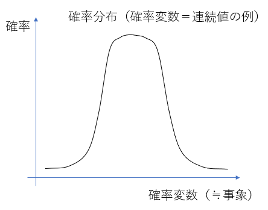

# 第2章：確率・統計

## 1. 要点まとめ

確率とは、ある事象がどのくらい発生するのかを表す指標で、大きく以下２つの考え方がある。
- 頻度確率（客観確率）
- ベイズ確率（主観確率）
  
これらは、事象の発生頻度をみるのか（頻度確率）、信念の度合いをみるのか（ベイズ確率）の違いであり、計算等には以下に挙げたような共通の数学のテクニックを使うことができる。

- 条件付き確率
- ベイズ則
- 確率分布
- 期待値、分散

-----
### 1.1 条件付き確率

条件付き確率とは、ある事象Xが発生した条件下で事象Yが発生する確率のことで、下図式であらわされる。全体がX（＝分母がX（赤丸））となっているところが通常の確率とは異なる点である。

-----
### 1.2 ベイズ則

ベイズ則とは、事象X、Yの同時確率（P(X∩Y)）が、Xの条件付き確率（P（Y|X））、Yの条件付き確率どちらから求めても同じとなることを以下方程式で示したものである。

これを使うと、Xの条件付き確率（P(Y|X)）から、条件を入れ替えたYの条件付き確率（P(X|Y)）を求めることができるようになる（逆も可能）。

-----
### 1.3 確率分布

確率分布とは、事象が発生する確率の分布を表す。

すなわち、事象そのもの、もしくは事象に結びつけられた数値、を変数（確率変数）として、個々の変数に対する確率の分布を示したものが確率分布であり、確率変数が離散値であれば表で表せ、連続値であればグラフで表せる（下図例）。

扱う事象に応じて、下表のような様々な確率分布がある。

| 確率分布 | 概要 | 扱う事象例 |
|:-----------|:------------|:------------|
| ベルヌーイ分布 | 事象が2値（確率変数が0,1の2値）の場合の分布 | コイントス |
| マルチヌーイ分布（カテゴリカル分布） | 事象が多値の場合の分布 | さいころを転がす |
| 二項分布 | ベルヌーイ分布の多試行版 | コイントス（複数回） |
| ガウス分布 | 釣鐘型の連続分布 | コイントス（複数（∞）回） |

-----
### 1.4 期待値、分散

期待値とは、確率変数の平均の値、ありえそうな（実現しそうな）値を表し、
分散とは、データの散らばり具合を表す。
分散には、個々のデータの散らばり具合の他に、２つのデータの傾向の違いを表す共分散もある。
また、分散を元データの単位に直したものを標準偏差という。

期待値、分散、共分散、標準偏差は、それぞれ下図の式で算出する。

 

