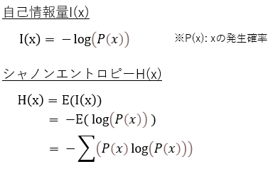
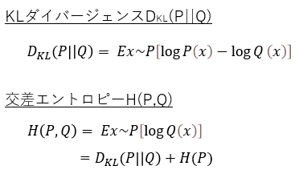

# 第3章：情報理論

## 1. 要点まとめ

### 1.1 自己情報量、シャノンエントロピー

自己情報量とは情報の価値（珍しさ）を表す指標で、シャノンエントロピーとは自己情報量の期待値で、それぞれ以下数式で定義される。

自己情報量は、発生確率が低いほど珍しい（情報量が大きい）、という性質を表した式となっている。

### 1.2 KLダイバージェンス、交差エントロピー

KLダイバージェンスとは、同じ事象、確率変数における異なる確率分布P,Qの違いを表す。こういったP,Qの例としては、ベイズ推定の事前／事後分布等が挙げられる。ここでいうダイバージェンスとは、距離の概念に近い。

交差エントロピーとは、KLダイバージェンスの一部分を取り出したもので、具体的にはKLダイバージェンスからPのシャノンエントリピーを取り除いたものであり、純粋にP,Qの違いを知るのに必要なものだけを抽出したものといえる。交差エントロピーは、機械学習の分類において評価関数として用いられることが多い。

KLダイバージェンス、交差エントロピーの定義式は以下

 

